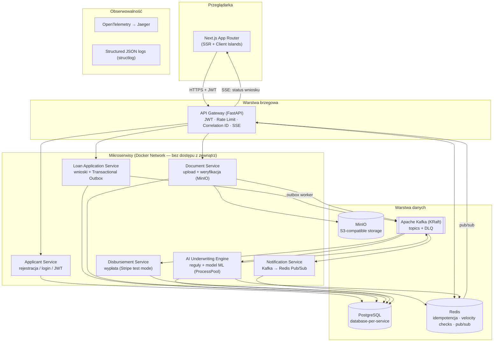

# CrediGuard

Fintech MVP pożyczkowe: mikroserwisy (FastAPI, async), architektura sterowana zdarzeniami (Kafka), scoring kredytowy ML, frontend Next.js. Projekt portfolio na poziomie Senior Full-Stack Developer — pełny kontekst, decyzje i uzasadnienia w [`docs/SPECYFIKACJA.md`](docs/SPECYFIKACJA.md).

## Status

🚧 **Etap 0 — Fundament.** Infrastruktura lokalna (Postgres, Redis, Kafka, MinIO, Jaeger) + szkielety pakietów współdzielonych. Żaden serwis aplikacyjny nie istnieje jeszcze — patrz [plan implementacji](docs/SPECYFIKACJA.md#11-plan-implementacji-krok-po-kroku) po kolejne etapy.

## Architektura



Pełny opis przepływów, kontraktów zdarzeń, maszyny stanów i modelu ML: [`docs/SPECYFIKACJA.md`](docs/SPECYFIKACJA.md).

## Quickstart (Etap 0)

```bash
cp .env.example .env
make infra-up      # Postgres, Redis, Kafka (KRaft), MinIO, Jaeger
make topics         # tworzy topiki Kafki (§5.1 specyfikacji)
```

- Jaeger UI: http://localhost:16686
- MinIO Console: http://localhost:9001
- Kafka (host): `localhost:9094`

`make infra-down` zatrzymuje infrastrukturę; `make infra-down-v` dodatkowo usuwa woluminy (czysty reset danych).

Pełny `make up` (całość systemu wraz z serwisami) pojawi się po Etapie 10.

## Struktura repozytorium

Zobacz [§10 specyfikacji](docs/SPECYFIKACJA.md#10-struktura-repozytorium-monorepo).

## Dokumentacja

- [`docs/SPECYFIKACJA.md`](docs/SPECYFIKACJA.md) — pełna specyfikacja techniczna (źródło prawdy)
- [`docs/adr/`](docs/adr/) — Architecture Decision Records (od Etapu 1+)
- [`CLAUDE.md`](CLAUDE.md) — kontekst i twarde reguły dla pracy z Claude Code
