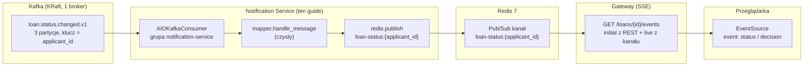
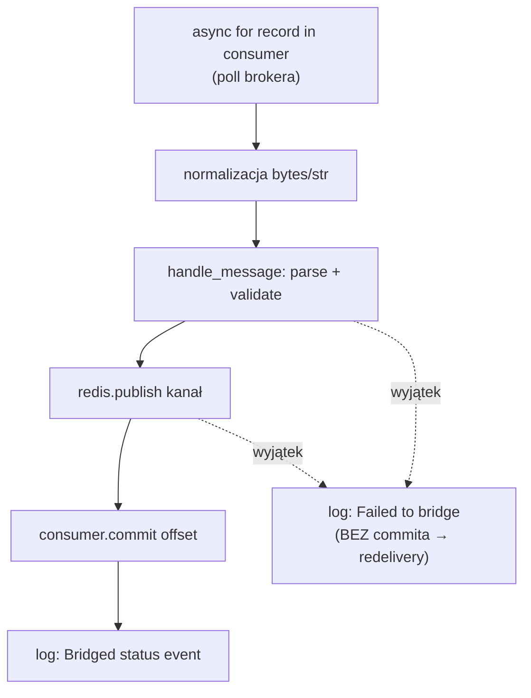
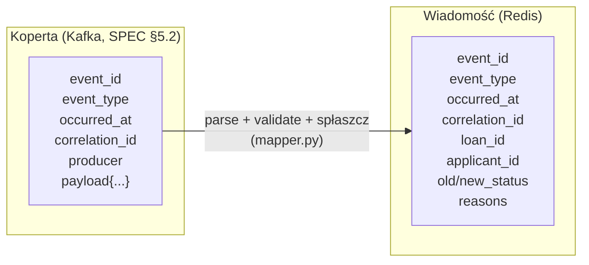

# CrediGuard Notification Service — Kompletny przewodnik techniczny

> **Wersja dokumentu:** 1.0 (Etap 4)
> **Zakres:** pełna analiza kodu źródłowego, architektury, protokołu powiadomień, testów i konfiguracji serwisu `notification` oraz całego pionu „żywego statusu" (Kafka → worker → Redis → SSE → przeglądarka).
> **Audytorium:** od laika (początkujący Pythonista) po seniora (architekt systemów).
> **Oryginalna specyfikacja:** `docs/SPECYFIKACJA.md` (kontrakty zdarzeń §5, Notification Service §4.7, plan Etapu 4 §11).

---

## Spis treści

1. [Wstęp — czym jest Notification Service](#1-wstęp--czym-jest-notification-service)
2. [Architektura — worker, nie serwis HTTP](#2-architektura--worker-nie-serwis-http)
3. [Struktura projektu](#3-struktura-projektu)
4. [Analiza plików źródłowych — linijka po linijce](#4-analiza-plików-źródłowych)
5. [Ścieżki wywołań — ślad jednego zdarzenia](#5-ścieżki-wywołań--ślad-jednego-zdarzenia)
6. [Koncepcje techniczne — Kafka, Redis Pub/Sub, SSE, asyncio](#6-koncepcje-techniczne)
7. [Bezpieczeństwo — dogłębna analiza](#7-bezpieczeństwo)
8. [Konfiguracja i uruchamianie](#8-konfiguracja-i-uruchamianie)
9. [Testy](#9-testy)
10. [Style i dobre praktyki](#10-style-i-dobre-praktyki)
11. [Kod źródłowy vs specyfikacja — luki i obszary do poprawy](#11-kod-źródłowy-vs-specyfikacja)
12. [Dodatki — diagramy, FAQ, glosariusz, troubleshooting](#12-dodatki)
13. [Podsumowanie — kluczowe decyzje architektoniczne](#13-podsumowanie)

---

## 1. Wstęp — czym jest Notification Service

### 1.1 Miejsce w systemie CrediGuard

CrediGuard to fintechowy system **MVP** zbudowany z mikroserwisów.
System obsługuje proces wnioskowania o pożyczkę (credit). W systemie występują między innymi:

- **Applicant Service** — serwis tożsamości (identity provider): rejestracja, logowanie, tokeny JWT (RS256).
- **Loan Application Service** — maszyna stanów wniosków pożyczkowych (to on, i **tylko** on, zmienia statusy wniosków) + Transactional Outbox.
- **Gateway** — brama API (jedyny serwis na internecie): JWT, reverse proxy, rate limiting, endpoint SSE.
- **Notification Service** (omawiany w tym dokumencie) — **bezgłowy most** między światem zdarzeń (Kafka) a światem „na żywo" (Redis Pub/Sub → SSE).

Notification Service pełni w CrediGuard rolę **tłumacza przy taśmie produkcyjnej**.
Z jednej strony taśmy jadą koperty zdarzeń (`loan.status.changed.v1` z Kafki — „wniosek X zmienił status z A na B").
Z drugiej strony czekają subskrybenci kanałów Redis (gateway, który strumieniuje to do przeglądarki przez SSE).
Worker bierze kopertę z taśmy, przepisuje adres z „kopertowego" na „kanałowy" (`loan-status:{applicant_id}`) i kładzie ją na drugą taśmę.
Nic więcej. Nie podejmuje decyzji, nie pyta bazy, nie wystawia HTTP.

> **Analogia z życia:** wyobraź sobie sortownię pocztową na lotnisku. Samoloty (Kafka) zrzucają worki z listami posortowane „po rejsach" (partycje po `applicant_id`). Pracownik sortowni (worker) otwiera każdy worek, czyta adresata i wrzuca list do przegródki adresata (kanał Redis `loan-status:{adresat}`). Kurierzy (gateway SSE) zaglądają tylko do przegródek swoich klientów i wiozą listy do domów (przeglądarki). Pracownik sortowni nie czyta treści listów pod kątem decyzji — tylko przepisuje adres. I nie ma własnego okienka dla klientów (brak HTTP) — klienci widzą tylko kurierów.

### 1.2 Co dokładnie robi ten serwis?

Serwis implementuje **jedną** operację biznesową (a właściwie: techniczną), wykonywaną w pętli w nieskończoność:

| Wejście | Przekształcenie | Wyjście |
|---------|-----------------|---------|
| Rekord Kafka z topiku `loan.status.changed.v1` (klucz: `applicant_id`) | Parsowanie koperty → walidacja Pydantic → wybór kanału → spłaszczenie do JSON | `PUBLISH loan-status:{applicant_id} {json}` na Redisie + commit offsetu |

Rozkładając to na kroki wykonywane dla **każdego** rekordu:

1. **Odbiór** — `async for record in consumer` (grupa `notification-service`, offsety commitowane ręcznie).
2. **Normalizacja bajtów** — `record.value` bywa `bytes` albo `str` (zależnie od deserializera); sprowadzamy do `bytes`.
3. **Parsowanie i walidacja** — `handle_message(raw)`: JSON → `LoanStatusChangedV1` (Pydantic) → koperta `EventEnvelope` → kanał + JSON na Redis. Czyste funkcje, zero I/O — testowalne bez Kafki i Redisa.
4. **Publikacja** — `await redis.publish(channel, message)` (fire-and-forget po stronie brokera Redis: jeśli nikt nie słucha, wiadomość przepada — patrz §6.3 i §11).
5. **Commit offsetu** — `await consumer.commit()` **dopiero po** udanej publikacji. To jest cała „transakcyjność" serwisu: commit = „uznaję rekord za dostarczony".
6. **Log strukturalny** — `Bridged status event to Redis` z `channel`, `partition`, `offset` (nić do debugowania: który rekord, skąd, dokąd).

A w razie **błędu** w którymkolwiek kroku 2–4: wyjątek → log `Failed to bridge status event` → **brak commita** → przy następnym pollingu Kafka dowiezie ten sam rekord jeszcze raz (redelivery, semantyka at-least-once — §6.2).
Retry z limitem i DLQ przyjdą dopiero w Etapie 9 (`libs/kafka.BaseConsumer`); do tego czasu „nieskończone redelivery" jest świadomą ceną prostoty (patrz §11).

Dodatkowo serwis **nie posiada** żadnych endpointów operacyjnych (`/health`, `/ready`, `/metrics`): nie ma serwera HTTP w ogóle (`Dockerfile` nie ma nawet `EXPOSE`).
Zdrowie workera widać w logach (`Notification worker started/stopped`) i w metrykach brokera (consumer lag grupy `notification-service` — §8.4).

#### Przykład: co worker robi z rekordem (ślad bajtów)

Wejście (Kafka, topik `loan.status.changed.v1`, klucz = `applicant_id`, partycja 2, offset 0):

```json
{
  "event_id": "7f3a…",
  "event_type": "loan.status.changed.v1",
  "occurred_at": "2026-09-13T08:35:00Z",
  "correlation_id": "9f8e…",
  "producer": "loan-application-service",
  "payload": {
    "loan_id": "d1b1…",
    "applicant_id": "30cd…",
    "old_status": "DOC_VERIFICATION",
    "new_status": "UNDERWRITING",
    "decision_reasons": null
  }
}
```

Wyjście (Redis, kanał `loan-status:30cd…`):

```json
{
  "event_id": "7f3a…",
  "event_type": "loan.status.changed.v1",
  "occurred_at": "2026-09-13T08:35:00Z",
  "correlation_id": "9f8e…",
  "loan_id": "d1b1…",
  "applicant_id": "30cd…",
  "old_status": "DOC_VERIFICATION",
  "new_status": "UNDERWRITING",
  "decision_reasons": null
}
```

- Zniknęło: `producer` (konsument kanału nie musi wiedzieć, kto wyprodukował — nick producenta był potrzebny tylko w świecie Kafki).
- Doszło: nic — kanał Redis **jest** adresem (nazwa kanału niesie `applicant_id`).
- Zostało: `event_id` + `correlation_id` (nić trace'a przez cały system — ten sam `correlation_id` od `POST /loans` aż do ramki SSE w przeglądarce).
- Efekt uboczny: commit offsetu `(partycja 2, offset 0)` w grupie `notification-service` + wpis w logu.

### 1.3 Dlaczego ten serwis jest ważny?

1. **Rozdziela dwa światy.** Bez niego gateway musiałby czytać Kafkę (ciężki klient `aiokafka`, grupy konsumenckie, offsety — w „grubym proxy", które ma być stateless i głupie). Dzięki mostowi gateway zna tylko Redis Pub/Sub (jedna komenda `SUBSCRIBE`), a Kafka zna tylko workerów. To jest podział odpowiedzialności z §2 specyfikacji: „Gateway nie dotyka Kafki".
2. **Przeżywa restarty konsumentów.** SSE w gateway subskrybuje **kanał Redis**, nie partycję Kafki. Restart workera (deploy, crash) nie zrywa strumieni do przeglądarek — one wiszą na Redisie, który jest osobnym procesem. Restart gateway też nie gubi pozycji w Kafce — offsety trzyma grupa `notification-service` po stronie brokera.
3. **Jest pierwszym konsumentem w systemie.** Etap 4 podpina pierwszego żywego konsumenta do topiku, który Loan App produkuje od Etapu 3. Udowadnia, że outbox naprawdę „dowozi" (test live z §5.4 przeszedł na prawdziwej infrze, nie na mockach).
4. **Wzorzec mostu na przyszłość.** Etapy 6–8 podepną kolejnych konsumentów (document, underwriting, disbursement). Ten serwis pokazuje minimalny kształt takiego konsumenta: grupa, ręczny commit, czysty mapper, seam pod retry/DLQ (Etap 9 podmieni pętlę na `BaseConsumer`, a `handle_message` zostanie nietknięte).
5. **Lekcja semantyki dostarczania.** Cały serwis to w zasadzie esej o różnicy at-least-once vs at-most-once, napisany kodem: commit-po-publikacji (nigdy nie gub) + brak deduplikacji (duplikat możliwy) + jawna notka, że DLQ przyjdzie później. Na rozmowie rekrutacyjnej bronisz tego w 2 minuty (§13).

### 1.4 Czego ten serwis NIE robi

- **Nie wystawia HTTP** — brak FastAPI, brak `/health`, brak portu. To nie jest „serwis" w sensie request/response; to proces roboczy (worker). IaC (compose z Etapu 10) będzie go nadzorować przez restart-policy, nie przez healthcheck HTTP.
- **Nie czyta żadnej bazy** — nie ma nawet `DATABASE_URL`. Przestrzega database-per-service w najmocniejszej formie: zero SQL w ogóle.
- **Nie zmienia statusów wniosków** — statusy zmienia wyłącznie Loan Application Service (maszyna stanów w domenie). Worker nie zna nawet listy legalnych statusów (pola `old_status`/`new_status` to dla niego zwykłe stringi — przepisuje, nie interpretuje).
- **Nie zna użytkowników** — `applicant_id` to dla niego fragment nazwy kanału, nie tożsamość do weryfikacji. Autoryzację („czy ten klient może słuchać tego wniosku") robi gateway przy nawiązywaniu SSE (§4.5 w tym guide).
- **Nie retry'uje z limitem i nie wysyła na DLQ** — do Etapu 9. Błąd = log + redelivery w kółko (świadome, patrz §11 luka #1).
- **Nie deduplikuje** — nie ma tabeli `processed_events`. Ten sam rekord dostarczony 2× = 2× publish na kanał (SSE pokaże ten sam status 2× — nieszkodliwe, bo ramki są idempotentne wizualnie; patrz §7.5).
- **Nie gwarantuje dostarczenia do przeglądarki** — Redis Pub/Sub to fire-and-forget: wiadomość opublikowana, gdy nikt nie słuchał, przepada bez śladu. Dlatego SSE wysyła initial-state z REST (§4.5) — spóźniony subskrybent i tak zobaczy prawdę.

---

## 2. Architektura — worker, nie serwis HTTP

### 2.1 Zasada: brak warstw, bo brak domeny

W Applicant Service obowiązywała klasyczna **Clean Architecture** (domain → application → infrastructure → api) z regułą „warstwa wewnętrzna NIE wie nic o zewnętrznych".
Loan Application Service kopiował ten układ.
Notification **świadomie go nie kopiuje** — i to nie jest lenistwo, tylko konsekwencja:

> Warstwy chronią **logikę biznesową** przed frameworkami i infrastrukturą. Ten serwis **nie ma logiki biznesowej** — ma jeden pipeline techniczny (przepisz kopertę z taśmy A na taśmę B). Nie ma encji do ukrycia, portów do zdefiniowania ani use case'ów do odizolowania. Dzielenie 155 linii na cztery warstwy dałoby cztery katalogi z jednym plikiem każdy — architektoniczny teatrzyk.

Zamiast warstw jest **podział na czystość**:

```
mapper.py   (czyste funkcje: bytes → (kanał, bytes))   → testy unit bez I/O
   ↑
main.py     (brudny brzeg: Kafka + Redis + sygnały)     → testy tylko live/integration
   ↑
config.py   (środowisko: 4 zmienne, zero sekretów)
```

Strzałka czytana jest jako „zależy od": `main` importuje `mapper` i `config`, nic nie importuje `main`.
To jest uproszczona Clean Architecture sprowadzona do jednego aksjomatu: **logika czysta na dole, efekty uboczne na górze**.
Gdy w Etapie 9 przyjdzie `BaseConsumer`, podmieni tylko `main.py` (pętlę), a `mapper.py` zostanie nietknięty — dokładnie tak, jak porty chronią use case'y w applicancie.

**Czy to narusza twarde reguły z `CLAUDE.md`?** Nie. Reguła „api → application → domain" dotyczy serwisów z domeną. Reguły, które obowiązują i tutaj: koperta z `libs/events` (tak), klucz partycji = `applicant_id` (tak — worker go nie wybiera, ale go konsumuje i propaguje jako kanał), idempotencja konsumenta (częściowo — patrz §11 luka #2), statusy zmienia tylko Loan App (tak — worker ich nie dotyka).

### 2.2 Diagramy (Mermaid)

**Diagram 1 — miejsce w systemie (przepływ Etapu 4):**



**Diagram 2 — wnętrze workera (jeden tick pętli):**



Zwróć uwagę na brak strzałki z `LOGERR` do czegokolwiek: błąd nie commituję, nie liczy, nie odkłada — po prostu wraca do `POLL`, a broker dowiezie ten sam rekord ponownie.
To jest cały „retry" Etapu 4 (nieskończony, bez backoffu — §11).

### 2.3 Dlaczego taki podział? (trzy powody + jeden esej)

- **Testowalność bez dockera.** `mapper.py` nie importuje `aiokafka` ani `redis` — trzy testy unit chodzą w 0.5 s na gołym interpreterze. Gdyby parsowanie żyło w `main.py` obok consumera, każdy test wymagałby brokera (testcontainers) albo rozbudowanych mocków. To jest ta sama lekcja co w applicancie (use case'y bez bazy), tylko w skali mikro.
- **Seam pod Etap 9.** `handle_message(raw) -> (kanał, bajty)` to gotowy interfejs dla przyszłego `BaseConsumer`: retry/DLQ owinie **wywołanie**, nie wnętrze. Gdyby logika była wpleciona w pętlę, Etap 9 musiałby ją najpierw wydłubać (refaktoring w środku feature'a — drogo i ryzykownie).
- **Czytelność dla on-call.** O 3 nad ranem, gdy lag grupy rośnie, chcesz wiedzieć w 30 sekund: „skąd czyta, dokąd pisze, kiedy commituje". Odpowiedź to 84 linie `main.py` bez ani jednego `if` biznesowego. Serwis, który da się przeczytać w całości między dwoma łykami kawy, to serwis, który da się zdebugować o 3 nad ranem.

**Esej: czemu nie biblioteka współdzielona od razu?** Pokusa: „wyciągnijmy pętlę consumera do `libs/kafka` już teraz, skoro Etap 9 i tak ją napisze". Odpowiedź: **przedwczesna abstrakcja**. Dziś mamy dokładnie jednego konsumenta o dokładnie jednym zachowaniu (publish + commit). `BaseConsumer` z retry/DLQ projektowany teraz, na podstawie jednego przypadku, zgadłby kształt API (jakie hooki? jakie nagłówki DLQ? gdzie jitter?). Etap 9 zaprojektuje go na podstawie **czterech** konsumentów (notification, document, underwriting, disbursement) — wtedy wspólny mianownik będzie faktem, nie zgadywaniem. Reguła trzech (trzy użycia → abstrahuj) w wersji fintech: cztery serwisy → `libs/kafka`. Do tego czasu duplikacja pętli (gdyby powstała) byłaby tańsza niż zła abstrakcja. To jest decyzja warta osobnego ADR-a w Etapie 10.

### 2.5 Rozważone i odrzucone alternatywy (dlaczego most, a nie…)

Każda z poniższych była na stole (lub powinna być — review checklist):

1. **Gateway czyta Kafkę wprost (bez workera).**
   Odpada: klient Kafki w stateless proxy (grupy, offsety, rebalance przy skalowaniu!),
   mieszanie odpowiedzialności, restart gateway = rebalance = czkawka wszystkich SSE naraz.
   Dodatkowo: gateway jest w Pythonie asyncio — aiokafka pasuje,
   ale każdy reconnect grupy to pauza w proxy (a proxy ma być głupie i szybkie).
   Werdykt: nie.
2. **Polling zamiast SSE** (frontend pyta `GET /loans/{id}` co 2 s).
   Odpada: młot na Loan App (tysiące pustych requestów na jeden wniosek!),
   opóźnienie do 2 s (status „na żywo" z lagiem), brak push-semantyki.
   Polling ma sens jako **fallback** (gdy `EventSource` niedostępny — stare przeglądarki, agresywne proxy),
   nie jako podstawa. Etap 5 może go dorzucić w 20 linijkach (ten sam endpoint REST!).
3. **WebSocket zamiast SSE.**
   Odpada: dwukierunkowość niepotrzebna (klient nic nie wysyła),
   a kosztuje (handshake, subprotokoły, sticky sessions przy skalowaniu gateway,
   osobny handling w proxy i CORS). SSE to zwykły GET — przechodzi przez każde proxy.
4. **Redis Streams zamiast Pub/Sub** (historia + grupy konsumenckie + `XREAD`).
   Kuszące (resume z historią za darmo! — §11 luka #6), ale:
   gateway musiałby trzymać kursory per strumień (stan! — gateway ma być stateless),
   a initial-state z REST i tak jest potrzebny (spójny obraz na start).
   Streams to upgrade, nie MVP. Decyzja odroczona do ADR w Etapie 10 (świadomie).
5. **NATS / Pusher / Ably zamiast Redis.**
   NATS: lżejszy protokół, wbudowane kolejki — ale kolejny składnik infra do utrzymania
   (Redis już stoi dla rate limitów i idempotencji — zero nowych kontenerów!).
   Pusher/Ably (SaaS): zero infra, ale zależność zewnętrzna + koszty + dane klientów poza VPC.
   Zasada MVP: nie dokładaj składnika, którego rolę pełni istniejący.
6. **Webhooki do frontendu** (serwer woła przeglądarkę — niemożliwe bez publicznego adresu klienta;
   service workery + push wymagają VAPID i uprawnień — przerost nad wnioskiem o pożyczkę).

Wspólny mianownik odrzuceń: **najmniej nowych ruchomych części, które dowożą „na żywo"**.
Most wygrywa, bo dokłada zero kontenerów (Kafka i Redis już stoją) i zero protokołów (SSE to GET).

### 2.6 Porównanie z sąsiadami — tabela

| Aspekt | Applicant | Loan Application | Gateway | **Notification** |
|---|---|---|---|---|
| Rola | tożsamość (IdP) | maszyna stanów + outbox | brzeg HTTP | **most Kafka→Redis** |
| HTTP | tak (4 endpointy) | tak (wnioski) | tak (proxy + SSE) | **nie** |
| Baza danych | PostgreSQL | PostgreSQL | brak | **brak** |
| Kafka | brak (produkuje `registered`? nie — publikuje w przyszłości) | producent (outbox) | brak (nie dotyka) | **konsument** (pierwszy!) |
| Redis | brak | idempotencja HTTP | rate limit + SSE sub | **pub/sub publish** |
| Warstwy | domain/app/infra/api | domain/app/infra/api | core/api/services/infra | **config/mapper/main** |
| Stan | trwały (klienci, tokeny) | trwały (wnioski, outbox) | bezstanowy | **pozycja w Kafce (offsety, po stronie brokera)** |
| Testy | unit + integration | unit + integration | unit | **unit (mapper) + live (most)** |

Wiersz „stan" zasługuje na akapit: notification **wygląda** na bezstanowy (restart nie gubi danych — nie ma bazy), ale ma stan **zewnętrzny**: offsety grupy `notification-service` trzyma broker Kafka.
Usunięcie grupy (np.
`kafka-consumer-groups.sh --delete`) = worker zacznie od `earliest` = **replay całej historii topiku** = fala duplikatów na kanałach.
To nie jest błąd — to konsekwencja at-least-once.
W produkcji: grupy się nie kasuje bez planu, a replay traktuje jak deployment-ze-skutkami (powiadom o tym zespół, bo SSE mignie starymi statusami).

---

## 3. Struktura projektu

### 3.1 Pełne drzewo katalogów

Serwis żyje w katalogu `services/notification/`. Poniżej pełna struktura (stan na Etap 4):

```
services/notification/
├── .env.example                      # Wzór zmiennych (4 sztuki, zero sekretów)
├── Dockerfile                        # Obraz workera (bez EXPOSE!)
├── pyproject.toml                    # Metadane, 4 depsy runtime, ruff/mypy/pytest
├── README.md                         # Jednolinijkowiec (stub do rozbudowy w Etapie 10)
├── src/
│   ├── __init__.py                   # (pusty) — pakiet
│   ├── config.py                     # Settings: 4 pola (14 linii)
│   ├── mapper.py                     # Czyste funkcje mostu (57 linii)
│   └── main.py                       # Pętla workera (84 linie)
└── tests/
    ├── __init__.py                   # (pusty)
    └── unit/
        ├── __init__.py               # (pusty)
        └── test_mapper.py            # 3 testy mappera (52 linie)
```

Uwaga: w przeciwieństwie do sąsiadów **brak** `src/api/` (brak HTTP), **brak** `src/domain/` i `src/application/` (brak domeny — §2.1), **brak** `alembic/` (brak bazy), **brak** `keys/` (brak kryptografii).
Katalog `tests/integration/` nie istnieje — testy live robiliśmy skryptami ad-hoc (§5.4); stały test integracyjny (testcontainers: Kafka+Redis) to luka z §9.3.

### 3.2 Po co podział na `src/`?

Analogicznie jak u sąsiadów: `src/` odizolowuje kod od konfiguracji i testów, umożliwia instalację editable (`pip install -e .`), daje jednoznaczną bazę dla mypy/ruff (`src = ["src"]`) i — co tu najważniejsze — pozwala odpalać workera jako moduł (`python -m src.main` z katalogu serwisu).
Bez `src/` layoutu `Dockerfile` musiałby kombinować z `PYTHONPATH`.

### 3.3 Po co `__init__.py`?

Opakowują katalogi w pakiety, dzięki czemu działają importy hierarchiczne:

```python
from src.config import Settings
from src.mapper import handle_message
```

W `tests/unit/test_mapper.py` import `from src.mapper import ...` działa, bo pytest odpalany jest z katalogu serwisu (`cd services/notification && pytest`), a `src/` leży obok `tests/`.
Gdyby testy miały ruszać z roota repo, potrzebny byłby `PYTHONPATH` (jak w `Makefile` dla applicanta: `PYTHONPATH=.`).

### 3.4 Plik po pliku — konfiguracja i pakowanie

#### Pełny `Dockerfile` (17 linii — każda zarabia na siebie)

```dockerfile
FROM python:3.12-slim AS base

ENV PYTHONDONTWRITEBYTECODE=1 \
    PYTHONUNBUFFERED=1 \
    PIP_NO_CACHE_DIR=1 \
    PIP_DISABLE_PIP_VERSION_CHECK=1

WORKDIR /app

COPY pyproject.toml ./
RUN pip install --no-cache-dir -e ".[dev]"

COPY src ./src

# No EXPOSE — worker without HTTP (spec §4.7).

CMD ["python", "-m", "src.main"]
```

- **`AS base`** (nazwany stage, choć jeden!): furka na multi-stage
  (np. `AS test` z testcontainers w przyszłości — nazwa już jest, doklejasz stage).
  Bez nazwy późniejszy `COPY --from=` wymagałby edycji tej linii.
- **`PYTHONDONTWRITEBYTECODE=1`**: brak `__pycache__` w obrazie
  (mniejszy layer + brak stunt-details: `.pyc` zepsute przy zmianie Pythona potrafią wybuchać dziwnie).
  Lokalnie (dev) `.pyc` są OK (szybkość); w obrazie (immutable) — zbędne.
- **`PYTHONUNBUFFERED=1`**: stdout bez bufora — logi JSON lecą na `docker logs` **natychmiast**,
  nie porcjami po 4–8 KB. Bez tego diagnoza „co worker robi TERAZ" ma lag bufora
  (najgorsze przy crashu: ostatnie linie giną w buforze, którego nikt nie spłukał!).
  Flaga krytyczna dla workerów (serwer HTTP z access-logiem by to ukrył; worker nie ma nic innego).
- **`PIP_NO_CACHE_DIR=1` + `PIP_DISABLE_PIP_VERSION_CHECK=1`**: mniejszy obraz (bez wheel-cache)
  + szybszy build bez checku wersji pipa (oszczędność sekund × każdy build CI).
- **Kolejność `COPY pyproject` → `RUN pip install` → `COPY src`**:
  warstwy Dockera cache'ują się od góry; zmiana kodu (`src/`) NIE przebudowuje warstwy `pip install`
  (najwolniejszej — minuty!). Odwrotna kolejność (`COPY .` na górze) = każdy commit przebudowuje wszystko.
  To jest dockerowa wersja „najrzadziej zmieniane na górze".
- **Brak `gcc`/`libpq-dev`** (Loan App je ma!): zero kompilowanych zależności
  (aiokafka/redis/pydantic mają wheele dla `slim`).
  Mniejszy obraz + szybszy build + mniejsza powierzchnia (kompilator w obrazie runtime to ryzyko).
  Gdyby przyszła zależność z kompilacją (np. `psycopg` z source), build padnie z jawnym błędem —
  wtedy dopiszesz toolchain (fail-fast > zgadywanie).
- **`COPY src ./src`, bez `tests/`**: testy nie płyną na produkcję (mniejszy obraz, mniej powierzchni).
  Kontrowersja? Niektórzy pakują testy do obrazu („testuj to, co deployujesz").
  Tu: testy unit chodzą w CI na checkoutcie, nie w obrazie — spójne z resztą repo.
- **`CMD ["python", "-m", "src.main"]`** (exec-form JSON, nie shell-form!):
  shell-form (`CMD python -m src.main`) owinęłaby proces w `/bin/sh -c`,
  a sygnały (`SIGTERM` z `docker stop`!) trafiałyby do shella, nie do Pythona
  (shell nie forwarduje bez `exec` — worker nie dostałby SIGTERM = brudny kill po grace period!
  §4.4 o graceful shutdown poszedłby się... nie wykonać).
  Exec-form = PID 1 to Python = sygnały docierają = `add_signal_handler` działa.
  To jest jedna z najważniejszych linii pliku (niewidoczna dopóki nie zabijasz kontenera).

#### `pyproject.toml` — zależności runtime (4 sztuki, każda zarabia na siebie)

```toml
dependencies = [
    "aiokafka>=0.10.0",      # asynchroniczny konsument Kafki (event loop, nie wątki)
    "pydantic>=2.9.2",       # walidacja koperty (EventEnvelope + LoanStatusChangedV1)
    "pydantic-settings>=2.5.2",  # Settings z env (BaseSettings)
    "redis>=5.0.0",          # asynchroniczny publish (redis.asyncio)
    "structlog>=24.4.0",     # JSON-owe logi z kontekstem (structlog to piąta — logowanie to też zależność!)
]
```

- **`aiokafka`, nie `confluent-kafka`** — ta sama decyzja co w Loan App (spec §3): asynchroniczność za cenę przepustowości. Worker robi jedno `publish` na rekord; GIL nie boli, bo publish to I/O (czekanie na Redis), nie CPU. `confluent-kafka` (librdkafka, synchroniczny) wymagałby owijania w executora — sensu zero przy tym profilu obciążenia.
- **`structlog`** — logi to tutaj **jedyny interfejs operacyjny** (brak `/health`!). `configure_logging("notification-service")` + pola `channel/partition/offset` w każdym wpisie = `grep` po `correlation_id` w `docker compose logs` wystarcza za monitoring w MVP (spec §9.2).
- **Sekcja `[tool.mypy]`** — `strict = true` jak wszędzie; `mypy_path` wskazuje oba `libs/` (mapper importuje `crediguard_events` i — pośrednio przez config — nic z observability; `main.py` importuje `crediguard_observability` wprost). Blok `[[tool.mypy.overrides]]` z `ignore_missing_imports` dla `aiokafka.*` i obu `libs` — bo stubów brak, a strict bez tego by nie przeszedł (ta sama konwencja co Loan App).
- **`asyncio_mode = "auto"`** — testy async bez dekoratorów (dziś bez znaczenia — testy mappera są synchroniczne; flaga to spadek po kopiuj-wklej z template'u serwisu. Uczciwie: martwa konfiguracja do czasu pierwszego testu async).

#### `Dockerfile` — obraz bez portu

```dockerfile
FROM python:3.12-slim AS base
ENV PYTHONDONTWRITEBYTECODE=1 PYTHONUNBUFFERED=1 PIP_NO_CACHE_DIR=1 PIP_DISABLE_PIP_VERSION_CHECK=1
WORKDIR /app
COPY pyproject.toml ./
RUN pip install --no-cache-dir -e ".[dev]"
COPY src ./src
# No EXPOSE — worker without HTTP (spec §4.7).
CMD ["python", "-m", "src.main"]
```

Linijka po linijce, tylko to, co inne niż u sąsiadów:

- **Brak `gcc`/`libpq-dev`** (Loan App je ma) — nie ma SQLAlchemy ani kompilowanych rozszerzeń; czysty Python + prekompilowane wheele (`aiokafka`, `redis`, `pydantic` mają wheele dla `slim`). Mniejszy obraz, szybszy build.
- **`COPY src ./src`, bez `alembic/`** — oczywiste (brak bazy), ale warte zdania: każda linia `COPY` to warstwa obrazu; kopiowanie tylko `src` to mniejszy context i czytelniejszy `docker history`.
- **`# No EXPOSE`** — komentarz zamiast dyrektywy. `EXPOSE` i tak jest tylko dokumentacją (nie otwiera portów), ale jego brak krzyczy „tu nie ma czego expose'ować" — celowy sygnał dla czytelnika Dockerfile. Gdyby ktoś dodał tu FastAPI „na chwilę" (np. `/health` — pokusa z §11!), brak `EXPOSE` zmusi go do dopisania linii i przemyślenia decyzji.
- **`CMD ["python", "-m", "src.main"]`, nie `uvicorn`** — jedyny serwis w repo bez uvicorna. `-m` (uruchom jako moduł) zamiast `python src/main.py` (uruchom jako skrypt): `-m` ustawia `sys.path[0]` na cwd, więc importy `from src.mapper import ...` działają identycznie jak w testach. Przy `src/main.py` importy absolutne `src.*` by się wysypały (katalog `src/` nie jest na path) — klasyczna pułapka, o której warto pamiętać, kopiując ten Dockerfile.

#### `.env.example` — 4 zmienne, zero sekretów

```
KAFKA_BOOTSTRAP_SERVERS=localhost:9094   # zewnętrzny listener KRaft (w sieci compose: kafka:9092)
REDIS_URL=redis://localhost:6380/0       # ta sama konwencja portu co wszędzie (6380, nie 6379)
KAFKA_GROUP_ID=notification-service      # nazwa grupy konsumenckiej (stabilna! zmiana = replay)
KAFKA_TOPIC=loan.status.changed.v1       # topik wejściowy (sufiks .v1 = wersja kontraktu)
```

- **`KAFKA_TOPIC` jako zmienna** (a nie stała w kodzie) — kontrowersyjne? Topik to kontrakt (spec §5.1), nie konfiguracja. Uzasadnienie: testy (live z §5.4) i przyszłe środowiska (staging/prod z innym nazewnictwem) — jeden obraz, różne topiki. Cena: literówka w env = cichy brak konsumpcji (consumer subskrybuje nieistniejący topik i czeka — aiokafka nie krzyczy). Mitigacja: log startowy wypisuje `topic` (jest — §4.4), więc `docker logs` od razu pokazuje, na co worker czeka.
- **Brak haseł/kluczy** — Kafka i Redis w MVP bez auth (sieć zamknięta). Gdy prod dorzuci SASL/ACL, przybędą tu `KAFKA_SASL_*` — i wpis do `.env.example` (reguła z `CLAUDE.md`: nowa zmienna ⇒ aktualizacja `.env.example`).

---

## 4. Analiza plików źródłowych — linijka po linijce

> W tej sekcji przechodzimy przez KAŻDY plik źródłowy serwisu (plus kontrakt `libs/events/loan.py` i protokół SSE po stronie konsumenta — bo most ma dwa końce, a ten guide opowiada historię całego pionu „żywego statusu"). Dla każdego pliku: cel, analiza blok po bloku, przykłady, konsekwencje usunięcia linii oraz alternatywy. Kolejność: od kontraktu (język), przez czystość (mapper), po brzeg (main).

---

### 4.1 Plik: `libs/events/loan.py` (kontrakt — język mostu)

**Cel:** jedno źródło prawdy dla payloadów zdarzeń pożyczkowych. Producent (Loan App, outbox worker) i konsumenci (ten worker, w przyszłości document/underwriting/disbursement) importują stąd, zamiast przepisywać te same pola w każdym serwisie.

```python
"""Loan-application Kafka payload schemas (spec §5.1-5.2).

Single source of truth for event contracts. Producers (loan-application
outbox worker) and consumers (notification, document, underwriting, ...)
import from here instead of duplicating ad-hoc dicts.
"""

from __future__ import annotations

from uuid import UUID

from pydantic import BaseModel, Field

LOAN_APPLICATION_SUBMITTED_V1 = "loan.application.submitted.v1"
LOAN_STATUS_CHANGED_V1 = "loan.status.changed.v1"


class LoanApplicationSubmittedV1(BaseModel):
    loan_id: UUID
    applicant_id: UUID
    amount: str
    term_months: int
    monthly_income: str
    applicant_age: int


class LoanStatusChangedV1(BaseModel):
    loan_id: UUID
    applicant_id: UUID
    old_status: str
    new_status: str
    decision_reasons: list[str] | None = Field(default=None)
```

Analiza, linijka po linijce:

- **`from __future__ import annotations`** — leniwe adnotacje (PEP 563), konwencja całego repo. Tu konkretnie umożliwia `list[str] | None` bez względu na wersję interpretera w toolingu (choć runtime to 3.12, gdzie i tak by działało — spójność ponad konieczność).
- **`from uuid import UUID`** — tylko `UUID`, bez `uuid4`: kontrakt niczego nie generuje, tylko waliduje. Pydantic sparsuje string `"30cd…"` do `UUID` i odrzuci śmieć (`UUID("nie-uuid")` → `ValidationError`). To jest pierwsza linia obrony workera: zatruty rekord z Kafki ginie na walidacji, nie na kanale.
- **`from pydantic import BaseModel, Field`** — `BaseModel` dla klas, `Field` tylko raz: `decision_reasons` z defaultem. Czemu `Field(default=None)`, a nie zwykłe `= None`? Oba działają; `Field` sygnalizuje „to pole ma jawny default w kontrakcie" i zostawia furtkę na `description=` w przyszłości (dokumentacja kontraktu w kodzie — Schema Registry dla ubogich).
- **Stałe `*_V1`** — nazwy topików/typów jako stałe modułowe, nie literały rozrzucone po kodzie. Historia: Loan App trzymał je jako literały (`"loan.status.changed.v1"` w use case + w `EVENT_SCHEMAS`) — loan guide w §11 sam to wytknął jako kandydata do współdzielenia. Etap 4 to zrealizował: use case nadal pisze string (payload w outboxie), ale worker i mapper używają stałych. Pełne wyczyszczenie literałów (też w use case) to robota na później — świadomy niedosyt, patrz §11 luka #4.
- **`amount: str`, nie `Decimal`** — kwoty podróżują jako stringi (`str(loan.amount)` w use case). Dlaczego? JSON nie ma typu dziesiętnego; `Decimal("15000.00")` zserializowany do `15000.0` (float!) straciłby precyzję groszy. String zachowuje dokładność; konsument parsuje do `Decimal` jeśli liczy (notification nie liczy — przepisuje). To jest lekcja „pieniądze nigdy floatem" w wersji kontraktowej.
- **`old_status`/`new_status: str`, nie enum** — worker nie importuje `LoanStatus` z Loan App (osobny serwis — import domeny sąsiada to złamanie granic). String = luźne sprzężenie: nowy status w maszynie stanów nie wymaga zmiany tego pliku. Cena: literówka w statusie przejdzie walidację i wyląduje na kanale (SSE pokaże „Przetwarzanie…" przez fallback w `_STATUS_STEP` — §4.5). Fail-open, nie fail-fast — tu słusznie, bo most nie jest od oceniania.
- **`decision_reasons: list[str] | None`** — `None` = „brak uzasadnienia" (statusy pośrednie), lista = powody odrzucenia/akceptacji. Rozróżnienie `None` vs `[]` ma znaczenie dla frontendu (`reasons` pokazuj tylko gdy niepuste — SSE dokleja klucz tylko `if reasons`).

`__init__.py` re-eksportuje wszystko z `__all__` — konsument pisze
`from crediguard_events.loan import LoanStatusChangedV1`
albo `from crediguard_events import LoanStatusChangedV1`
(obie formy działają; worker używa pierwszej — jawniejszej,
bo widać, z którego modułu kontrakt pochodzi).

#### Koperta `envelope.py` (26 linii — dom, w którym mieszka payload)

```python
"""Shared Kafka event envelope (spec docs/SPECYFIKACJA.md §5.2).

Every event CrediGuard services publish is wrapped in this envelope. Per-event
payload schemas (e.g. `UnderwritingCompletedV1`) are added alongside the
service that owns them, not here — this module only defines the envelope
itself.
"""

from __future__ import annotations

from datetime import UTC, datetime
from typing import Generic, TypeVar
from uuid import UUID, uuid4

from pydantic import BaseModel, Field

PayloadT = TypeVar("PayloadT", bound=BaseModel)


class EventEnvelope(BaseModel, Generic[PayloadT]):
    event_id: UUID = Field(default_factory=uuid4)
    event_type: str
    occurred_at: datetime = Field(default_factory=lambda: datetime.now(UTC))
    correlation_id: UUID
    producer: str
    payload: PayloadT
```

- **Docstring z decyzją architektoniczną** (nie opisem!):
  „schematy per-event DODAWAJ OBOK serwisu-właściciela, nie tutaj".
  Bez tego zdania ktoś dopisałby `LoanStatusChangedV1` do `envelope.py`
  (wygoda krótkoterminowa, monolit kontraktów długoterminowo).
  Docstring jako strażnik granic — tańszy niż review.
- **`TypeVar("PayloadT", bound=BaseModel)`** (nie nieograniczony!):
  payload MUSI być modelem Pydantic (walidacja! serializacja!).
  `bound` wymusza to na poziomie typów: `EventEnvelope[str]` nie przejdzie mypy.
  Bez `bound` ktoś owinąłby kopertą goły słownik (dzicz bez walidacji — §4.2!).
- **`Generic[PayloadT]`**: `EventEnvelope[LoanStatusChangedV1]`
  to INNY typ niż `EventEnvelope[UnderwritingCompletedV1]` (dla mypy!).
  Worker deklaruje zwrotkę `parse_status_changed` z parametrem —
  czytelnik sygnatury wie, JAKI payload dostanie, bez wchodzenia w ciało.
  Alternatywa (`payload: BaseModel`) zgubiłaby typ (rzutowania `cast` w każdym konsumencie).
- **`event_id` z `default_factory=uuid4`** (nie `uuid4()`! — klasyk z applicant guide:
  `uuid4()` policzyłoby raz przy definicji klasy = WSZYSTKIE koperty z tym samym ID
  = deduplikacja uznałaby wszystko za duplikat = katastrofa cicha!).
- **`occurred_at` z lambdą** (`lambda: datetime.now(UTC)`):
  `Field(default_factory=...)` nie przyjmuje argumentów, więc lambda owija wywołanie z `UTC`.
  `datetime.now` BEZ argumentu dałby czas naiwny (lokalny!) —
  rozjazd stref w trace'ach (ramka „z przyszłości" we frontendzie!).
- **`correlation_id: UUID` BEZ defaultu** (pole wymagane!):
  koperty nie wolno utworzyć bez nici trace'a (producent MUSI ją podać).
  Wymagalność w typie = niemożliwość „zapomnienia" (konstruktor krzyczy).
  Z defaultem każdy zapomniany trace zaczynałby nową nić po cichu (ciemne debugowanie).
- **`producer: str`** (nie enum serwisów!): nowy serwis (document w Etapie 6)
  nie wymaga edycji koperty. Wartość techniczna (`"loan-application-service"`),
  grep-po-logach bez mapowania.
- **`event_type: str`** (nie enum, nie stała!): typy przyrastają (dziś 2, docelowo 5+).
  Worker i tak nie sprawdza typu (subskrybuje TYLKO ten topik;
  typ służy diagnostyce, nie routingowi!).
  Gdyby subskrybował wiele topików (Etap 9+?), `event_type` stałby się routerem
  (dict typ→handler — wtedy enum miałby sens — dziś YAGNI).

#### Importy `loan.py` — każdy z osobna (jak w gateway guide §4.1)

- **`from uuid import UUID`** — tylko `UUID`, bez `uuid4`.
  Kontrakt niczego nie generuje, tylko waliduje.
  Gdyby był tu `uuid4`, ktoś mógłby zacząć „produkować" ID w kontrakcie
  (mieszanie ról: kontrakt opisuje, nie tworzy).
  Brak importu to też dokumentacja: „ten moduł nie ma efektów ubocznych".
- **`from pydantic import BaseModel, Field`** — `BaseModel` dla obu klas;
  `Field` dokładnie raz (`decision_reasons`).
  Czemu nie `Optional[...]` z `typing`? Bo Pydantic v2 rozumie natywne `X | None`
  (a `from __future__ import annotations` i tak to leniwieje).
  Jeden import mniej = jedna zależność pojęciowa mniej dla laika.
- **Brak `datetime`, brak `Decimal`, brak `Enum`** — kontrakt nie zna czasu
  (czas mieszka w kopercie, nie w payloadzie!),
  nie zna pieniędzy (stringi zamiast `Decimal` — §wyżej),
  nie zna statusów (stringi zamiast enuma — §wyżej).
  Lista importów pliku kontraktowego to spis tego,
  czego kontrakt **nie musi wiedzieć** — czytaj ją jak manifest niezależności.

#### Pola `LoanStatusChangedV1` — każde z osobna

- **`loan_id: UUID`** — którego wniosku dotyczy zmiana.
  UUID (nie int!): identyfikatory z Loan App są UUID v4
  (rozproszone generowanie bez koordynacji — int wymagałby sekwencji w bazie,
  a bazy są per-service i nie dzielą sekwencji).
- **`applicant_id: UUID`** — czyj wniosek.
  To pole robi **trzy roboty naraz**:
  (a) klucz partycji w Kafce (routing — broker),
  (b) sufiks kanału Redis (adres — worker),
  (c) filtr autoryzacji w SSE (własność — gateway).
  Jedno pole, trzy systemy, zero redundancji.
  Gdyby `applicant_id` zabrakło w payloadzie,
  worker musiałby go wyciągać z klucza rekordu (dostępne, ale brzydkie)
  albo z koperty (nie ma go tam!) — pole jest nieusuwalne z architektury.
- **`old_status: str`** — status źródłowy (np. `"DOC_VERIFICATION"`).
  Po co SSE staremu statusowi? Do animacji przejścia („z → do")
  i do debugowania („kto tu skoczył z DRAFT wprost do APPROVED?!" —
  odpowiedź: nikt, maszyna stanów nie pozwala; ale gdyby pozwoliła, to pole by to pokazało).
- **`new_status: str`** — status docelowy; jedyne pole, które naprawdę steruje ramką
  (`_STATUS_STEP[new_status]` → krok + komunikat).
- **`decision_reasons: list[str] | None = Field(default=None)`** —
  `None` = „uzasadnienia brak" (statusy pośrednie),
  `[]` = „uzasadnienia puste" (teoretycznie; SSE traktuje jak brak przez `if reasons`),
  lista = powody do pokazania.
  Trójstanowość (`None` vs `[]` vs `[...]`) to subtelność, którą frontend musi znać
  (rozróżnia po obecności klucza `reasons` w ramce, nie po wartości — §4.5).

### 4.2 Plik: `src/mapper.py` (57 linii czystego mostu)

**Cel:** cała „inteligencja" serwisu w funkcjach bez efektów ubocznych: `bytes` z Kafki → `(kanał, bytes)` na Redis. Zero importów `aiokafka`/`redis` — ten plik da się zaimportować i przetestować na kuchennym laptopie bez dockera.

#### Blok 1: importy

```python
from __future__ import annotations

import json
from typing import Any
from uuid import UUID

from crediguard_events.envelope import EventEnvelope
from crediguard_events.loan import LOAN_STATUS_CHANGED_V1, LoanStatusChangedV1
```

- **`import json`** (stdlib) zamiast `orjson`/` msgspec` — przepustowość workera to dziesiątki rekordów na minutę (ludzie składają wnioski, nie HFT); `json` ze stdlib jest wystarczająco szybki, a nie dokłada kompilowanej zależności do obrazu. Optymalizacja byłaby przedwczesna (a `orjson` zwróciłby `bytes` wprost — wtedy `to_redis_message` nie musiałoby kodować; mikro-oszczędność, mikro-koszt czytelności).
- **`from typing import Any`** — `dict[str, Any]` dla surowego JSON
  (nie wiemy, co przyszło, dopóki nie zwalidujemy).
  `Any` to tu uczciwość: „ten słownik jest jeszcze dziki".
  Po walidacji wracamy do typów (`LoanStatusChangedV1`).
  Alternatywa `dict` bez parametrów = `dict[Any, Any]` niejawnie
  (mypy strict by przepuścił, ale czytelnik nie wiedziałby, co jest dzikie, a co nie).
- **`from uuid import UUID`** — tylko do adnotacji `redis_channel_for(applicant_id: UUID | str)`.
  Funkcja akceptuje oba, bo wołają ją dwa światy:
  typowany (`envelope.payload.applicant_id: UUID`)
  i testowy/ad-hoc (`"abc"` w teście, stringi z logów).
  `f-string` i tak wszystko stringifikuje — adnotacja dokumentuje intencję („przyjmę ID w każdej rozsądnej formie"),
  nie wymusza (brak `UUID(...)` parsowania w środku — funkcja nie waliduje, tylko wkleja).
  Gdyby parsowała (odrzucała nie-UUID), kanały z przyszłych formatów ID padłyby tu zamiast tam, gdzie mają sens.
- **`from crediguard_events.envelope import EventEnvelope`** — import wprost z modułu, nie z pakietu
  (`from crediguard_events import EventEnvelope` też działa przez re-eksport).
  Wprost = odporność na re-eksportowe wpadki (gdyby `__init__` kiedyś przestał re-eksportować,
  ten import by przetrwał) + jawność dla czytelnika (widać, gdzie klasa **mieszka**, nie gdzie jest **wystawiona**).
- **`from crediguard_events.loan import LOAN_STATUS_CHANGED_V1, LoanStatusChangedV1`** —
  stała (default w `parse_status_changed`) + klasa (walidacja payloadu).
  Dwie rzeczy z jednego modułu, bo kontrakt to para „nazwa + kształt".
  Import stałej (nie literału `"loan.status.changed.v1"` w kodzie!)
  to domknięcie luki z loan guide'a (linia 1274: „kandydat na współdzieloną stałą" — zrealizowane tutaj).
- **`from uuid import UUID`** — tylko do adnotacji `redis_channel_for(applicant_id: UUID | str)`. Funkcja akceptuje oba, bo wołają ją dwa światy: typowany (`envelope.payload.applicant_id: UUID`) i testowy (`"abc"`). `f-string` i tak wszystko stringifikuje — adnotacja dokumentuje intencję, nie wymusza.

#### Blok 2: `redis_channel_for`

```python
def redis_channel_for(applicant_id: UUID | str) -> str:
    return f"loan-status:{applicant_id}"
```

Jednolinijkowiec, a trzy decyzje:

1. **Kanał per użytkownik, nie per wniosek.** Alternatywa `loan-status:{loan_id}` byłaby „czystsza" (subskrybent dostaje tylko swoje), ale: kanałów byłoby tyle, ile wniosków (Redis zniesie, ale gateway musiałby znać `loan_id` przed subskrypcją — zna, ale…), a przede wszystkim klient z dwoma wnioskami (teoretycznie — guard aktywnego dziś zabrania, ale kontrakt ma żyć dłużej niż guard) potrzebowałby dwóch subskrypcji. Kanał per user + filtr po `loan_id` w SSE (§4.5) to jeden strumień na przeglądarkę niezależnie od liczby wniosków. Prefix `loan-status:` (nie samo ID) — namespace'owanie kanałów; gdyby jutro doszedł kanał `chat:{id}`, nie będzie kolizji.
2. **Klucz partycji Kafki = sufiks kanału.** `applicant_id` jest kluczem partycji w topiku (spec §5.1) — wszystkie eventy jednego klienta lądują na jednej partycji (kolejność!), a worker przepisuje ten sam ID na kanał. Dzięki temu kolejność z partycji **dziedziczy się** na kanał (jeden worker, jeden publish za drugim — Redis dostarcza subskrybentom w kolejności publikacji). Łańcuch gwarancji: partycja → jeden consumer w grupie → sekwencyjny publish → uporządkowany strumień. Złam którykolwiek (np. 2 workery w grupie na różnych partycjach — tu niemożliwe, bo partycje per user, a user ma jedną partycję… chyba że rebalance; patrz §6.1) i kolejność może się posypać.
3. **Czysta funkcja** — test `test_channel_is_per_applicant` to jedna linijka. Gdyby nazwa kanału była zahardkodowana w `main.py`, test wymagałby mockowania Redisa.

**Co by się stało bez tej funkcji (inline `f"loan-status:{...}"` w `to_redis_message`)?** Nic strasznego dziś — ale Etap 9 (retry/DLQ) i SSE muszą użyć **tej samej** konwencji nazewniczej. Trzy miejsca z literałem `"loan-status:"` to trzy miejsca do rozjechania. Funkcja = jedno źródło prawdy dla nazwy (choć — uczciwie — SSE w gateway ma własny literał `f"loan-status:{applicant_id}"`, bo to osobny serwis bez współdzielonego pakietu; kontrakt tekstowy, nie importowy — §11 luka #5).

#### Blok 3: `parse_status_changed`

```python
def parse_status_changed(raw: bytes) -> EventEnvelope[LoanStatusChangedV1]:
    """Parse and validate a raw Kafka record into a typed envelope."""
    data: dict[str, Any] = json.loads(raw.decode("utf-8"))
    payload = LoanStatusChangedV1.model_validate(data["payload"])
    return EventEnvelope[LoanStatusChangedV1](
        event_id=data["event_id"],
        event_type=data.get("event_type", LOAN_STATUS_CHANGED_V1),
        occurred_at=data["occurred_at"],
        correlation_id=data["correlation_id"],
        producer=data.get("producer", "loan-application-service"),
        payload=payload,
    )
```

Krok po kroku:

1. **`raw.decode("utf-8")`** — rekordy Kafki to bajty; dekodowanie z jawnym `utf-8` (nie domyślnym — choć domyślne to też utf-8, jawność dokumentuje kontrakt „na topiku leży UTF-8 JSON"). Nie-UTF-8 bajty → `UnicodeDecodeError` (podklasa `ValueError`) → wyjątek w górę → brak commita → redelivery (i tak w kółko — zatruty rekord to wieczna pętla do Etapu 9; §11).
2. **`json.loads` → `dict[str, Any]`** — surowy słownik; adnotacja mówi mypy „tu jeszcze nic nie wiemy". Zły JSON → `json.JSONDecodeError` (też `ValueError`) → ta sama ścieżka co wyżej.
3. **`LoanStatusChangedV1.model_validate(data["payload"]`** — serce: Pydantic waliduje payload (UUID-ki sparsowane, `decision_reasons` jako lista-albo-None). Brak klucza `payload` → `KeyError` (nie `ValidationError`! — dostęp słownikowy, nie walidacja). Niespójność typów wyjątków (`KeyError` vs `ValidationError` vs `ValueError`) nie ma tu znaczenia, bo caller (`main.py`) łapie wszystko (`except Exception`) — ale w teście unit widać różnicę: testy walidują tylko happy path (§9.2 luka: brak testów negatywnych).
4. **Konstrukcja `EventEnvelope[...]`** — envelope składany ręcznie z pól, nie przez `model_validate(data)`. Dlaczego? Bo `EventEnvelope` jest generyczny (`Generic[PayloadT]`) — `model_validate` na generyku wymagałby parametryzacji i i tak walidowałby payload jako `BaseModel`, nie jako `LoanStatusChangedV1`. Ręczne złożenie = payload walidowany właściwą klasą, reszta przepisana. `data.get("event_type", LOAN_STATUS_CHANGED_V1)` i `data.get("producer", ...)` — tolerancja na starsze/uboższe koperty (fail-open na metadanych, fail-fast na payloadzie — świadoma asymetria: typ i producent to diagnostyka, payload to treść).
5. **`occurred_at` jako string** — Pydantic sparsuje ISO 8601 do `datetime` przy konstrukcji envelope (pole `occurred_at: datetime`). Potem `to_redis_message` woła `.isoformat()` — round-trip przez `datetime` normalizuje format (np. `Z` → `+00:00`). Subtelność: czas na kanale może wyglądać minimalnie inaczej niż na topiku (ta sama chwila, inny zapis). Test `test_parse_and_map_roundtrip` tego nie sprawdza (porównuje tylko `loan_id` i `correlation_id`) — §9.2.

#### Blok 4: `to_redis_message`

```python
def to_redis_message(envelope: EventEnvelope[LoanStatusChangedV1]) -> tuple[str, bytes]:
    """Return (channel, json_bytes) for Redis Pub/Sub."""
    channel = redis_channel_for(envelope.payload.applicant_id)
    message = {
        "event_id": str(envelope.event_id),
        ...
        "decision_reasons": envelope.payload.decision_reasons,
    }
    return channel, json.dumps(message).encode("utf-8")
```

- **Spłaszczenie koperty** — wejście ma zagnieżdżenie (`payload: {...}`), wyjście jest płaskie (wszystko na jednym poziomie). Dlaczego? Konsument kanału (SSE) chce `loan_id` bez wchodzenia w `payload.` — płaski JSON to prostsze `payload.get("loan_id")` i czytelniejszy `EventSource.onmessage` we frontendzie. Cena: dwa „kształty" tego samego zdarzenia (koperta vs wiadomość kanałowa) — dokumentuje to §5.2 (wejście) i §5.3 (wyjście).
- **`str(...)` na UUID-ach** — JSON nie zna UUID; bez `str()` byłby `TypeError: Object of type UUID is not JSON serializable`. `decision_reasons` przechodzi bez `str()` (już `list[str] | None` — JSON-serializowalne natywnie).
- **Zwrotka `tuple[str, bytes]`** — krotka zamiast dataclassa, bo pozycyjna para (kanał, treść) jest idiomem publish (`redis.publish(channel, message)` bierze dokładnie dwa argumenty w tej kolejności). Rozpakowanie w callerze: `channel, message = handle_message(...)` — czyta się jak zdanie.
- **`.encode("utf-8")`** — Redis przyjmie i `str`, i `bytes`; `decode_responses=False` po stronie klienta (§4.4) oznacza, że subskrybent dostanie `bytes` tak czy owak. Wysyłanie `bytes` = determinizm: dokładnie te bajty, które tu zakodowaliśmy, dotrą do subskrybenta (bez ⋅niej klient kodowałby `str` domyślnie — ten sam efekt, mniej jawności).

#### Blok 5: `handle_message` — seam

```python
def handle_message(raw: bytes) -> tuple[str, bytes]:
    """Full in-process pipeline for one Kafka record (parse -> map).

    Raises on invalid payload — caller decides commit/retry semantics.
    """
    return to_redis_message(parse_status_changed(raw))
```

Trzy linie, w tym docstring dłuższy niż kod — bo kontrakt jest ważniejszy niż implementacja: **„rzucam na złym payloadzie, caller decyduje"**.
Dziś caller (`main.py`) decyduje: log + brak commita.
W Etapie 9 caller (`BaseConsumer`) zdecyduje: 3× backoff + DLQ.
Sygnatura nie zmieni się ani o znak — to jest definicja seama (szwu): miejsce, w którym przyszła zmiana nie wymaga rozcinania istniejącego kodu, tylko dopisania nowego callera.

### 4.3 Plik: `src/config.py` (14 linii spokoju)

```python
"""Notification Service configuration (env-only, no secrets in code)."""

from __future__ import annotations

from pydantic_settings import BaseSettings, SettingsConfigDict


class Settings(BaseSettings):
    model_config = SettingsConfigDict(env_file=".env", extra="ignore")

    kafka_bootstrap_servers: str = "localhost:9094"
    kafka_topic: str = "loan.status.changed.v1"
    kafka_group_id: str = "notification-service"
    redis_url: str = "redis://localhost:6380/0"
```

- **`extra="ignore"`** — `.env` współdzielony z innymi serwisami nie wysadzi walidacji (ta sama konwencja co gateway).
- **Brak `get_settings()` z `lru_cache`** (gateway/applicant je mają) — worker tworzy `Settings()` raz w `run()` i tyle. Singleton-cache byłby tu martwym kodem; YAGNI w czystej formie.
- **`kafka_group_id` stabilne jak nazwisko** — zmiana group_id = nowa grupa = `auto_offset_reset="earliest"` = replay całego topiku (fala duplikatów na kanałach — §2.6 wiersz „stan"). Tę zmienną zmienia się z planem powiadomienia zespołu, nie „bo ładniej brzmi".
- **`kafka_topic` jako zmienna, nie stała** — dyskusja w §3.4: elastyczność środowisk kosztem ryzyka literówki (cicha konsumpcja nicości — aiokafka czeka na nieistniejący topik bez błędu; jedyny sygnał to log startowy, który topik wypisuje — dlatego go wypisuje!).

### 4.4 Plik: `src/main.py` (84 linie pętli)

**Cel:** brudny brzeg — jedyne miejsce z efektami ubocznymi (Kafka, Redis, sygnały, event loop). Wszystko, co da się przetestować bez brokera, już wyjechało do `mapper.py`; tu zostało to, czego nie da się (tanio) zamockować.

#### Blok 1: importy i logger

```python
from __future__ import annotations

import asyncio
import signal
from contextlib import suppress

from aiokafka import AIOKafkaConsumer
from crediguard_observability import configure_logging, get_logger
from redis.asyncio import Redis

from src.config import Settings
from src.mapper import handle_message

configure_logging("notification-service")
logger = get_logger()
```

- **`import signal` + `from contextlib import suppress`** — para do graceful shutdown (§blok 3).
  `suppress(NotImplementedError)` zamiast `try/except/pass` — tak każe ruff (SIM105),
  ale i czytelność: „te sygnały mogą nie istnieć na tej platformie (Windows), ignoruj i jedź dalej".
  `signal.SIGINT` (Ctrl+C, czyli `docker stop` wysyła najpierw SIGTERM, potem po grace period SIGKILL —
  worker ma te ~10 s na dokończenie rekordu; dłużej = SIGKILL w pół commita = redelivery, nie zguba).
  `signal.SIGTERM` (grzeczne „kończ" od orkiestratora).
  Brak `SIGHUP` (przeładowanie konfiguracji w locie — worker czyta env raz na starcie; HUP nic by nie dał).
- **`import asyncio`** — `asyncio.run` (entrypoint), `asyncio.Event` (flaga stop), `asyncio.sleep(0)` (hook w SSE).
  Cały moduł stoi na trzech funkcjach biblioteki — reszta to aiokafka/redis.
  Gdyby ktoś chciał przepisać workera na wątki (`threading` + `confluent-kafka`),
  ten import (i cała pętla) poszedłby do kosza — miara tego, jak bardzo kod jest „async-native".
- **`from aiokafka import AIOKafkaConsumer`** — tylko konsument (producenta tu nie ma i nie będzie:
  worker nigdy nie pisze na Kafkę — jednokierunkowość pionu).
  `AIOKafkaConsumer(topics, *, bootstrap_servers, group_id, ...)`:
  topiki pozycyjnie (gwiazdka `*topics` w sygnaturze!), opcje jako keyword-only
  (nie pomylisz kolejności `group_id` z `bootstrap_servers` — API wymusza jawność).
- **`from crediguard_observability import configure_logging, get_logger`** —
  dwie funkcje, dwie role: `configure_logging("notification-service")` ustawia format JSON + nazwę serwisu raz,
  `get_logger()` zwraca logger (wołany raz na poziomie modułu — logger jako singleton modułowy,
  nie przekazywany argumentami; structlog i tak niesie kontekst w `bound` polach, nie w instancji).
- **`from redis.asyncio import Redis`** — uwaga na ścieżkę importu: `redis.asyncio`, nie `redis`.
  Pakiet `redis>=5.0` ma obie klientówki (sync + async) w jednym pakiecie;
  zła ścieżka (`from redis import Redis` + `await`) = `TypeError` w runtime, nie w mypy
  (mypy widzi sync-klienta i krzyczy dopiero przy `await` — połowa ochrony).
  `Redis.from_url(..., decode_responses=False)` — fabryka z URL (12-factor: adres z env, nie z kodu).
- **`from src.config import Settings`** + **`from src.mapper import handle_message`** —
  jedyne importy własne; kierunek: main → config/mapper (nigdy odwrotnie).
  Gdyby `mapper` importował coś z `main` (np. loggera!), powstałby cykl
  i testy mappera ciągnęłyby aiokafkę — granica testowalności przebiega dokładnie wzdłuż tych dwóch linii importu.
- **`configure_logging("notification-service")` na poziomie modułu** (nie w `main()`) — logger gotowy od importu; nazwa serwisu w każdym wpisie (`"service": "notification-service"` w JSON) = `docker compose logs | grep notification-service` działa bez kombinowania.
- **Brak importu FastAPI/uvicorn** — jedyny `main.py` w repo bez nich. To nie przeoczenie, to manifest: ten proces nigdy nie odpowie na żaden request.

#### Blok 2: konstrukcja konsumenta i Redisa

```python
async def run() -> None:
    settings = Settings()
    consumer = AIOKafkaConsumer(
        settings.kafka_topic,
        bootstrap_servers=settings.kafka_bootstrap_servers,
        group_id=settings.kafka_group_id,
        enable_auto_commit=False,
        auto_offset_reset="earliest",
    )
    redis = Redis.from_url(settings.redis_url, decode_responses=False)
```

Parametr po parametrze (każdy to decyzja):

- **`settings.kafka_topic` pozycyjnie** — pierwszy argument `AIOKafkaConsumer(*topics)`: subskrypcja jednego topiku. Pozycyjnie, bo to „temat rozmowy", nie opcja — czytelniejsze niż `topics=[...]` gdyby ktoś chciał listę.
- **`bootstrap_servers`** — `localhost:9094` lokalnie (zewnętrzny listener KRaft), `kafka:9092` w sieci compose (wewnętrzny). Rozjazd listenerów to klasyczne źródło „działa lokalnie, nie działa w kontenerze" — `.env.example` ustawia wariant hosta, compose (Etap 10) nadpisze na wariant sieciowy.
- **`group_id="notification-service"`** — tożsamość grupy konsumenckiej. Jeden group_id = Kafka gwarantuje, że każdą partycję czyta **co najwyżej jeden** członek grupy naraz (podział pracy + kolejność per partycja). Dwie repliki workera = podział 3 partycji (2+1), nie duplikacja. Ten sam group_id w teście live i w prod = ten sam „postęp czytania" — współdzielenie grup między środowiskami to błąd operacyjny (test zjadłby prod-offsety), więc środowiska mają osobne brokery.
- **`enable_auto_commit=False`** — **najważniejsza linia pliku.** Auto-commit (tło co 5 s) commitowałby offsety niezależnie od tego, czy publish się udał: crash między autocommitem a publishem = zgubiony rekord na zawsze (at-most-once w przebraniu). Ręczny commit po publishu = at-least-once (duplikat możliwy, zguba niemożliwa). Dla powiadomień o statusie wybór jest oczywisty: lepiej pokazać status 2× niż 0×.
- **`auto_offset_reset="earliest"`** — gdy grupa nie ma zapisanych offsetów (pierwszy start, skasowana grupa): czytaj **od początku topiku**. Alternatywa `latest` (tylko nowe) zgubiłaby eventy wyprodukowane, gdy worker stał (deploy w nocy + wniosek o 3:00 = brak powiadomienia). Cena `earliest`: replay historii przy nowej grupie (fala starych statusów na kanałach — nieszkodliwa, bo SSE i tak zaczyna od initial-state z REST, a kanał bez słuchaczy gubi).
- **`Redis.from_url(..., decode_responses=False)`** — bajty w obie strony (symetria z `to_redis_message`, które zwraca `bytes`). `True` dałoby `str` — wtedy publish kodowałby niejawnie, a subskrybent w SSE dostawałby `str` zamiast `bytes` (rozjazd z `json.loads(msg["data"])` — działa na obu, ale po co zgadywać).

#### Blok 3: sygnały i pętla

```python
    await consumer.start()
    logger.info("Notification worker started", topic=..., group_id=...)
    stop = asyncio.Event()
    loop = asyncio.get_running_loop()
    for sig in (signal.SIGINT, signal.SIGTERM):
        with suppress(NotImplementedError):
            loop.add_signal_handler(sig, stop.set)
```

- **`await consumer.start()` przed logiem** — log „started" znaczy „naprawdę połączony i w grupie" (w live-teście widać było w logach aiokafki: join → sync → przypisanie 3 partycji — dopiero potem nasz wpis). Gdyby start wisiał (Kafka down), logu nie ma — i to jest informacja (brak wpisu = worker nie żyje, nie „działa cicho").
- **`asyncio.Event` jako flaga stop** — zamiast `while True` + `break` na sygnale: `stop.set` wołane z handlera sygnału (kontekst synchroniczny!), sprawdzane w pętli (`if stop.is_set(): break`). `Event` jest tu mostem między światem sygnałów a światem async — handler nie może `await`, więc tylko ustawia flagę.
- **Czemu nie `consumer.stop()` w handlerze?** Bo handler sygnału nie może robić I/O ani `await` (uruchamiany spoza loopa w nieprzewidywalnym momencie). Bezpieczny wzorzec: handler → flaga → pętla kończy iterację → `finally` sprząta (`consumer.stop()`, `redis.aclose()`, log „stopped"). Sygnał dostaje najwyżej jeden rekord opóźnienia (rekord w trakcie i tak się dokończy — commit albo redelivery, obie opcje poprawne).

```python
    try:
        async for record in consumer:
            if stop.is_set():
                break
            try:
                raw = record.value
                if isinstance(raw, str):
                    raw = raw.encode("utf-8")
                channel, message = handle_message(bytes(raw))
                await redis.publish(channel, message)
                await consumer.commit()
                logger.info("Bridged status event to Redis", channel=..., partition=..., offset=...)
            except Exception:
                logger.exception("Failed to bridge status event", partition=..., offset=...)
    finally:
        await consumer.stop()
        await redis.aclose()
        logger.info("Notification worker stopped")
```

- **`async for record in consumer`** — aiokafka jest asynchronicznym iteratorem: każda iteracja to `poll` brokera zawieszony na `await` (event loop w międzyczasie wolny — choć tu i tak nic innego nie robi; worker to jeden strumień). Rekord ma `.value` (bajty), `.partition`, `.offset`, `.key` (tu nieużywany — klucz robił robotę po stronie brokera: routing na partycję).
- **Guard `isinstance(raw, str)`** — defensywa na deserializery: domyślnie aiokafka daje `bytes`, ale custom `value_deserializer=str` dałby `str`. Jedna linia, która ratuje przed `AttributeError: 'str' object has no attribute 'decode'` w głębi mappera. `bytes(raw)` po guardzie to formalność typowa (mypy widzi `bytes | str` → po branchu `bytes`; jawne `bytes()` domyka).
- **Kolejność `publish` → `commit`** — święta (patrz blok 2: at-least-once). Odwrócona (`commit` → `publish`) dałaby at-most-once: crash po commicie, przed publishem = rekord uznany za dostarczony, a kanał go nie widział = zgubione powiadomienie. Test chaosu na to: ubij workera między tymi liniami (SIGKILL w pętli) i policz duplikaty vs braki — duplikaty tak, braki nigdy (propozycja testu w §9.3).
- **`except Exception` (gołe)** — łapie wszystko z mappera i z Redisa (walidacja, JSON, połączenie). Bez rozróżniania: błąd parsowania (zatruty rekord — będzie wracał wiecznie) i błąd Redisa (chwilowy — redelivery ma sens) traktowane identycznie. To jest główny dług Etapu 4 (§11 luka #1): Etap 9 rozróżni (parsowanie → DLQ od razu; I/O → backoff + DLQ po 3×). `logger.exception` (nie `error`!) — ze stack trace'em; bez niego debugowanie zatrutego rekordu to zgadywanie.
- **Brak liczników/metruk** (`bridged_total`, `failed_total`) — luka observability (§11): dziś jedyny sygnał życia to logi i lag grupy. Prometheus-licznik to 5 linii (`prometheus_client.Counter`) — kandydat na Etap 10 razem z `/metrics` (choć bez HTTP trzeba by pchać pushgateway — decyzja do podjęcia tam).

#### Blok 4: wejście

```python
def main() -> None:
    asyncio.run(run())


if __name__ == "__main__":
    main()
```

- **`asyncio.run`** — tworzy świeży event loop, odpala `run()`, po zakończeniu zamyka loop i czyści. Klasyczny entrypoint workera (nie serwera — serwer dostałby uvicorn).
- **`if __name__ == "__main__"`** — pozwala i `python -m src.main`, i `from src.main import run` (testy integracyjne zaimportują `run()` i odpalą z własnym mock-consumerem — szkic w §9.3). Bez guarda import wykonywałby program — grzech główny skryptów.

### 4.5 Drugi koniec mostu: protokół SSE (konsument kanału)

> Most ma dwa końce. Ten guide opowiada historię pionu „żywego statusu", więc opisuje tu **protokół SSE** (ramki, resume, heartbeat — plik `services/gateway/src/api/sse.py`, 248 linii): język, którym kanał Redis przemawia do przeglądarki. Brzeg HTTP (cookies, CORS, ownership-check) opisuje gateway guide — tu tylko tyle, ile trzeba, by zrozumieć przepływ. Granica: **tu protokół, tam autoryzacja transportu.**

#### Stałe: `HEARTBEAT_SECONDS`, `TOTAL_STEPS`, `_STATUS_STEP`, `_TERMINAL_STATUSES`

```python
HEARTBEAT_SECONDS = 15
TOTAL_STEPS = 5

_STATUS_STEP: dict[str, tuple[int, str]] = {
    "SUBMITTED": (1, "Wniosek przyjęty..."),
    "DOC_VERIFICATION": (2, "Weryfikacja dokumentu..."),
    "UNDERWRITING": (3, "Analiza ryzyka kredytowego..."),
    "APPROVED": (4, "Wniosek zaakceptowany"),
    "DISBURSING": (5, "Wypłata środków..."),
    "DISBURSED": (5, "Wypłacono"),
    "DOC_REJECTED": (2, "Dokument zweryfikowany negatywnie"),
    "REJECTED": (3, "Wniosek odrzucony"),
    "DISBURSEMENT_FAILED": (5, "Błąd wypłaty"),
}

_TERMINAL_STATUSES = frozenset({"DISBURSED", "DOC_REJECTED", "REJECTED", "DISBURSEMENT_FAILED"})
```

- **Duplikat mapy z Loan App** (`STATUS_PROGRESS` w `domain/value_objects.py`) — świadomy, nie lenistwo. Loan App mówi językiem domeny (enum `LoanStatus`), gateway mówi językiem frontendu (krok + komunikat PL). Współdzielenie wymagałoby importu domeny sąsiada przez gateway (złamanie granic serwisów) albo trzeciego pakietu `libs/loan-status` dla 9 wpisów (przerost). Cena: nowy status w maszynie = edycja w dwóch miejscach (loan guide też to odnotowuje). Fallback `.get(status, (1, "Przetwarzanie..."))` w `status_frame` łagodzi rozjazd: nieznany status nie wysadzi strumienia, pokaże generyk.
- **`_TERMINAL_STATUSES` jako `frozenset`** — niemutowalny zbiór (nikt w runtime nie doda statusu), test przynależności O(1). Używany 2×: „czy zamknąć strumień po initial?" i „czy zamknąć po ramce?". `APPROVED` terminalny nie jest (wniosek żyje dalej: wypłata), ale ramkowo jest `decision` — stąd warunek `status in _TERMINAL_STATUSES or status == "APPROVED"` w wyborze eventu (§niżej).
- **`HEARTBEAT_SECONDS = 15`** — `: ping` co 15 s idle. Po co: proxy/load balancery tną ciche połączenia (typowe timeouty 30–60 s); komentarz SSE (`:` na początku) jest ignorowany przez klienta, ale resetuje liczniki proxy. 15 s < 30 s (najciaśniejszy typowy timeout) z zapasem 2×. Za często (np. 1 s) = spam budzący radio w telefonie (bateria!); za rzadko (60 s) = martwe strumienie za NAT-em.

#### Ramki: `format_sse`, `heartbeat_frame`, `status_frame`

```python
def format_sse(*, event: str, data: dict[str, Any], event_id: str) -> str:
    """Render one SSE frame (id + event + data lines)."""
    return f"id: {event_id}\nevent: {event}\ndata: {json.dumps(data)}\n\n"
```

Protokół SSE (WHATWG HTML, § Server-Sent Events) w jednej linijce: ramka to linie `pole: wartość` zakończone **pustą linią** (`\n\n` = „koniec zdarzenia, wyślij do klienta").
Trzy pola:

- **`id:`** — identyfikator zdarzenia; przeglądarka zapamiętuje ostatnie i przy reconnect wysyła `Last-Event-ID` (resume bez dziur — §`event_stream`).
- **`event:`** — typ do `addEventListener("status"|"decision")` (bez tego wszystko leci do `onmessage` — frontend CrediGuard rozróżnia timeline od decyzji werdyktu).
- **`data:`** — **jedna linia** (stąd `json.dumps` bez wcięć! pretty-print z `\n` rozbiłby ramkę na wiele `data:` — klient by je skleił z powrotem, ale po co ryzykować). Dane z polskimi znakami: `json.dumps` domyślnie escapuje (`\u00f3`) — poprawne, choć mniej czytelne w `curl`; `ensure_ascii=False` dałoby „Wniosek przyjęty..." wprost (kosmetyka do rozważenia).

```python
event = "decision" if status in _TERMINAL_STATUSES or status == "APPROVED" else "status"
```

Jednolinijkowiec po walce z ruffem (SIM108 wymusił ternary zamiast if/else — historia: najpierw if/elif, potem if/or, w końcu ternary; linter jako współautor stylu).
Semantyka: `decision` = „frontend ma pokazać werdykt (i może zamknąć timeline)", `status` = „toczy się dalej".
`APPROVED` to decyzja-pozytywna-ale-nie-koniec (strumień żyje do `DISBURSED`) — niuans, który łatwo zgubić: terminal ≠ decision.

#### `event_stream` — serce protokołu

```python
async def event_stream(*, loan_id, applicant_id, last_event_id, correlation_id):
    # 1. Initial state z REST — spóźniony subskrybent nigdy nie wisi.
    loan = await _fetch_loan(loan_id, applicant_id, correlation_id)
    if loan is None:
        return
    ...
    if last_event_id is None:
        yield status_frame(..., event_id=f"initial-{uuid4()}")
    if status in _TERMINAL_STATUSES and last_event_id is None:
        return
    # 2. Live z kanału.
    channel = f"loan-status:{applicant_id}"
    pubsub = _redis.pubsub()
    await pubsub.subscribe(channel)
    ...
```

Faza 1 (initial): `GET loan-service /loans/{id}` z `X-User-ID` (ten sam ownership-check co endpoint — podwójne sprawdzenie, bo między HTTP a pierwszym `yield` nic nie stoi na przeszkodzie, a generator mógłby zostać stworzony dla cudzego wniosku gdyby sprawdzał tylko endpoint).
`event_id=f"initial-{uuid4()}"` — prefiks `initial-` odróżnia ramkę syntetyczną (z REST, bez `event_id` z Kafki) od żywych; klient **nie powinien** używać jej do resume (nie odpowiada żadnemu rekordowi na kanale) — subtelność protokołu: resume po `initial-*` odtworzy wszystko od bieżącego momentu subskrypcji, czyli poprawnie, ale przypadkiem.

Faza 2 (live): `subscribe` → pętla `get_message(timeout=15)`:

- **`timeout=HEARTBEAT_SECONDS`** — sprytne sprzężenie: brak wiadomości przez 15 s = `None` = `yield heartbeat_frame()`. Jeden parametr robi robotę timera (bez `asyncio.wait_for` ani taska w tle). Cena: granulacja heartbeatu zależy od implementacji `get_message` (redis-py czeka pełne 15 s — dokładnie to chcemy).
- **Filtr `loan_id`** — kanał jest per user (`§4.2`), strumień per wniosek: `if str(payload.get("loan_id")) != loan_id: continue`. Klient z dwoma wnioskami (dwie karty) dostaje na obu strumieniach te same publikacje, każdy filtruje swoje. Koszt: marne bajty na drugim strumieniu; zysk: jeden kanał, zero fan-outu po stronie workera.
- **Resume**: `seen_resume_id = last_event_id is None`; dopóki nie zobaczymy rekordu o ID równym `last_event_id`, wszystko lecące z kanału jest pomijane (`continue`), a po nim — wysyłane. Dziura: jeśli rekord o danym ID już przewinął się (pub/sub nie ma historii!), flaga nigdy się nie ustawi i strumień milczy aż do następnej zmiany statusu. To jest fundamentalne ograniczenie resume-na-pubsub (bez logu nie ma „od tego miejsca") — łagodzone initial-state (klient i tak widzi prawdę na starcie) i rzadkością reconnectów w życiu wniosku (minuty, nie godziny). Prawdziwe resume wymagałoby strumienia z historią (Redis Streams, Kafka directly) — future work z §11.
- **Terminal-break**: po ramce ze statusem terminalnym generator kończy się (`break` → `finally: unsubscribe + aclose`). Strumień nie wisi wiecznie na zakończonym wniosku (oszczędność deskryptorów; przeglądarka i tak dostała `decision`). `finally` zawsze sprząta subskrypcję — wyciek subskrypcji na Redisie to wyciek pamięci po stronie serwera (kanał trzyma bufor dla martwego konsumenta).
- **`_disconnect_hint()`** — stub zwracający `False` (prawdziwe rozłączenia i tak wybuchają jako `CancelledError` w `await`, co przerywa generator i wpada w `finally`). Hook na przyszłość (np. sprawdzanie `request.is_disconnected()` z prawdziwym `Request` — dziś generator go nie dostaje; §11).

#### `loan_events` — endpoint (skrót, pełnia w gateway guide)

`GET /api/v1/loans/{loan_id}/events` (`response_model=None` — FastAPI nie próbuje budować schematu Pydantic ze `StreamingResponse | JSONResponse, bo nie potrafi — lekcja: adnotacje zwracane muszą być „modelem albo niczym"). Kolejność: gotowość → Origin (403) → cookie/Bearer (401) → ownership (404, nie 403 — nie zdradzamy istnienia) → `StreamingResponse(event_stream(...), text/event-stream, no-cache, keep-alive, X-Accel-Buffering: no)`. `X-Accel-Buffering: no` — wyłącza buforowanie nginx (bez tego ramki stałyby w buforze proxy do pełna — klasyk „SSE działa lokalnie, nie działa za nginx").

### 4.6 Druga strona ciasteczka: przepływ cookie-auth w `proxy_router.py` (gateway)

> SSE loguje się ciasteczkiem, więc ciasteczko musi się skądś wziąć.
> Bierze się z translacji w catch-all proxy: Applicant zwraca goły JSON z tokenami,
> a gateway zamienia go na dwa `Set-Cookie` i czyści body z sekretów.
> Ten podrozdział opisuje mechanikę z perspektywy pionu
> (pełna analiza proxy jest w gateway guide — tu tyle, ile musi wiedzieć czytelnik „żywego statusu").

#### Kolejność w `proxy_endpoint`: logout → match → refresh → auth → forward

```python
client_headers = dict(request.headers.items())
correlation_id = client_headers.get("x-correlation-id") or str(uuid4())

# Local logout: clear both cookies, never touches upstream.
# Checked before route matching — logout is not in the proxy table.
if is_logout_path(path):
    return build_logout_response(_settings, correlation_id)

route = _match_route(path)
if route is None or route.base_url == "":
    return JSONResponse({"detail": "Not Found"}, status_code=404)
```

Trzy decyzje w siedmiu linijkach:

1. **Logout przed matchowaniem** — bo `/auth/logout` nie istnieje w tabeli tras.
   To endpoint czysto lokalny, bez upstreamu.
   Pierwsza wersja kodu sprawdzała logout **po** matchu i dostawała 404
   (wykryte naszym smoke-testem z §5.4!).
   Lekcja: lokalne endpointy w catch-all filtruj przed tabelą, nie po niej.
   Tabela opisuje tylko to, co proxy'uje.
2. **`correlation_id` przed wszystkim** — nawet odpowiedź o błędzie (401/404/503)
   niesie `X-Correlation-ID`.
   Klient dostaje nić do supportu także wtedy, gdy go odrzucamy.
   Bez tego odrzucone requesty byłyby anonimowe.
3. **Gałąź `base_url == ""`** — martwa dla `/events`
   (SSE Router rejestrowany jest **przed** proxy w `main.py`,
   więc request nigdy tu nie dociera),
   ale żywa jako strażnik przyszłych stubów.

#### Refresh-only-cookie: przeglądarka nie zna swojego refresh tokena

```python
refresh_token_from_cookie: str | None = None
if path.lstrip("/") == "api/v1/auth/refresh":
    refresh_token_from_cookie = request.cookies.get(_settings.refresh_cookie_name)
    if not refresh_token_from_cookie:
        return JSONResponse({"detail": "Missing refresh cookie"}, status_code=401, ...)
```

- **Porównanie po `lstrip("/")`** — bo `path` z `{path:path}` nie ma wiodącego slasha.
  Ta sama lekcja co `_match_route`: Starlette obcina `/`.
  Bez `lstrip` ten `if` nigdy by nie zaskoczył
  i refresh zawsze szedłby z body klienta (cicha degradacja do wariantu nie-prod!).
- **Brak cookie → 401, nie 400** — klient jest nieuwierzytelniony, nie „źle sformułował żądanie".
  Frontend na 401 robi redirect do loginu; na 400 pokazałby błąd formularza.
  Kody statusu to UI.

Dalej (forward z podmienionym body):

```python
body: object = request.stream()
if refresh_token_from_cookie is not None:
    raw = build_refresh_body_from_cookie(refresh_token_from_cookie)

    async def _single_body() -> AsyncIterator[bytes]:
        yield raw

    body = _single_body()
    client_headers["content-type"] = "application/json"
```

- **Generator jednorazowy** (`yield raw` raz) zamiast `request.stream()`.
  Upstream (Applicant) oczekuje JSON `{"refresh_token": ...}`,
  a przeglądarka wysłała puste body (token siedział w cookie).
  Gateway **wstrzykuje** ciało, którego klient nie wysłał.
  To jest istota BFF: frontend mówi „odśwież mnie",
  gateway tłumaczy na język serwisu.
- **`content-type` nadpisany** — oryginalny request mógł nie mieć body w ogóle.
  Applicant parsuje JSON po content-type; bez tej linii dostałby 422 na pustym body.
  Szczegół, który łamie cały flow, jeśli go pominąć.

#### Pełny kod translacji w `proxy_router.py` (linie 103–204, serce cookie-auth)

```python
# Refresh is cookie-only (prod-like): the browser sends only the
# HttpOnly cg_refresh cookie; the gateway injects the upstream body.
refresh_token_from_cookie: str | None = None
if path.lstrip("/") == "api/v1/auth/refresh":
    refresh_token_from_cookie = request.cookies.get(_settings.refresh_cookie_name)
    if not refresh_token_from_cookie:
        return JSONResponse(
            {"detail": "Missing refresh cookie"},
            status_code=401,
            headers={"X-Correlation-ID": correlation_id},
        )
```

- **Komentarz w kodzie mówi „dlaczego"** (prod-like, przeglądarka nie zna tokena),
  nie „co" (to widać). Komentarze-decyzje vs komentarze-streszczenia:
  pierwsze starzeją się z decyzją (aktualne dopóki decyzja żyje),
  drugie z kodem (gniją przy pierwszym refaktorze).
- **Wczesny `return` zamiast flagi**: brak cookie kończy request TU (401),
  nie „idzie dalej z None" (co skończyłoby się 500 w głębi albo — gorzej —
  forwardem pustego body do applicanta, który zwróciłby mylące 422).
  Fail-fast na brzegu: im wcześniej odrzucasz, tym mniej stanów do sprzątania.
- **`X-Correlation-ID` także w 401** (§4.6 decyzja #2 w akcji —
  tu widać ją w kodzie, nie w opisie: każdy `JSONResponse` w pliku niesie ten nagłówek;
  policz je przy review — brakujący to bug).

```python
# JWT auth where required: Bearer header first, cg_access cookie fallback
# (browsers on SSE / credentialed fetch cannot set Authorization).
applicant_id: str | None = None
if route.requires_auth:
    try:
        uid = _validator.validate(client_headers.get("authorization"))
        applicant_id = str(uid)
    except InvalidTokenError:
        try:
            uid = _validator.validate_cookie(request.cookies.get(_settings.access_cookie_name))
            applicant_id = str(uid)
        except InvalidTokenError:
            return JSONResponse(
                {"detail": "Unauthorized"},
                status_code=401,
                headers={
                    "WWW-Authenticate": "Bearer",
                    "X-Correlation-ID": correlation_id,
                },
            )
```

- **`str(uid)`** (nie `uid`!): dalej `applicant_id` idzie do f-stringów kluczy
  (`loans:{applicant_id}`) i nagłówków (`X-User-ID` jako `str`!).
  `UUID` w nagłówku HTTP wymagałby konwersji w `proxy.py` (łacińskie kodowanie bajtów!) —
  konwersja przy źródle (tu), nie przy ujściu (tam).
  Reguła: typy domenowe (`UUID`) konwertuj na transportowe (`str`) na granicy warstw.
- **`WWW-Authenticate: Bearer`** (nie samo 401!): RFC 6750 wymaga tego nagłówka w odmowie Bearer.
  Klienci maszynowi (curl z `--oauth2-bearer` retry, biblioteki) go parsują;
  bez niego muszą zgadywać schemat. Jeden nagłówek = interoperacyjność za darmo.
- **Rate limiting PO auth** (linie 136–144, po tym bloku!):
  klucz `loans:{applicant_id}` wymaga tożsamości (bez niej `None` → 400!).
  Kolejność auth-przed-limitem to nie przypadek: limit per user bez usera nie istnieje.
  Auth-endpointy (`register/login`) limitują per IP (bez tożsamości — kolejność nie ma znaczenia,
  ale kod i tak najpierw próbuje auth... na trasach publicznych `requires_auth=False`, więc blok się nie wykonuje —
  martwa ostrożność? Nie: jawna struktura „najpierw kto, potem ile" czyta się tak samo na każdej trasie).

```python
# Forward and stream back.
body: object = request.stream()
if refresh_token_from_cookie is not None:
    raw = build_refresh_body_from_cookie(refresh_token_from_cookie)

    async def _single_body() -> AsyncIterator[bytes]:
        yield raw

    body = _single_body()
    client_headers["content-type"] = "application/json"

result = await _proxy.forward(
    method=request.method,
    path=path,
    query_string=request.scope.get("query_string", b""),
    base_url=route.base_url,
    client_headers=client_headers,
    body=body,  # type: ignore[arg-type]
    applicant_id=applicant_id,
    correlation_id=correlation_id,
)
```

- **`body: object`** (najszersza adnotacja!): `request.stream()` to `AsyncIterator[bytes]`,
  `_single_body()` to `AsyncGenerator[bytes, None]` — wspólny mianownik dla mypy to... `object`
  (autor nie znalazł węższego: `AsyncIterator[bytes] | AsyncGenerator[bytes, None]` —
  generator JEST iteratorem, więc `AsyncIterator[bytes]` wystarczyłoby!
  `object` + `ignore[arg-type]` to lenistwo typowe (dług mikro: zawęzić adnotację, usunąć ignore).
- **Zagnieżdżona `async def` w branchu** (nie na poziomie modułu!):
  `_single_body` istnieje tylko w świecie refresh (domknięcie nad `raw`).
  Definicja w branchu = zero kosztu, gdy branch nie wchodzi + sygnał „używane tylko tu".
  Alternatywa (helper modułowy `single_chunk(body: bytes)`) byłaby testowalna —
  dziś nietestowalna (logika w handlerze!). Dług testowy mikro.
- **`query_string` z `request.scope`** (nie z `request.query_params`!):
  surowe bajty (`b"a=1&b=2"`) przekazane bez parsowania/re-kodowania
  (proxy przepisuje je 1:1 w `_rewrite_headers`... znaczy: w `forward` przez `req.url.copy_with`).
  Parsowanie query (do `dict`) i składanie z powrotem ryzykowałoby normalizację
  (kolejność parametrów! `%2F` vs `/`! duplikaty kluczy!) — passthrough bajtów tego nie rusza.
  Ta sama filozofia co body (`request.stream()` bez czytania): gateway jest rurą, nie sitem.

```python
# Cookie translation for auth endpoints: buffer the small JSON
# TokenResponse, set HttpOnly cookies, strip raw JWTs from the body.
if is_cookie_auth_path(path):
    chunks = [chunk async for chunk in result["body_iterator"]]
    raw_body = b"".join(chunks)
    ...
```

- **List-comprehension na async iteratorze** (`[chunk async for chunk in ...]`):
  składnia `async for` w comprehension (nie mylić z generatorem!).
  Buforuje CAŁĄ odpowiedź w pamięci (lista chunków, potem `join`).
  Dla `TokenResponse` (~500 B) to nic; wzorzec skopiowany na endpoint z dużym body
  (np. dokumenty z Etapu 6!) byłby OOM-bombą.
  Komentarz w kodzie mówi „small JSON" — ostrzeżenie dla kopiujących („małe! tylko małe!").
- **`200 <= status < 300`** (nie `== 200`!): register zwraca **201** (Created!).
  `== 200` zepsułby rejestrację przez gateway (201 przeszedłby gałęzią błędu 1:1 z tokenami w body —
  wyciek sekretów przy rejestracji, nie przy logowaniu! Test `test_cookie_auth_paths` tego nie łapie
  (testuje predykat, nie translację) — lukę domyka dopiero test integracyjny z mock-upstreamem (§9.2/§11!).
- **`media_type=...get("content-type", "application/json")`** w gałęzi błędu:
  upstream dyktuje typ (JSON z FastAPI applicanta), default na wypadek braku nagłówka.
  Bez tego `Response` zgadłby `text/plain` i klient zobaczyłby JSON jako tekst (błąd parsowania po stronie frontendu!).
  Szczegół transportowy, który łamie UI — klasyk „backend działa, frontend nie parsuje".

#### Translacja odpowiedzi: buforowanie małego JSON

```python
if is_cookie_auth_path(path):
    chunks = [chunk async for chunk in result["body_iterator"]]
    raw_body = b"".join(chunks)
    if 200 <= result["status_code"] < 300:
        safe_body, access, refresh = sanitize_auth_body(raw_body)
        if access is None or refresh is None:
            return JSONResponse(status_code=502, ...)
        return build_cookie_auth_response(...)
    return Response(content=raw_body, status_code=..., ...)
```

- **Buforowanie łamie streaming — świadomie.**
  `TokenResponse` to ~500 bajtów (nie film),
  a żeby ustawić cookie, trzeba znać tokeny **przed** pierwszym bajtem odpowiedzi.
  Streaming i modyfikacja nagłówków na podstawie treści wzajemnie się wykluczają.
- **Sukces + śmieć w body → 502, nie 500.**
  502 = „upstream odpowiada niezgodnie z kontraktem" (Bad Gateway).
  500 sugerowałoby błąd gateway.
  Kody proxy: 502 = wina upstreamu, 500 = wina nasza, 503 = niegotowi.
- **Błąd upstreamu (4xx) przechodzi 1:1** — gateway nie „poprawia" odmowy logowania.
  Translacja dotyczy tylko sekretów, nie semantyki.
- **`set-cookie` upstreamu odfiltrowane** w zwykłym proxy.
  Applicant nie stawia cookie, ale gdyby kiedyś zaczął,
  gateway nie przepuściłby obcych ciasteczek. Obrona w głąb.

#### Cookie-fallback na trasach chronionych

```python
if route.requires_auth:
    try:
        uid = _validator.validate(client_headers.get("authorization"))
    except InvalidTokenError:
        try:
            uid = _validator.validate_cookie(request.cookies.get(_settings.access_cookie_name))
        except InvalidTokenError:
            return JSONResponse({"detail": "Unauthorized"}, status_code=401, ...)
```

- **Bearer pierwszy, cookie drugie.**
  Klienci maszynowi (curl, serwisy) działają jak dawniej (kompatybilność z Etapem 2),
  przeglądarki bez nagłówków dostają drugą szansę.
- **Dwa zagnieżdżone try/except, nie `or`.**
  Każda metoda ma własny wyjątek — w logach widać, która ścieżka padła.
- **Skutek dla Etapu 5:** Server Actions użyją Bearera, `EventSource` — cookie.
  Ten jeden blok to cała strategia „dwa klienty, jeden gateway".

### 4.7 Tokeny z cookie i konfiguracja brzegu

#### Pełny kod `token.py` po refaktorze (66 linii — rozpadnięcie monolitu)

```python
"""JWT validation for the gateway (spec §4.1, §8).

The gateway holds only the *public* key (RS256) and uses it to validate a
Bearer access token issued by the Applicant Service. On success it extracts the
applicant ID and binds it as X-User-ID for downstream services.
"""

from __future__ import annotations

from uuid import UUID

from jose import jwt
from jose.exceptions import JWTError

from src.core.config import Settings

ALGORITHM = "RS256"


class InvalidTokenError(Exception):
    """Raised when the access token is missing or invalid."""


class TokenValidator:
    """Validates RS256 access tokens using the public key."""

    def __init__(self, public_key: bytes) -> None:
        self._public_key = public_key

    def validate_token(self, token: str) -> UUID:
        """Validate a raw JWT string and return the applicant UUID.

        Raises InvalidTokenError for any missing/malformed/expired token.
        """
        if not token:
            raise InvalidTokenError("Missing token")
        try:
            payload = jwt.decode(
                token,
                self._public_key,
                algorithms=[ALGORITHM],
            )
            if payload.get("type") != "access":
                raise InvalidTokenError("Not an access token")
            return UUID(payload["sub"])
        except (JWTError, KeyError, ValueError) as e:
            raise InvalidTokenError(f"Invalid token: {e}") from e

    def validate(self, authorization: str | None) -> UUID:
        """Parse `Authorization: Bearer <token>` and return the applicant UUID.

        Raises InvalidTokenError for any missing/malformed/expired token.
        """
        if authorization is None or not authorization.startswith("Bearer "):
            raise InvalidTokenError("Missing or invalid Authorization header")
        return self.validate_token(authorization[7:])

    def validate_cookie(self, cookie_value: str | None) -> UUID:
        """Validate the access token carried in the HttpOnly cookie."""
        if not cookie_value:
            raise InvalidTokenError("Missing access cookie")
        return self.validate_token(cookie_value)


def build_token_validator(settings: Settings) -> TokenValidator:
    return TokenValidator(settings.jwt_public_key)
```

Linijka po linijce — tylko to, co zmienił Etap 4 (reszta jest w gateway guide §4.4):

- **`validate_token`: serce bez transportu.**
  `if not token` łapie `""` (pusty string to falsy — a `None`? sygnatura mówi `str`, nie `str | None`;
  `None` przeszłoby `not token` (też falsy!) i dostało „Missing token" zamiast `TypeError`.
  Przypadkiem poprawnie, celowo nieudokumentowane — mypy strict nie pozwala i tak przekazać `None`,
  więc gałąź jest obroną przed kłamcami typów (np. `request.cookies.get()` zwraca `str | None`!
  — i dokładnie dlatego `validate_cookie` sprawdza wcześniej).
- **`jwt.decode(token, public_key, algorithms=[RS256])` — trzy weryfikacje w jednej linii:**
  podpis (kluczem publicznym — podrobiony token nie przejdzie),
  `exp` (wygasły token → `JWTError` — python-jose sprawdza domyślnie!),
  algorytm (biała lista — obrona przed confusion HS256/RS256, gdzie atakujący podpisuje
  kluczem publicznym jako sekretem HMAC — §7 gateway guide'a).
  Brak weryfikacji: `iat` (przyszłościowy token przechodzi — nie jest to problem dla 15-min access),
  `aud`/`iss` (single-issuer system — Applicant to jedyny wystawca; multi-tenant wymagałby).
- **`payload.get("type") != "access"`** — refresh token jako access odpada **tutaj**,
  nie w endpointach (test `test_validate_cookie_rejects_refresh_type`).
  Atak „użyj długowiecznego refresh (7 dni) jako access" kończy się na walidatorze,
  zanim jakikolwiek endpoint go zobaczy. Obrona na najniższym możliwym poziomie.
- **`UUID(payload["sub"])`** — `KeyError` (brak `sub`) i `ValueError` (nie-UUID) łapane razem z `JWTError`
  i owijane w `InvalidTokenError(...) from e` (łańcuch `__cause__` zachowany do debugowania:
  `InvalidTokenError: Invalid token: badly formed hexadecimal UUID string`).
- **`authorization[7:]`** — obcięcie `"Bearer "` (7 znaków z spacją!).
  Magiczna siódemka (gateway guide §4.4 to wytknął: `len("Bearer ")` czytelniej —
  nie naprawione, dług kosmetyczny, tu odnotowany).
- **`validate_cookie`: lustro `validate` bez prefiksu.**
  Cookie nie ma schematu (`Bearer `) — wartość to goły token.
  Dwa różne komunikaty braku („Missing access cookie" vs „Missing or invalid Authorization header"):
  w logach widać, której metody klient próbował (diagnostyka! — §4.7 wyżej).
- **`build_token_validator`**: fabryka (nieużywana! — `init_gateway` i `init_sse` wołają konstruktor wprost).
  Martwy kod? Nie do końca: to gotowy seam, gdyby klucz miał być rotowany/ładowany leniwie
  (np. JWKS z URL zamiast pliku — Etap 10+, SPEC §8).
  Trzymanie nieużywanej fabryki to dług mikro (alternatywa: usunąć; koszt przywrócenia to 2 linie).

#### Konfiguracja cookie i CORS (gateway `config.py`, `main.py` — pełny kod)

```python
# --- Cookie auth (prod-like, Etap 4) ---
# Frontend origin for CORS with credentials (EventSource withCookies).
frontend_url: str = "http://localhost:3000"
# Set Secure on cookies only when serving HTTPS (prod). Localhost is HTTP.
cookie_secure: bool = False
access_cookie_name: str = "cg_access"
refresh_cookie_name: str = "cg_refresh"
access_cookie_max_age: int = 900  # 15 min, mirrors JWT access lifetime
refresh_cookie_max_age: int = 604800  # 7 days, mirrors JWT refresh lifetime
```

- **Komentarz-separator `# --- Cookie auth (prod-like, Etap 4) ---`**:
  wizualna granica „tu zaczyna się Etap 4" w pliku z Etapu 2.
  Tanie, skuteczne: `git blame` i tak pokaże, ale czytelnik pliku widzi od razu.
- **Komentarze przy polach to decyzje, nie opisy**:
  `# Set Secure on cookies only when serving HTTPS (prod). Localhost is HTTP.`
  mówi DLACZEGO default to `False` (nie „co to jest" — to widać z nazwy).
  Dobry komentarz konfiguracji odpowiada na „czemu taka wartość",
  zły powtarza nazwę (`# cookie secure flag` — zero informacji).
- **`900` i `604800` z komentarzami `mirrors JWT ... lifetime`**:
  parzystość z Applicant (`timedelta(minutes=15)`, 7 dni) udokumentowana w miejscu użycia.
  Trzecie miejsce z tą samą liczbą (serwis, test, config!) — §9.4 o `timedelta`.
  Komentarz `mirrors` to ręczny test spójności („czytam i porównuję");
  automatyczny nie istnieje (współdzielona stała w `libs` — dług mikro, §11).
- **`cg_` prefix w defaultach** (nie w kodzie!): zmiana nazwy cookie nie wymaga deployu kodu,
  tylko env + restart. Nazwa to konfiguracja (środowiskowa!), nie stała programu.
  Dwa deploymenty (staging/prod) na jednej domenie nadrzędnej mogą mieć różne nazwy
  bez forka kodu.

```python
# CORS with credentials: browsers on SSE (EventSource withCredentials) and
# credentialed fetch need an explicit origin (never "*") to receive cookies.
app.add_middleware(
    CORSMiddleware,
    allow_origins=[settings.frontend_url],
    allow_credentials=True,
    allow_methods=["GET", "POST", "PUT", "PATCH", "DELETE", "OPTIONS"],
    allow_headers=["Authorization", "Content-Type", "X-Correlation-ID", "Idempotency-Key"],
    expose_headers=["X-Correlation-ID"],
)

app.add_middleware(CorrelationIdMiddleware)
# SSE before the catch-all proxy so /loans/{id}/events is handled locally.
app.include_router(sse_router)
app.include_router(proxy_router)
```

- **Komentarz nad CORS to spec Fetch w pigułce** (`never "*"`):
  `Access-Control-Allow-Origin: *` + `credentials: include` = przeglądarka odrzuca odpowiedź.
  Ktoś „upraszczający" CORS do `["*"]` zepsuje WSZYSTKIE credentialed requesty naraz
  (login z cookie, SSE, refresh) — komentarz stoi na straży jak test (tańszy niż test, słabszy niż test).
- **`allow_methods` bez HEAD/OPTIONS-osobno**: `OPTIONS` jawnie (preflight!),
  reszta to metody API. Brak `HEAD`/`TRACE` (nieużywane — zasada najmniejszych uprawnień także w CORS).
- **`allow_headers` to whitelist** (nie `*`!): `Authorization` (Bearer-fallback),
  `Content-Type` (JSON), `X-Correlation-ID` (trace), `Idempotency-Key` (wnioski!).
  Brak nagłówka na liście = przeglądarka go nie wyśle (preflight padnie).
  Nowy nagłówek w API (np. `X-Request-ID` w Etapie 5?) wymaga dopisania TU —
  inaczej frontendowe wywołania padną z enigmatycznym błędem CORS
  (klasyk: „działa w curla, nie działa w przeglądarce" — bo curl nie robi preflight!).
- **`expose_headers=["X-Correlation-ID"]`**: bez tego JS nie odczyta nagłówka z odpowiedzi
  (CORS chowa nie-wylistowane — `getResponseHeader` zwróci null).
  Frontendowe „zgłoś błąd z ID" (§4.5) wymaga tej jednej linijki.
- **Kolejność middleware (stos!)**: Starlette wykonuje od ostatniego dodanego —
  `CorrelationIdMiddleware` (dodany później) biegnie **wcześniej** niż CORS.
  Skutek: preflight `OPTIONS` (obsłużony samym CORS, krótka ścieżka)
  też dostaje `X-Correlation-ID`. Odwrotna kolejność = preflight bez ID (drobiazg, ale spójność).
- **Kolejność routerów to routing**: `sse_router` PRZED catch-all `/{path:path}`,
  bo catch-all połknąłby `/api/v1/loans/{id}/events` (prefix `/api/v1/loans` matchuje!).
  Komentarz w kodzie dokumentuje pułapkę, w którą każdy wpada raz.
  Test na to: request do `/events` bez auth → 401 z handlera SSE (nie 404 z proxy) —
  smoke-test z §5.4 to weryfikuje przy każdym uruchomieniu.

#### `validate_token` / `validate_cookie` — rozpadnięcie monolitu

Przed Etapem 4 `TokenValidator` miał jedną metodę: `validate(authorization)`.
Etap 4 rozpadł ją na trzy:

```python
def validate_token(self, token: str) -> UUID: ...      # goły JWT → UUID (serce)
def validate(self, authorization: str | None) -> UUID: ...  # Bearer-wrapper
def validate_cookie(self, cookie_value: str | None) -> UUID: ...  # cookie-wrapper
```

- **`validate_token` nie zna transportu.**
  Nie wie, czy token przyszedł w nagłówku, cookie czy gołębiu.
  Weryfikacja kryptograficzna vs ekstrakcja transportowa — osobno.
- **Rozróżnienie komunikatów** („Missing access cookie" vs „Missing or invalid Authorization header").
  W logach widać, której metody klient próbował.
- **Jeden punkt weryfikacji podpisu** (biała lista `RS256`, `type == "access"`, `UUID(sub)`).
  Bez dwuklasowości bezpieczeństwa z konstrukcji.

#### Konfiguracja cookie i CORS (gateway `config.py`, `main.py`)

```python
frontend_url: str = "http://localhost:3000"
cookie_secure: bool = False
access_cookie_name: str = "cg_access"       # Path=/, 15 min (900 s)
refresh_cookie_name: str = "cg_refresh"     # Path=/api/v1/auth/refresh, 7 dni
access_cookie_max_age: int = 900
refresh_cookie_max_age: int = 604800
```

- **Nazwy z env** (`cg_` prefix: unikalność w devtoolsach i grepach).
- **`Max-Age` зеркалит JWT** (900 s = życie access w applicancie).
  Rozjazd = martwy token w przeglądarce = zmarnowana runda 401.
- **`cookie_secure: False` lokalnie** — flaga `Secure` wymaga HTTPS.
  Na `http://localhost` przeglądarka odrzuciłaby ciasteczko po cichu
  (login 200, a następny request bez cookie — najpodlejszy bug: „prawie działa").
- **CORS z credentials:** jeden origin (nigdy `*` — Fetch tego zabrania),
  `expose_headers=["X-Correlation-ID"]` (inaczej JS go nie odczyta).
- **Kolejność routerów:** `sse_router` **przed** catch-all proxy.
  FastAPI matchuje w kolejności rejestracji;
  catch-all połknąłby `/events` (prefix `/api/v1/loans` matchuje!).

#### `_match_route` i wiodący slash (found-bug z live-testu)

```python
normalized = path if path.startswith("/") else f"/{path}"
```

Starlette obcina wiodący `/` z `{path:path}`,
a tabela trzyma prefixy ze slashem.
Bez normalizacji **nic** nie matchowało — cały proxy zwracał 404 od Etapu 2
(DoD „rejestracja przez gateway" nigdy nie zadziałał na żywca!).
Wykryte naszym smoke-testem, naprawione jedną linijką,
zamrożone testem `test_routing_match.py`.
Lekcja: testy jednostkowe pomocników nie zastąpią testu ścieżki.

### 4.8 Endpoint `loan_events` w całości (serce po stronie gateway)

```python
@router.get("/api/v1/loans/{loan_id}/events", response_model=None)
async def loan_events(loan_id: str, request: Request) -> StreamingResponse | JSONResponse:
```

- **`response_model=None`** — FastAPI nie potrafi zbudować schematu Pydantic
  z unii `StreamingResponse | JSONResponse` (błąd przy starcie, nie przy requeście!).
  Wykryte odpaleniem testów (collection error), nie review.
  Lekcja: adnotacje zwracane muszą być „modelem albo niczym".

Kolejność strażników (każda warstwa ma własny kod — diagnostyka po statusie):

1. **Gotowość (503)** — `_validator/_settings/_redis is None` = lifespan nie dobiegł.
   503 (nie 500!): „zaraz będę gotowy, spróbuj ponownie" — load balancer to rozumie.
2. **Origin (403)** — `_check_origin`: brak `Origin/Referer` = nie-przeglądarka (curl) → przepuść
   (auth i tak egzekwowane); obcy origin → 403.
   `SameSite=Lax` blokuje większość cross-site, to domyka resztę.
3. **Auth (401)** — cookie-first, Bearer-fallback (§4.6).
   Nagłówek `WWW-Authenticate: Bearer` (konwencja HTTP, nie ozdobnik).
4. **Ownership (404, nie 403!)** — `_fetch_loan` z `X-User-ID`;
   Loan App zwraca 404 dla cudzego (guard własności u właściciela danych).
   404 zamiast 403, żeby nie zdradzać istnienia cudzych wniosków
   (rozróżnienie 403/404 to enumeracja zasobów — §7.2).
5. **Strumień** — `StreamingResponse(event_stream(...), media_type="text/event-stream")`
   z nagłówkami: `Cache-Control: no-cache` (żadnego buforowania po drodze),
   `Connection: keep-alive`, `X-Accel-Buffering: no` (wyłącza bufor nginx —
   bez tego ramki stałyby w buforze proxy do pełna;
   klasyk „SSE działa lokalnie, nie działa za nginx"),
   `X-Correlation-ID` (nić do supportu).

`_fetch_loan` wołany jest **dwa razy** (endpoint + wnętrze `event_stream`).
Dlaczego nie raz z przekazaniem wyniku?
Bo generator żyje dłużej niż request-handler:
między nawiązaniem a pierwszym `yield` wniosek mógł zmienić właściciela
(teoretycznie) — a serio: podwójne sprawdzenie kosztuje jeden GET,
a eliminuje klasę TOCTOU (time-of-check vs time-of-use).
Dla purystów: tak, to dodatkowy request na strumień; strumieni jest tyle, ilu klientów na żywo.

#### Pełny kod `_check_origin` i `_fetch_loan` (strażnicy otwarcia strumienia)

```python
def _check_origin(request: Request) -> bool:
    """CSRF guard: cookies are sent automatically, so require our own origin.

    SameSite=Lax blocks most cross-site sends; this check closes the
    remaining gap (top-level GET navigations can't read the stream anyway).
    """
    if _settings is None:
        return False
    origin = request.headers.get("origin") or request.headers.get("referer")
    if origin is None:
        return True  # non-browser client (curl) — auth still enforced
    return origin.startswith(_settings.frontend_url)
```

- **`if _settings is None: return False`** (fail-closed!):
  niezainicjalizowany moduł = odmowa, nie przepustka.
  Odwrotna default (`True` — „skoro nie wiem, przepuść") otworzyłaby strumień
  w oknie między importem a `init_sse` (lifespan!).
  Reguła: strażnik bez konfiguracji odmawia (deny by default).
- **`origin or referer`**: `fetch`/`EventSource` wysyłają `Origin`;
  top-level nawigacje (wklejony URL, zakładka) wysyłają tylko `Referer` (albo nic!).
  Sprawdzanie obu pokrywa oba tryby przeglądarek.
  `Referer` piszemy z jednym `r` (historyczna literówka HTTP, RFC 1945 — tak, naprawdę!).
- **`origin is None → True`**: curl/skrypty nie wysyłają Origin w ogóle.
  Blokowanie ich zepsułoby DoD (`curl -b jar -N .../events` — §5.4!).
  Auth (cookie/Bearer) i tak egzekwowane niżej — Origin to druga linia, nie pierwsza.
  Ktoś spyta: „czy atakujący nie ominie checku usuwając Origin?" —
  tak (curl bez Origin przechodzi!) — ale atakujący z curla i tak nie ma cudzego cookie
  (HttpOnly!) ani Bearera. Check broni przed **przeglądarką ofiary** (CSRF),
  nie przed człowiekiem z terminalem.
- **`startswith(frontend_url)`**, nie `==`: subpathi i query też matchują.
  Ale: `http://localhost:3000.evil.com` też by matchował!
  (prefix-atak na stringowe porównanie originów!).
  Poprawka: porównywać `urlparse(origin).netloc == urlparse(frontend).netloc`
  (host+port, bez ścieżki, bez prefix-trików). **Realna luka mikro** — do naprawy
  (jedna funkcja + test `test_origin_prefix_attack` — dopisuję do §11 jako lukę #10!).

```python
async def _fetch_loan(loan_id, applicant_id, correlation_id):
    """Ownership-checked read from the loan service. None => 404 to caller."""
    assert _settings is not None
    url = f"{_settings.loan_service_url.rstrip('/')}/api/v1/loans/{loan_id}"
    if _http_client is not None:
        resp = await _http_client.get(url, headers={"X-User-ID": ..., "X-Correlation-ID": ...})
        if resp.status_code == 200:
            return resp.json()  # type: ignore[no-any-return]
        return None
    async with httpx.AsyncClient(timeout=10.0) as client:
        resp = await client.get(url, headers={...})
        ...
```

- **Dwie ścieżki klienta** (`_http_client` wstrzyknięty vs tworzony na miejscu):
  produkcja (lifespan nie przekazuje klienta → gałąź `async with` —
  nowy klient i nowy connection pool na **każdy** strumień!).
  Przy setkach strumieni to marnotrawstwo deskryptorów.
  Poprawka: jeden modułowy klient tworzony w `init_sse` (jak `ProxyService` w proxy_router).
  Dług wydajnościowy (niewidoczny w MVP, bolesny w prod) — dopisuję do §11 jako lukę #9!
- **`assert _settings is not None`** (nie `if → 503` jak w endpoincie!):
  wewnątrz generatora nie ma jak zwrócić JSON (generator yielduje stringi, nie Response) —
  assert to „awaria programisty" (init zapomniany), nie „stan runtime".
  `AssertionError` w generatorze = zerwany strumień + traceback w logach (głośno = dobrze).
- **`rstrip('/')`** na base URL: bez podwójnego slasha w path
  (podwójny slash to inna trasa dla niektórych frameworków — normalizacja jak w `_match_route`).
- **`X-User-ID` (nie Bearer!)** do Loan App: zaufane nagłówki sieci wewnętrznej (spec §8).
  Gateway **nie forwarduje** cookie ani tokena w głąb
  (proxy i tak by je zdjęło — tu wołamy wprost, więc regułę trzeba powtórzyć ręcznie;
  zapomnienie = wyciek sekretu do logów Loan App!).
- **`type: ignore[no-any-return]`** na `resp.json()`: `httpx` typuje JSON jako `Any`,
  mypy strict nie przepuszcza `Any` z funkcji typowanej `dict | None`.
  Oba ignory w pionie (tu i przy `aclose`) graniczne: biblioteki bez stubów,
  oba z kodem błędu (nie gołe `ignore` — gołe ukrywa wszystko).

### 4.9 Wnętrze `cookies.py`: sanitacja, budowa odpowiedzi, logout (149 linii)

> §4.6 pokazał JAK proxy używa ciasteczek; tu JAK są zbudowane.
> Plik ma 149 linii i zero zależności HTTP-poza-FastAPI (`JSONResponse`).
> Testy z §9.4 ćwiczą każdą funkcję w izolacji — czytaj je równolegle.

#### Stałe ścieżek i predykaty

```python
AUTH_REGISTER_PATH = "api/v1/auth/register"
AUTH_LOGIN_PATH = "api/v1/auth/login"
AUTH_REFRESH_PATH = "api/v1/auth/refresh"
AUTH_LOGOUT_PATH = "api/v1/auth/logout"

_COOKIE_PATHS = (AUTH_REGISTER_PATH, AUTH_LOGIN_PATH, AUTH_REFRESH_PATH)


def is_cookie_auth_path(path: str) -> bool:
    normalized = path.lstrip("/")
    return any(normalized == p or normalized.startswith(p + "/") for p in _COOKIE_PATHS)
```

- **Ścieżki bez wiodącego `/`** (konwencja `{path:path}` — §4.7).
  Stałe pisane BEZ slasha to dokumentacja konwencji w kodzie:
  każdy, kto dopisze `"/api/..."` ze slashem, zepsuje porównanie po cichu
  (test `test_cookie_auth_paths` zamraża obie formy? nie — testuje bez slasha;
  luka testowa: brak asercji na formę ze slashem — §9.2 do dopisania).
- **`startswith(p + "/")`** — podścieżki też matchują (`/login/callback` gdyby kiedyś powstał).
  Luźne, ale świadomie: auth to strefa, nie punkt.
- **Logout OSOBNO** (`is_logout_path`, nie w `_COOKIE_PATHS`):
  logout nie tłumaczy tokenów (nie ma czego), tylko czyści.
  Gdyby był w `_COOKIE_PATHS`, proxy próbowałoby parsować jego (pustą) odpowiedź jako `TokenResponse`.

#### `_cookie_header`: jeden budowniczy, zero powtórzeń

```python
def _cookie_header(name, value, *, max_age, path, secure):
    parts = [f"{name}={value}", f"Max-Age={max_age}", f"Path={path}", "HttpOnly", "SameSite=Lax"]
    if secure:
        parts.append("Secure")
    return "; ".join(parts)
```

- **Argumenty keyword-only** (`*`): kolejność `max_age/path/secure` nie do pomylenia przy wywołaniu.
  Bez `*` ktoś kiedyś zamieni `path` z `max_age` i ciasteczko dostanie `Path=900` (ciche zło).
- **Kolejność atrybutów** (`Max-Age` przed `Path` przed flagami): kosmetyka, ale zamrożona testem
  (testy porównują podstringi, nie całość — mądrze: pełny string-match pękłby przy każdym przestawieniu).
- **Brak `Expires`**: tylko `Max-Age` (względny czas życia).
  `Expires` (absolutna data) + `Max-Age` razem = `Max-Age` wygrywa we współczesnych przeglądarkach,
  a rozjazd zegarów klient-serwer psułby `Expires`.
  Jeden mechanizm zamiast dwóch — mniej stanów do debugowania.
- **Brak `Domain`**: cookie ważne tylko dla hosta, który je postawił (gateway).
  Ustawienie `Domain=.example.com` dzieliłoby sekret z subdomenami (większa powierzchnia).
  Default (brak) = najwężej. Kolejna decyzja „bezpieczniej przez nie-robienie".

#### `sanitize_auth_body`: granica sekretu

```python
def sanitize_auth_body(body: bytes) -> tuple[dict[str, Any], str | None, str | None]:
    try:
        data = json.loads(body.decode("utf-8"))
    except (ValueError, UnicodeDecodeError):
        return {"detail": "Invalid auth response"}, None, None
    if not isinstance(data, dict):
        return {"detail": "Invalid auth response"}, None, None
    access = data.get("access_token")
    refresh = data.get("refresh_token")
    if not isinstance(access, str) or not isinstance(refresh, str):
        return {"detail": "Invalid auth response"}, None, None
    safe = {"token_type": data.get("token_type", "bearer"), "expires_in": data.get("expires_in")}
    return safe, access, refresh
```

- **Trzy strażnicy, jeden komunikat**: zły JSON / nie-słownik / brak tokenów —
  wszystkie zwracają identyczne `{"detail": "Invalid auth response"}`.
  Jednolity komunikat = brak enumeracji kształtu upstreamu
  (atakujący nie dowiaduje się, KTÓRY warunek padł — ta sama zasada co `InvalidCredentials` w applicancie!).
- **`isinstance(access, str)`** (nie truthiness): token `""` (pusty string) też odpada.
  Puste `Set-Cookie` z pustą wartością = wylogowanie klienta zamiast zalogowania (ciche zło).
- **`safe` zawiera tylko `token_type` + `expires_in`**: frontend dowiaduje się „kiedy odświeżyć"
  (`expires_in` do timera refresh w Etapie 5), ale nigdy nie widzi sekretu.
  Gdyby Applicant dorzucił do `TokenResponse` nowe pole (np. `user`), `safe` by je **zgubiło**
  (whitelist, nie passthrough!). To celowe: każde nowe pole w body przeglądarki wymaga świadomej decyzji
  (dopisać do `safe`), nie dzieje się „samo" przy zmianie upstreamu.
  Whitelist > blacklist dla sekretów — zawsze.
- **Krotka 3-elementowa** zamiast wyjątku na błędzie: caller (`proxy_router`) rozróżnia
  `(body, None, None)` → 502 vs `(safe, A, R)` → cookie.
  Zwrotka zamiast raise, bo „zły upstream" to oczekiwany przypadek biznesowy (502),
  nie awaria kodu. Wyjątki są na awarie, wartości na przypadki.

#### `build_cookie_auth_response` / `build_logout_response`: nagłówki

```python
response = JSONResponse(status_code=status_code, content=safe_body, headers=headers)
response.headers.append("Set-Cookie", access_cookie_header(access_token, settings))
response.headers.append("Set-Cookie", refresh_cookie_header(refresh_token, settings))
```

- **Dwa `append`, nie jeden `Set-Cookie` z przecinkiem**: RFC 6265 zabrania łączenia `Set-Cookie` przecinkiem
  (przecinki występują w datach `Expires`!). Starlette `MutableHeaders.append` wysyła dwie osobne linie —
  dokładnie to, czego wymagają przeglądarki. Klasyczny bug juniora: `", ".join` na ciasteczkach.
- **`status_code` z upstreamu przekazywany** (201 z register = 201 do klienta, nie 200!).
  Gateway nie „normalizuje" sukcesu — klient rozróżnia „utworzono" od „OK" (semantyka REST).
- **Logout to lustrzane odbicie**: ten sam kształt, `Max-Age=0` zamiast tokenów, body `{"detail": "Logged out"}`.
  Symetria set/clear (te same `path`! — `clear_auth_cookies_headers` używa identycznych Path:
  `/` i `/api/v1/auth/refresh`). Czyszczenie z INNYM Path niż ustawienie **nie zadziała**
  (przeglądarka traktuje je jako różne ciasteczka!) — najpodlejszy bug cookie-auth,
  tu niemożliwy z konstrukcji (wspólne stałe nazw, Path wpisane w obu miejscach jawnie. Dokładniej:
  Path powtórzony literalnie w `access_cookie_header` i `clear_auth_cookies_headers`.
  Literatura Dupont: gdyby Path żył w stałej `ACCESS_COOKIE_PATH`, byłoby DRY;
  dziś są dwa literały `/` — mikro-dług, mikro-test (`test_logout_clears_both_cookies` sprawdza oba Path).

#### `build_refresh_body_from_cookie`: jednozdaniowiec z misją

```python
def build_refresh_body_from_cookie(refresh_token: str) -> bytes:
    return json.dumps({"refresh_token": refresh_token}).encode("utf-8")
```

- Cała funkcja to kontrakt między dwoma światami:
  przeglądarka mówi cookie, Applicant mówi JSON — to zdanie je tłumaczy.
- Osobna funkcja (nie inline w proxy), bo ma **test** (`test_refresh_body_injects_cookie_token`).
  Inline nie miałby nazwy, a nazwa dokumentuje intencję („z cookie robię body").
  Reguła kciuka: jeśli coś ma test, zasługuje na nazwę.

---

## 5. Ścieżki wywołań — ślad jednego zdarzenia

### 5.1 Happy path: wniosek przechodzi do underwritingu

Aktorzy: Loan App (producent) → Kafka → worker → Redis → gateway SSE → przeglądarka.
Załóżmy wniosek `d1b1…` klienta `30cd…`, status `DOC_VERIFICATION → UNDERWRITING`.

**Krok 1 — Loan App publikuje** (outbox worker, Etap 3): koperta `loan.status.changed.v1` ląduje na partycji (klucz = `30cd…`, partycja 2, offset N). Korelacja: `correlation_id` ten sam, co przy `POST /loans` (propagowany przez outbox).

**Krok 2 — worker konsumuje** (`main.py`): `async for` budzi się z rekordem; `handle_message` parsuje (Pydantic OK) i mapuje na (`loan-status:30cd…`, json); `redis.publish` → `consumer.commit()` → log:

```json
{"channel": "loan-status:30cd…", "partition": 2, "offset": 0,
 "event": "Bridged status event to Redis",
 "service": "notification-service", "level": "info",
 "timestamp": "2026-09-13T08:27:29Z"}
```

Trzy liczby do grepa: kanał (dokąd), partycja+offset (skąd).
Wystarczą, by odtworzyć los rekordu bez Jaegera.

**Krok 3 — gateway strumieniuje** (`sse.py`): `pubsub.get_message` zwraca JSON; filtr `loan_id` pasuje; `status_frame(UNDERWRITING)` → ramka:

```
id: 7f3a…
event: status
data: {"loan_id": "d1b1…", "status": "UNDERWRITING", "step": 3, "total_steps": 5, "message": "Analiza ryzyka kredytowego...", "occurred_at": "..."}

```

**Krok 4 — przeglądarka** (`EventSource`): listener `status` przesuwa timeline na krok 3/5 bez przeładowania. `id: 7f3a…` zapamiętane do ewentualnego resume.

### 5.2 Ścieżka błędu: zatruty rekord

Ktoś (test, bug producenta) publikuje JSON bez `payload` albo z `applicant_id: "nie-uuid"`:

1. `parse_status_changed` rzuca (`KeyError` / `ValidationError`).
2. `except Exception` w `main.py`: log `Failed to bridge status event` **ze stack trace'em** (`logger.exception`) + partition/offset.
3. Brak commita → następny poll dowozi ten sam rekord → krok 1 w kółko (wieczna pętla aż do Etapu 9 — §11 luka #1). Objaw operacyjny: log rośnie, lag grupy stoi (offset nie idzie do przodu), inne rekordy z tej partycji czekają (head-of-line blocking na poziomie partycji!). To ostatnie jest ważne: **jeden zatruty rekord blokuje cały kanał klienta** (ale nie innych klientów — ich partycje płyną). Diagnoza: `partition` w logu + `kcat -o <offset>` na partycji.

### 5.3 Drugi wniosek tego samego klienta / cudzy klient

- Dwa wnioski klienta: oba eventy lądują na tym samym kanale (ten sam `applicant_id`); dwa strumienie SSE (dwie karty) filtrują po swoim `loan_id`. Działa bez zmian w workerze — dowód, że kanał-per-user był słuszną decyzją (§4.2).
- Cudzy `loan_id` w URL: `_fetch_loan` z cudzym `X-User-ID` zwraca 404 od Loan App (guard własności po stronie właściciela danych) → endpoint odpowiada 404. Worker nic o tym nie wie (i nie musi — autoryzacja to nie jego warstwa, §7.2).

### 5.4 Dowód live (transkrypt z Etapu 4, prawdziwa infra)

Infrastruktura: `make infra-up` (Postgres, Redis :6380, Kafka :9094 KRaft), `make topics` (topik + DLQ).
Worker odpalony lokalnie (`python -m src.main`), grupa `notification-service` dołączyła (logi aiokafki: join → sync → 3 partycje).

#### Start workera — protokół dyplomatyczny z brokerem (verbatim)

```
Updating subscribed topics to: frozenset({'loan.status.changed.v1'})
Group Coordinator Request failed: [Error 15] GroupCoordinatorNotAvailableError
Discovered coordinator 1 for group notification-service
(Re-)joining group notification-service
Marking the coordinator dead (node 1) for group notification-service.
Discovered coordinator 1 for group notification-service
(Re-)joining group notification-service
Marking the coordinator dead (node 1) for group notification-service.
...
Joined group 'notification-service' (generation 1) with member_id aiokafka-0.14.0-…
Elected group leader -- performing partition assignments using roundrobin
Successfully synced group notification-service with generation 1
Setting newly assigned partitions {TopicPartition(topic='loan.status.changed.v1', partition=0), (…, 1), (…, 2)} …
{"topic": "loan.status.changed.v1", "group_id": "notification-service",
 "event": "Notification worker started", "service": "notification-service",
 "level": "info", "timestamp": "2026-09-13T08:27:16Z"}
```

Czytanie linijka po linijce (to czyta się jak protokół dyplomatyczny — i tak samo trzeba je rozumieć):

- `Updating subscribed topics` — klient wie, czego chce (topik z env, nie z palca).
- `GroupCoordinatorNotAvailableError` na starcie to **norma**, nie alarm:
  broker KRaft (1 węzeł) wybiera koordynatora leniwie; retry aiokafki to załatwia w sekundy.
  Panikuj dopiero, gdy występuje w kółko **minutami** (broker naprawdę down albo zły bootstrap).
- `Discovered coordinator 1` / `Marking the coordinator dead` w pętli —
  też norma rozruchu (próba → timeout → ponowienie).
  Wzorzec do rozpoznawania: serie **zbiegające** (finalny `Joined`) = zdrowy start;
  **niezbiegające** (w kółko to samo bez `Joined`) = awaria sieciowa.
- `generation 1` — pierwsza generacja członkostwa grupy.
  Rosnąca generacja w logach w ciągu dnia = rebalnce (dołączenia/wypadnięcia członków).
  Skok generacji + fala duplikatów = ktoś restartuje repliki (deploy!).
- `roundrobin` — strategia przydziału partycji (po równo, bez względu na lag).
  Alternatywa `range` (ciągłe zakresy) / `sticky` (minimalizacja przemieszczeń przy rebalancie).
  Przy 3 partycjach i 1 członku wszystkie strategie dają to samo — wybór ma znaczenie od 2 replik wzwyż
  (`sticky` wtedy lepszy: rebalance nie tasuje partycji bez potrzeby).
- `Setting newly assigned partitions {...0, 1, 2}` — **wszystkie trzy dla nas**
  (sami w grupie — nikt nie podbiera). Nie ufaj, sprawdzaj: brak tej linii = inny członek trzyma partycje
  (duch starej repliki? dwa środowiska na jednym brokerze z tym samym group_id?! — §12.7 scenariusz 6).
- Dopiero na końcu **nasz** wpis (`Notification worker started`).
  Kolejność celowa (§4.4): log startowy po `consumer.start()`, czyli „naprawdę w grupie",
  nie „proces odpalony". Brak wpisu = worker nie żyje, choć proces wisi.

Test 1 — most (subscribe → produce → odbiór na kanale):

Skrypt produce (aiokafka, `key=applicant_id`, `acks=all`):

```
APPLICANT 30cdfb0c-0376-416c-850b-58344475f3ef
LOAN d1b1b034-de34-4248-938f-3b8bc860b0bf
PRODUCED OK
```

Skrypt produce (aiokafka, `key=applicant_id`, `acks=all`):

```python
import asyncio, json
from uuid import uuid4
from aiokafka import AIOKafkaProducer

async def main():
    loan_id = uuid4(); applicant_id = uuid4()
    print("APPLICANT", applicant_id)   # ← zapisz! kanał Redis zależy od tego ID
    print("LOAN", loan_id)             # ← i to (filtr loan_id w SSE)
    env = {
        "event_id": str(uuid4()),
        "event_type": "loan.status.changed.v1",
        "occurred_at": "2026-09-13T08:35:00Z",
        "correlation_id": str(uuid4()),
        "producer": "live-test",
        "payload": {
            "loan_id": str(loan_id),
            "applicant_id": str(applicant_id),
            "old_status": "DOC_VERIFICATION",
            "new_status": "UNDERWRITING",
            "decision_reasons": None,
        },
    }
    p = AIOKafkaProducer(bootstrap_servers="localhost:9094", acks="all")
    await p.start()
    try:
        await p.send_and_wait("loan.status.changed.v1",
            key=str(applicant_id).encode(), value=json.dumps(env).encode())
        print("PRODUCED OK")
    finally:
        await p.stop()

asyncio.run(main())
```

- **`print` ID przed produce** (nie po!): jeśli skrypt padnie między produce a printem,
  nie wiesz, na który kanał patrzeć. ID znane z góry = subskrypcja PRZED produce
  (lekcja wyścigu z §5.4-test-2 wbudowana w kolejność linii!).
- **`producer: "live-test"`** (nie `loan-application-service`!):
  koperta testowa sygnowana uczciwie („to ja, test, nie Loan App").
  Fałszowanie producenta w teście uczy złych nawyków (prod-producent w logach z testu = fałszywy ślad).
- **`key=applicant_id.encode()`** (nie losowy!): klucz steruje partycją.
  Losowy klucz = losowa partycja = test niedeterministyczny (raz partycja workera, raz... worker czyta wszystkie 3,
  więc akurat tu bez różnicy — ale nawyk „klucz zawsze z payloadu" ratuje w testach Document/Underwriting,
  gdzie kolejność per klucz ma znaczenie biznesowe).
- **`send_and_wait` + `finally: stop`** (nie fire-and-forget):
  skrypt kończy się dopiero po ACK brokera (`all` = zapis na replikach).
  Bez `wait` skrypt mógłby się skończyć przed wysłaniem (event loop zamknięty z niedokończonym sendem —
  klasyk „test przechodzi, a nic nie wysłał", wykrywany dopiero brakiem logu po drugiej stronie).
- **`occurred_at` sztywny** (nie `now()`): determinizm transkryptu.
  Timestamp z zegara psułby porównania między przebiegami (oczekiwany JSON „taki sam, tylko czas inny"
  to test, który zawsze wymaga myślenia — sztywny czas eliminuje myślenie).

Odpowiedź workera w logu (ten sam rekord, druga strona):

```
{"channel": "loan-status:30cdfb0c-…", "partition": 2, "offset": 0,
 "event": "Bridged status event to Redis", ...}
{"channel": "loan-status:1087aed4-…", "partition": 2, "offset": 1,
 "event": "Bridged status event to Redis", ...}
```

Dwa różne testy, dwa różne kanały, rosnące offsety (0 → 1) na tej samej partycji (2):
klucz `applicant_id` hashuje tu na partycję 2 (oba testowe UUID trafiły na 2 — przypadek, nie reguła;
przy 3 partycjach i losowych kluczach kolizje są normą, nie anomalią).

Test 1b — pełny łańcuch ze słuchaczem (subscribe PRZED produce!):

```
LIVE DOD OK: loan.status.changed.v1 DOC_VERIFICATION -> UNDERWRITING
```

Asercje skryptu: `loan_id` zgodny, `new_status == "UNDERWRITING"`.
Gdyby kanał niósł cudzy event (filtr!), asercja by padła — test łańcucha, nie tylko mostu.

Test 2 — SSE na żywym Redisie (initial + live frame):

```
SSE LIVE OK
frame1: event: status        ← initial z REST (SUBMITTED, krok 1/5)
frameN: event: status        ← live z kanału (UNDERWRITING, krok 3/5)
```

Test 3 — TestClient na gateway (auth): logout 200 z czyszczeniem obu cookie; SSE bez cookie 401; refresh bez cookie 401; obcy `Origin` 403.
I znaleziony przy okazji bug Etapu 2 (`_match_route` nigdy nie matchował — cały proxy zwracał 404; naprawiony + `test_routing_match.py`).

**Found-bug z testu 2 (uczciwie):** pierwsza próba zgubiła wiadomość — publish zdążył przed zakończeniem `subscribe` (wyścig w skrypcie testowym, nie w kodzie serwisu: `await pubsub.subscribe` w `event_stream` jest poprawne, to skrypt publikował za wcześnie). Lekcja do testów integracyjnych (§9.3): synchronizować na potwierdzeniu subskrypcji (np. `pubsub.subscribed` / retry-loop), nie na `sleep(1.0)`.

---

## 6. Koncepcje techniczne

### 6.1 Kafka w pigułce (tyle, ile worker potrzebuje)

- **Topik** (`loan.status.changed.v1`): nazwany, trwały log (append-only). 3 partycje (§5.1 spec) = 3 równoległe „szyny" + porządek **wewnątrz** szyny (offsety rosnące). Reklamacja „Kafka nie gwarantuje kolejności globalnej" — prawda i celowo: gwarantuje per klucz (`applicant_id` → zawsze ta sama partycja → kolejność per klient za darmo, równoległość między klientami gratis).
- **Klucz partycji** (`key=applicant_id` w produce): `hash(klucz) % partycje` → numer szyny. Ten sam klient zawsze ta sama szyna (dopóki liczba partycji stała — **zmiana liczby partycji łamie routing kluczy**: stary i nowy event klienta mogą wylądować na różnych szynach = koniec gwarancji kolejności. Partycje zwiększaj tylko ze świadomością re-keyingu).
- **Grupa konsumencka** (`notification-service`): „kto czyta". Broker przydziela partycje członkom grupy (rebalance przy dołączeniu/wypadnięciu). Jeden group_id w dwóch środowiskach = kradzież offsetów (dlatego osobne brokery na env).
- **Offset + commit**: zakładka „dotąd przeczytane" per (grupa, partycja). `enable_auto_commit=False` + ręczny `commit()` po publishu = zakładka przesuwa się tylko za dostarczonym. Crash przed commitem = zakładka stoi = redelivery (at-least-once). Crash po commicie = …nie ma „po" (commit jest ostatni) — stąd brak zgubień z winy workera.
- **`auto_offset_reset="earliest"`**: co gdy brak zakładki (nowa grupa). `earliest` = od początku logu (replay historii, fale duplikatów — bezpieczne tu, bo ramki idempotentne wizualnie); `latest` = tylko nowe (gubi zaległości z przestoju). Dla powiadomień: `earliest` (lepiej pokazać 2× niż 0× — ten sam aksjomat co przy commitach).
- **`acks=all` + `enable_idempotence=True`** (po stronie producenta, Loan App): broker potwierdza zapis na wszystkich replikach (tu: 1), producent deduplikuje własne retry (PID+sequence). Nie mylić z idempotencją biznesową! To chroni przed duplikatem **sieciowym** (wysłałem, nie dostałem ACK, wysłałem znowu — broker odrzuci drugi egzemplarz). Duplikat **logiczny** (crash między send a commitem outboxa) i tak powstanie — filtruje go konsument (tu: wcale — §11; w przyszłości: `processed_events` w Loan App dla jego konsumentów).
- **Rebalance**: worker 2 (druga replika) dołącza → broker zabiera mu partycje (revoke) → przydział od nowa. W trakcie: oba workery mogą chwilowo dostać ten sam rekord (duplikat na kanale — nieszkodliwy), a dostarczanie staje na sekundy. W logach aiokafki widać to jako `Revoking previously assigned partitions` (mieliśmy to w live-teście przy starcie — normalne).

### 6.2 At-least-once vs at-most-once vs exactly-once (jedno zdanie każde + wybór serwisu)

- **At-most-once** („co najwyżej raz"): commit przed dostarczeniem — może zgubić, nigdy nie zduplikuje. Dobre dla metryk, **złe dla pieniędzy i powiadomień**.
- **At-least-once** („co najmniej raz"): commit po dostarczeniu — nigdy nie gubi, może zduplikować. **Wybór tego serwisu** (i całego outboxa w Loan App).
- **Exactly-once** („dokładnie raz"): istnieje tylko w zamkniętych systemach (Kafka transactions end-to-end, np. Kafka Streams consume-transform-produce w jednej transakcji). **Nie istnieje między bazą a brokerem ani między brokerem a Redisem** bez 2PC — dlatego nikt tu go nie obiecuje. Kto obiecuje exactly-once przez dwa systemy, ten nie rozumie problemu (albo sprzedaje).

### 6.3 Redis Pub/Sub: kanał to nie kolejka

- `PUBLISH kanał wiadomość` → broker Redis rozsyła do **aktualnie podpiętych** subskrybentów i **zapomina**. Zero persistencji, zero historii, zero ACK. Różnica vs Kafka (log z offsetami) i vs Redis Streams (log z ID i grupami konsumenckimi — gdybyśmy chcieli resume z historią, Streams byłyby naturalne; wybraliśmy Pub/Sub, bo resume robi initial-state z REST, a kanał ma być głupi i szybki).
- `SUBSCRIBE` + `get_message(timeout)` — polling z blokadą (nie busy-loop!): klient pyta, broker czeka do timeoutu. Timeout robi tu podwójną robotę (dane albo heartbeat — §4.5).
- Kanał per user (`loan-status:{id}`), nie per wniosek — decyzja z §4.2 (jeden strumień na przeglądarkę, filtr po `loan_id` w SSE).
- `decode_responses=False` po obu stronach (worker publish, SSE subscribe): bajty w obie strony, zero niejawnych kodeków. `json.loads` przyjmie i `bytes`, i `str` — mapper nie zależy od tej flagi (testy mappera chodzą bez Redisa w ogóle).

### 6.4 SSE: protokół dla cierpliwych (jednokierunkowy strumień)

- Format: linie `pole: wartość`, zdarzenie kończy **pusta linia**. Pola: `id` (resume), `event` (typ do listenera), `data` (payload, jedna linia!), `: komentarz` (heartbeat — klient ignoruje, proxy liczy).
- `EventSource` w przeglądarce: natywny reconnect z `Last-Event-ID`, brak nagłówków (stąd cookie-auth, nie Bearer — §7.3), limit ~6 połączeń na domenę w HTTP/1.1 (tu: jeden strumień na wniosek — OK).
- SSE vs WebSocket (dwukierunkowy, cięższy: handshake, sticky sessions, subprotokoły — niepotrzebne, bo klient nic nie wysyła) vs polling (młot na API co X s — marnotrawstwo + opóźnienie do X s). Dla „serwer mówi, klient słucha": SSE wygrywa prostotą (zwykły GET przez zwykłe proxy).
- Pułapki produkcyjne (wszystkie załatwione w `loan_events`): buforowanie nginx (`X-Accel-Buffering: no`), cache (`Cache-Control: no-cache`), timeouty cichych połączeń (heartbeat 15 s), `response_model=None` (FastAPI nie modeluje unii Response).

### 6.5 asyncio: jedna pętla, zero wątków

- Worker to **jeden** strumień wykonania: `async for` (poll) → `await publish` (I/O) → `await commit` (I/O). `await` oddaje sterowanie loopowi w czasie czekania na sieć — CPU nie śpi, tylko nie ma tu nic innego do roboty (brak drugiego taska — celowo: kolejność!).
- Gdyby publish był CPU-bound (szyfrowanie, scoring), `await` by nie pomógł (GIL!) — trzeba by `run_in_executor(process_pool)` jak w Underwriting (Etap 7, spec §4.5). Tu I/O-bound → czysty async wystarcza. Rozpoznanie profilu (I/O vs CPU) to cała filozofia doboru współbieżności w Pythonie.
- Sygnały + `asyncio.Event` (§4.4 blok 3): handler sygnału to kod synchroniczny w nieprzewidywalnym momencie — wolno mu tylko ustawić flagę. Ciężka robota (stop consumera, close Redisa) dzieje się w `finally` pętli, w świecie `await`. Ten podział (flaga tu, sprzątanie tam) to kanoniczny wzorzec graceful shutdown w asyncio.

### 6.6 Structlog: logi jako interfejs operacyjny

- Bez HTTP jedyne „API" workera to stdout w JSON: `{"event": "Bridged status event to Redis", "channel": ..., "partition": ..., "offset": ..., "service": "notification-service", "timestamp": ...}`.
- Każde pole ma konsumenta: `channel` (routowanie skargi „nie dostałem statusu" → czy publish był?), `partition/offset` (pozycja w Kafce → `kcat` do odtworzenia), `correlation_id` (nić do `POST /loans` i do ramki SSE — jeden `grep` przez 3 serwisy), `service` (filtr w `compose logs`).
- `logger.exception` w ścieżce błędu (ze stack trace'em) vs `logger.info` na happy path — rozróżnienie poziomów to nie estetyka, to alertowanie (Etap 10: `level=error` → alert, `info` → dashboard).

---

## 7. Bezpieczeństwo

### 7.1 Powierzchnia ataku: port, którego nie ma

Worker nie nasłuchuje na żadnym porcie (brak socketu serwerowego w ogóle — `Dockerfile` bez `EXPOSE`, brak uvicorna).
Klasy ataków HTTP (injection w query, CSRF, rate-limit bypass, path traversal) **nie istnieją** — nie ma czego atakować.
To jest najtańsza forma bezpieczeństwa: nie kod, tylko topologia.
Atakujący z internetu nie ma jak dotrzeć do workera inaczej niż przez Kafka/Redis w sieci wewnętrznej (a te nie są wystawione — tylko gateway :8000 i frontend :3000 wychodzą na host, plus dev-porty narzędzi).

### 7.2 Autoryzacja? Nie ten serwis

Worker nie sprawdza, **komu wolno** słuchać kanału (Redis Pub/Sub nie ma ACL per kanał w tej konfiguracji; każdy z dostępem do Redisa przeczyta wszystko).
To nie luka, tylko podział ról: autoryzacja dzieje się w gateway przy nawiązywaniu SSE (JWT z cookie → `applicant_id` → `_fetch_loan` z `X-User-ID` → 404 dla cudzego).
Worker ufa, że subskrybent kanału przeszedł bramkę.
Model zaufania: **sieć wewnętrzna = zaufana**, brzeg (gateway) = nieufny.
Taki sam model jak `X-User-ID` między gateway a Loan App (spec §8).

### 7.3 Cookie-auth na SSE (skrót protokołu; pełnia w gateway guide)

Dlaczego nie `Authorization: Bearer`?
Bo `EventSource` nie wysyła nagłówków (ograniczenie przeglądarki, nie lenistwo).
Opcje: token w query (`?token=` — wyciek do logów/historii/Referer) vs HttpOnly cookie (niewidoczne dla JS, nie ląduje w URL).
Projekt wybrał cookie (prod-like): `cg_access` (Path=/, 15 min) + `cg_refresh` (Path=/api/v1/auth/refresh, 7 dni — nigdy nie leci do SSE).
Obrona w głąb: `SameSite=Lax` (blokuje większość cross-site) + check `Origin/Referer` w `loan_events` (403 dla obcych) + krótki czas życia access.
CSRF na GET-owym SSE jest i tak niskiego ryzyka (odczyt, nie zapis; top-level GET nie odczyta strumienia cross-origin bez CORS), ale pasy i szelki.

### 7.4 Zatrute rekordy: walidacja jako firewall

`parse_status_changed` to granica zaufania: wszystko sprzed niej to „dzicz" (dowolne bajty z topiku — producenta może podmienić bug albo przyszły upstream), wszystko za nią to typowane obiekty.
Pydantic odrzuca: zły JSON, brak `payload`, złe UUID, `decision_reasons` nie-listę.
Odrzut = wyjątek = brak commita = rekord wraca (pętla do Etapu 9 — §11).
Alternatywa „toleruj i publikuj co się da" (np.
`payload.get` z defaultami) przepuściłaby śmieć na kanał, a stamtąd do przeglądarek — waliduj na wejściu, nie przy wyświetlaniu.

### 7.5 Duplikaty: nieszkodliwe z definicji protokołu

Redelivery (crash przed commitem, rebalance, replay po skasowaniu grupy) = ten sam status 2× na kanale = ta sama ramka 2× w strumieniu.
Nieszkodliwe, bo: (a) ramki są idempotentne wizualnie (timeline ustawia „krok 3", nie „+1 krok"), (b) `event_id` pozwala frontendowi deduplikować (słownik widzianych ID — 5 linii w Etapie 5), (c) terminal-break i tak zamyka strumień raz.
Gdyby payload był „dodaj 100 zł" zamiast „status to X", duplikat byłby katastrofą — dlatego wypłaty (Etap 8) dostaną podwójną idempotencję (Stripe-Key + `processed_events`), a powiadomienia nie muszą.

### 7.6 Sekrety: brak

`.env.example` workera nie ma haseł/kluczy (Kafka/Redis bez auth w sieci zamkniętej).
Jedyny sekret w pionie (klucz prywatny RSA) mieszka w applicancie; worker go nie zna, nie potrzebuje, nie dotyka.
Reguła `CLAUDE.md` (nowa zmienna ⇒ `.env.example`) przestrzegana: 4 zmienne, 4 wpisy.

---

## 8. Konfiguracja i uruchamianie

### 8.1 Tabela zmiennych

| Zmienna | Default | Znaczenie | Zmiana groźna? |
|---|---|---|---|
| `KAFKA_BOOTSTRAP_SERVERS` | `localhost:9094` | Adres brokera (listener zewnętrzny KRaft) | W sieci compose musi być `kafka:9092` (listener wewnętrzny) — klasyk „działa lokalnie, nie działa w kontenerze" (§12.3 wiersz 5) |
| `KAFKA_TOPIC` | `loan.status.changed.v1` | Topik wejściowy | Literówka = ciche czekanie na nic (aiokafka nie krzyczy o nieistniejący topik — jedyny sygnał to log startowy, który topik wypisuje; dlatego go wypisuje!) |
| `KAFKA_GROUP_ID` | `notification-service` | Tożsamość grupy konsumenckiej | Zmiana = nowa grupa = `earliest` = replay historii = fala duplikatów na kanałach (§2.6 wiersz „stan"). Zmieniasz z planem powiadomienia zespołu, nie „bo ładniej brzmi" |
| `REDIS_URL` | `redis://localhost:6380/0` | Redis (publish) | Port 6380 to konwencja repo (nie 6379 — unikanie konfliktów z lokalnym Redisem dewelopera) |

Wszystkie cztery to zwykłe stringi (`str`, nie `SecretStr` — zero sekretów w tym serwisie, §7.6).
`extra="ignore"` w `model_config` oznacza, że współdzielony `.env` z obcymi zmiennymi nie wysadzi walidacji — ważne w monorepo, gdzie jeden plik env karmi 7 serwisów.

### 8.2 Uruchomienie lokalne (krok po kroku)

```bash
# 1. Infrastruktura (raz na maszynę):
make infra-up
# → Postgres :5433, Redis :6380, Kafka :9094, MinIO :9000/:9001, Jaeger :16686

# 2. Topiki (raz na świeże wolumeny):
python3 scripts/create_topics.py
# → loan.status.changed.v1 (3 partycje) + .dlq + reszta z §5.1 spec

# 3. Worker (osobny terminal, logi na żywo):
cd services/notification && .venv/bin/python -m src.main
```

Oczekiwany początek logów (najpierw szum aiokafki, potem nasz wpis):

```
Updating subscribed topics to: frozenset({'loan.status.changed.v1'})
Joined group 'notification-service' (generation 1) with member_id aiokafka-…
Setting newly assigned partitions {TopicPartition(…, partition=0), (…, 1), (…, 2)} …
{"topic": "loan.status.changed.v1", "group_id": "notification-service",
 "event": "Notification worker started", "service": "notification-service",
 "level": "info", "timestamp": "…"}
```

Czytanie tego jak checklisty: `Updating subscribed` = klient wie, czego chce; `Joined group` = broker go przyjął (generation 1 = pierwsza generacja członkostwa; rosnąca generacja = rebalnce — migotanie); `newly assigned partitions` = dostał wszystkie 3 (sam na grupę — nikt mu nie podbiera); `Notification worker started` = **nasz** kod potwierdza gotowość (dopiero teraz, nie wcześniej — §4.4 blok 3).

**Brak wpisu startowego = worker nie żyje**, choć proces wisi. Przyczyny w kolejności prawdopodobieństwa: Kafka down (brak `Joined group` w ogóle), zły bootstrap (timeouty connect), topik nie istnieje (wisi na metadanych — `make topics` naprawia). Nigdy nie zakładaj „działa cicho" — ten serwis nie ma trybu cichego działania; albo loguje mosty, albo nie żyje.

### 8.3 Zdrowie bez `/health`: lag grupy (30-sekundowa diagnostyka on-call)

```bash
docker compose -f docker-compose.infra.yml exec kafka \
  /opt/kafka/bin/kafka-consumer-groups.sh --bootstrap-server localhost:9092 \
  --group notification-service --describe
```

Interesuje Cię kolumna `LAG` (suma po 3 partycjach): ile rekordów czeka na most. Drzewo decyzyjne:

- **LAG rośnie + log stoi** → worker martwy (proces? proces żyje, ale poll wisi?) albo partycja zatruta (§5.2 — head-of-line: offset stoi, `Failed to bridge` w kółko).
- **LAG rośnie + log płynie (`Bridged…`)** → worker żyje, producent produkuje szybciej (fala wniosków albo replay po restarcie Loan App). Nie panikuj — most nadrabia; LAG ma zejść do 0. Jeśli nie schodzi godzinami: za mało przepustowości (publish synchroniczny, jeden worker — sufit to setki rekordów/s, wnioski to sztuki/minutę; policz, zanim skalujesz).
- **LAG 0 + brak ramek u klienta** → problem **za** mostem (kanał Redis pusty? SSE niepodpięte? filtr `loan_id`? przeglądarka bez cookie?). Most uniewinniony — szukaj dalej w dół strumienia (§12.3 wiersz 3).
- **LAG ujemny / brak grupy** → ktoś skasował grupę (replay w drodze — §12.2 pytanie 8).

To jest cała „obsługa incydentu" dla tego serwisu w MVP: jedno polecenie + jeden `grep` po logach.
Bez PagerDuty, bez dashboardu — Etap 10 dorzuci metryki (§11 luka #3).

### 8.4 Co w Etapie 10 (pełny compose)

- Usługa bez `ports` (nie ma czego wystawiać) i bez `healthcheck` HTTP (nie ma czego pytać) — nadzoruje ją `restart-policy` Dockera (padł → wstań), nie sonda.
- `depends_on`: Kafka + Redis (z condition na zdrowie **infrastruktury**, nie na serwisy — worker nie woła żadnego serwisu HTTP, więc kolejność startu serwisów go nie obchodzi).
- Env: `KAFKA_BOOTSTRAP_SERVERS=kafka:9092` (**wewnętrzny** listener — najczęstszy błąd compose'owy, §12.3 wiersz 5).
- Skalowanie: 2 repliki = podział partycji 2+1 w ramach tej samej grupy (kolejność per user zachowana, bo partycja per user — §4.2 decyzja #2). Trzecia replika = jedna bezrobotna (3 partycje, więcej czytelników niż szyn nie da nic — chyba że zwiększysz partycje, co łamie routing kluczy — §6.1).

---

## 9. Testy

### 9.1 Unit: `tests/unit/test_mapper.py` (3 testy, 0.5 s, zero dockera)

Cały plik ma 52 linie — analizujemy go w całości, bo jest wzorcem „testu bez infrastruktury":

```python
"""Unit tests for the notification mapper (pure, no I/O)."""

from __future__ import annotations

import json
from uuid import uuid4

from src.mapper import handle_message, parse_status_changed, redis_channel_for, to_redis_message
```

Importuje tylko `mapper` (nie `main` — bo `main` ciągnie `aiokafka` i sieć; test nie chce wiedzieć, że broker istnieje).
`json` + `uuid4` do budowy fixture'a „z drutu".

#### Fixture `_envelope_bytes()` — świat zewnętrzny na piechotę

```python
def _envelope_bytes() -> bytes:
    loan_id = uuid4()
    applicant_id = uuid4()
    ...
    return json.dumps({...}).encode()
```

Kluczowa decyzja: fixture budowany jest z **surowego słownika** (`json.dumps`), nie z konstruktorów Pydantic (`LoanStatusChangedV1(...).model_dump_json()`).
Dlaczego? Bo test ma udawać **drut** (bajty z Kafki), nie nasze obiekty.
Budowanie wejścia z testowanych klas to tautologia: „nasz serializer czyta to, co nasz serializer pisze" — taki test przechodzi nawet przy złamanym kontrakcie (obie strony złamane tak samo).
Surowy JSON łapie regresje kontraktu: zmiana nazwy pola w `loan.py` wysypie fixture (dobrze!
— test krzyczy, że drut się zmienił).
Dodatkowo `occurred_at` to sztywny string `"2026-07-13T12:00:00Z"` (data z spec-przykładu — determinizm: test nie zależy od zegara).

#### `test_channel_is_per_applicant`

```python
def test_channel_is_per_applicant() -> None:
    assert redis_channel_for("abc") == "loan-status:abc"
```

Jedna linijka, a dokumentuje dwie rzeczy: format nazwy (`loan-status:` + ID) i polimorfizm wejścia (string `"abc"`, nie UUID — adnotacja `UUID | str` z §4.2 w akcji). Gdyby ktoś zmienił prefix kanału, ten test padnie pierwszy — strażnik kontraktu tekstowego z SSE (§11 luka #5 w wersji mini).

#### `test_parse_and_map_roundtrip`

```python
def test_parse_and_map_roundtrip() -> None:
    raw = _envelope_bytes()
    envelope = parse_status_changed(raw)
    assert envelope.payload.new_status == "SUBMITTED"
    channel, message = to_redis_message(envelope)
    assert channel == f"loan-status:{envelope.payload.applicant_id}"
    decoded = json.loads(message.decode())
    assert decoded["loan_id"] == str(envelope.payload.loan_id)
    assert decoded["correlation_id"] == str(envelope.correlation_id)
```

„Roundtrip" w nazwie lekko na wyrost (prawdziwy roundtrip to parse(serialize(x)) == x) — tu: parse → map → dekodowanie JSON z kanału → asercje na polach.
Sprawdza: status przeszedł, kanał zawiera applicant_id z payloadu (nie znikąd!), `loan_id` i `correlation_id` przetrwały spłaszczenie (nić trace'a nie zerwana).
Nie sprawdza (§9.2): `occurred_at` (round-trip przez `datetime` normalizuje zapis — `Z` → `+00:00`; asercja na równość stringów by padła, a nikt jej nie napisał — ani dobrze (fałszywy alarm), ani źle (brak pokrycia) — po prostu luka), `producer` (ginie w spłaszczeniu celowo, ale żaden test tego nie dokumentuje — ktoś mógłby „naprawić" to, co nie jest zepsute).

#### `test_handle_message_returns_channel_and_bytes`

```python
def test_handle_message_returns_channel_and_bytes() -> None:
    channel, message = handle_message(_envelope_bytes())
    assert channel.startswith("loan-status:")
    assert isinstance(message, bytes)
```

Test **seama** (kontraktu z §4.2 blok 5): wejście `bytes` → wyjście `(str-który-jest-kanałem, bytes-które-są-JSON)`.
`isinstance(message, bytes)` to nie pedanteria: `redis.publish` z `decode_responses=False` + testy z `decode_responses=True` po drugiej stronie rozjechałyby się na typach (str vs bytes w `json.loads` działa, ale w `msg["data"] == expected` już nie).
Ten test zamraża typ wyjścia dla przyszłego `BaseConsumer` (Etap 9 nie może zmienić sygnatury niepostrzeżenie).

### 9.2 Luki w testach (uczciwie, 4 punkty)

1. **Brak testów negatywnych mappera** — zły JSON (`b"nie-json"`), brak klucza `payload`, `applicant_id: "nie-uuid"`, `decision_reasons: "nie-lista"`. Każdy powinien rzucać — ale **czym**? `KeyError` (dostęp słownikowy), `ValidationError` (Pydantic), `ValueError`/`UnicodeDecodeError` (JSON/bajty) — niespójność z §4.2, którą testy negatywne wymusiłyby ujednolicić (np. opakować wszystko w `MapperError`? — decyzja na Etap 9, bo `BaseConsumer` będzie rozróżniał „zatrute na zawsze" od „chwilowo nieosiągalne").
2. **Brak testów `main.py`** — pętla, święta kolejność publish→commit, brak commita na błędzie, guard `str/bytes`, obsługa `stop`. Da się bez brokera: fake-consumer (asynchroniczny iterator z listy rekordów + licznik commitów) i fake-redis (`publish` do słownika + flaga awarii). Wzorzec fake'ów jest w repo (gateway `FakeRedis` w `test_rate_limit.py`, loan `Fake*` w testach use case'ów) — tu nikt go nie zastosował. Koszt: ~80 linii; zysk: regresja na świętość kolejności.
3. **Brak testu integracyjnego** (`tests/integration/` nie istnieje w tym serwisie): prawdziwa Kafka (testcontainers) + prawdziwy Redis → produce → jeden obrót pętli → subscribe → asercja na kanale. To jedyny test, który złapałby rozjazd nazw kanałów worker↔SSE (kontrakt tekstowy w dwóch serwisach — §11 luka #5) i regresję `auto_offset_reset`. Szkic w §9.3.
4. **Brak testu chaosu**: SIGKILL między `publish` a `commit` → restart workera → **duplikat, ale zero braków** (dowód at-least-once z §4.4, nie deklaracja). Do zrobienia przy Etapie 9 (infrastruktura DLQ i lag-metryki i tak będą pod ręką; test chaosu bez DLQ kończy się wieczną pętlą — patrz §5.2).

### 9.3 Szkic testu integracyjnego (propozycja, nie implementacja)

```python
# tests/integration/test_bridge.py (testcontainers: kafka + redis)
async def test_kafka_to_redis_bridge(kafka, redis):
    await produce(kafka, "loan.status.changed.v1", key=APPLICANT, value=envelope_json(...))
    async with asyncio.timeout(10):
        channel, message = await run_one_tick(consumer, redis)  # jeden obrót pętli main
    assert channel == f"loan-status:{APPLICANT}"
    assert json.loads(message)["new_status"] == "UNDERWRITING"
```

Trzy detale, które decydują o stabilności (flaky-testy to gorsze niż brak testów):

- Subskrypcję Redisa potwierdź **przed** produce (retry-loop na potwierdzeniu, nie `sleep(1.0)` — lekcja z §5.4, gdzie pierwsza próba live-testu zgubiła wiadomość przez wyścig).
- `run_one_tick`, nie pełna `run()` (nieskończona pętla w teście = test wiszący na timeoutach zamiast asercji).
- Izolacja grupy: osobny `group_id` testowy (np. `notification-test`), żeby test nie zjadał prod-offsetów ani nie replayował historii (§6.1 o współdzieleniu grup).

### 9.4 Analiza testów gateway dla pionu (linijka po linijce)

Testy SSE i cookie żyją w gateway (brzeg), ale testują język pionu — więc ich analiza mieszka tu (gateway guide dostaje tabelę + odesłanie).

#### `test_cookies.py` — ciasteczka bez przeglądarki

Pełny kod (92 linie — cytowany w całości, bo każdy test to zamrożony kontrakt bezpieczeństwa):

```python
"""Unit tests for HttpOnly cookie auth (Etap 4, prod-like)."""

from __future__ import annotations

import json

from src.core.config import Settings
from src.services.cookies import (
    access_cookie_header,
    build_refresh_body_from_cookie,
    clear_auth_cookies_headers,
    is_cookie_auth_path,
    is_logout_path,
    refresh_cookie_header,
    sanitize_auth_body,
)


def _settings() -> Settings:
    return Settings(
        _env_file=None,  # type: ignore[call-arg]
        jwt_public_key_path="/dev/null",
        cookie_secure=False,
    )
```

- Helper `_settings()` buduje Settings **bez plików i bez env** (jawne kwargs!).
  `_env_file=None` + `ignore[call-arg]` (ta sama sztuczka co w `test_routing_match` —
  pydantic-settings połyka, mypy krzyczy; §9.4 wyżej).
  `jwt_public_key_path="/dev/null"` (klucz nieczytany w konstruktorze — §9.4 wyżej).
  `cookie_secure=False` (wariant dev! — testy domyślnie ćwiczą localhost HTTP;
  wariant prod ma osobny test, nie osobny plik).

```python
def test_cookie_auth_paths() -> None:
    assert is_cookie_auth_path("api/v1/auth/login")
    assert is_cookie_auth_path("api/v1/auth/register")
    assert is_cookie_auth_path("api/v1/auth/refresh")
    assert not is_cookie_auth_path("api/v1/loans")
    assert not is_cookie_auth_path("api/v1/me")


def test_logout_path() -> None:
    assert is_logout_path("api/v1/auth/logout")
    assert not is_logout_path("api/v1/auth/login")
```

- Ścieżki testowane **bez wiodącego slasha** (konwencja `{path:path}`!).
  Negatywy (`loans`, `me`) pilnują, żeby translacja nie „pożarła" zwykłego proxy
  (gdyby ktoś dopisał `/loans` do `_COOKIE_PATHS`, wnioski przestałyby się proxy'ować
  i zaczęły zwracać sanitized-body zamiast danych — test to łapie).
  Luka (uczciwie): brak asercji na formę **ze** slashem (`/api/v1/auth/login`) —
  `is_cookie_auth_path` robi `lstrip`, więc obie formy działają, ale tylko jedna jest testowana.
  Jedna linijka do dopisania (backlog §9.2).

```python
def test_access_cookie_is_httpx_only_lax() -> None:
    header = access_cookie_header("tok123", _settings())
    assert "cg_access=tok123" in header
    assert "HttpOnly" in header
    assert "SameSite=Lax" in header
    assert "Path=/" in header
    assert "Secure" not in header  # localhost HTTP
```

- Asercje na **podstringi**, nie na cały nagłówek (mądrze!):
  pełny string-match pękłby przy każdym przestawieniu atrybutów
  (a kolejność atrybutów w `Set-Cookie` jest semantycznie obojętna).
  Test zamraża **obecność** gwarancji (HttpOnly, Lax, Path), nie ich kolejność.
- `"Secure" not in header` z komentarzem `# localhost HTTP`:
  negatywna asercja na flagę prod w wariancie dev.
  Komentarz tłumaczy, dlaczego brak flagi to sukces, nie przeoczenie
  (czytelnik bez kontekstu mógłby „naprawić" test dodając Secure — komentarz go zatrzymuje).

```python
def test_refresh_cookie_scoped_path() -> None:
    header = refresh_cookie_header("ref123", _settings())
    assert "cg_refresh=ref123" in header
    assert "Path=/api/v1/auth/refresh" in header
    assert "HttpOnly" in header
```

- Trzy asercje, trzy gwarancje: nazwa (`cg_refresh=`), scoping (Path!), flaga.
  Brak asercji na `Max-Age` (7 dni) i brak na `Secure`:
  Max-Age testuje... nikt (luka mikro — `604800` vs `84600` (literówka!) przeszłaby niezauważona;
  jedna asercja `"Max-Age=604800" in header` zamknęłaby temat).
  Wniosek ogólny: testy bezpieczeństwa powinny być **zachłanne** (asercja na każdą właściwość sekretu),
  bo każda nietestowana właściwość to właściwość, która kiedyś się zmieni po cichu.

```python
def test_secure_flag_in_prod() -> None:
    settings = Settings(
        _env_file=None,  # type: ignore[call-arg]
        jwt_public_key_path="/dev/null",
        cookie_secure=True,
    )
    assert "Secure" in access_cookie_header("t", settings)
```

- Osobny test na wariant prod (nie parametryzacja!):
  dwa jawne światy (dev/prod) zamiast jednego testu z flagą.
  Parametryzacja (`@pytest.mark.parametrize("secure", [True, False])`) byłaby krótsza,
  ale rozmyłaby intencję (dwa różne reżimy bezpieczeństwa to dwie różne historie).
  Token `"t"` (jednoliterowy — treść nieistotna, liczy się otoczka).

```python
def test_sanitize_strips_raw_jwts() -> None:
    body = json.dumps(
        {"access_token": "A", "refresh_token": "R", "token_type": "bearer", "expires_in": 900}
    ).encode()
    safe, access, refresh = sanitize_auth_body(body)
    assert access == "A"
    assert refresh == "R"
    assert "access_token" not in safe
    assert "refresh_token" not in safe
    assert safe["expires_in"] == 900
```

- Tokeny `"A"`/`"R"` (jednoliterowe!): treść sekretu nieistotna — testowana jest **droga** sekretu
  (wchodzi w body → wychodzi bokiem do cookie, nie do przeglądarki).
  Realistyczne JWT niczego by nie dodały (a kusiłyby do kopiuj-wklej sekretów do testów — nigdy!).
- Asercje negatywne (`not in safe`) to serce testu: **nie-wyciek**, nie kształt.
  Pozytywne (`access == "A"`) pilnują, żeby sanitacja nie zjadała sekretów w ogóle
  (funkcja zwracająca zawsze `(detail, None, None)` przeszłaby same negatywy!).
  Para pozytyw+negatyw = pełny kontrakt: „sekret wychodzi bokiem I ZNIKA z przodu".

```python
def test_sanitize_rejects_garbage() -> None:
    safe, access, refresh = sanitize_auth_body(b"not-json")
    assert access is None and refresh is None
    assert "detail" in safe


def test_refresh_body_injects_cookie_token() -> None:
    raw = build_refresh_body_from_cookie("REF")
    assert json.loads(raw) == {"refresh_token": "REF"}


def test_logout_clears_both_cookies() -> None:
    headers = clear_auth_cookies_headers(_settings())
    assert len(headers) == 2
    assert any("cg_access=" in h and "Max-Age=0" in h for h in headers)
    assert any("cg_refresh=" in h and "Max-Age=0" in h for h in headers)
```

- `b"not-json"` (nie JSON w ogóle — najgorszy przypadek, nie „prawie-poprawny"):
  testy negatywne powinny zaczynać od skrajności (śmieć), potem schodzić do subtelności
  (poprawny JSON bez tokenów, tokeny nie-stringi — tych dwóch tu **brak**, luka mikro).
- `json.loads(raw) == {"refresh_token": "REF"}` — round-trip przez JSON
  (funkcja koduje, test dekoduje): łapie literówki w nazwie klucza po obu stronach
  (`refreshToken` vs `refresh_token` — klasyk JS-vs-Python — padłby tu, nie na produkcji).
- Logout: `len(headers) == 2` (dokładnie dwa! nie „co najmniej" — trzecie ciasteczko byłoby wyciekiem... znaczy: niespodzianką),
  `any(... and ...)` (para nazwa+`Max-Age=0` w tym samym nagłówku —
  samo `Max-Age=0` bez nazwy to czyszczenie niczego; sama nazwa bez `Max-Age=0` to odświeżenie zamiast czyszczenia).
  Brak asercji na Path w nagłówkach czyszczących (luka! — §4.9 tłumaczył, że Path musi się zgadzać;
  test tego nie pilnuje — `Path=/api/...` vs `Path=/` rozjechałyby się po cichu).

#### Podsumowanie pokrycia `test_cookies.py` (mapa test → funkcja)

| Funkcja (`cookies.py`) | Testy | Pokrycie |
|---|---|---|
| `is_cookie_auth_path` | `test_cookie_auth_paths` | pełne (brak formy ze slashem) |
| `is_logout_path` | `test_logout_path` | pełne |
| `_cookie_header` | pośrednio (przez oba) | brak bezpośredniego (defaulty `Max-Age` refresh nietestowane!) |
| `access_cookie_header` | `test_access_cookie_is_httpx_only_lax`, `test_secure_flag_in_prod` | pełne |
| `refresh_cookie_header` | `test_refresh_cookie_scoped_path` | częściowe (brak `Max-Age`, brak `Secure`-prod) |
| `sanitize_auth_body` | `test_sanitize_strips_raw_jwts`, `test_sanitize_rejects_garbage` | częściowe (brak: poprawny JSON bez tokenów, tokeny nie-stringi) |
| `clear_*` | `test_logout_clears_both_cookies` | częściowe (brak asercji na Path!) |
| `build_cookie_auth_response` | brak (!) | **zero** — dwa `append Set-Cookie` nietestowane (RFC 6265 z §4.9 wisi na wierze) |
| `build_logout_response` | brak (!) | **zero** (status 200 + body `Logged out` + 2 nagłówki — nic) |
| `build_refresh_body_from_cookie` | `test_refresh_body_injects_cookie_token` | pełne |

Wniosek: buildery odpowiedzi HTTP (`build_*_response`) nie mają testów w ogóle —
bo wymagają `Settings` + `JSONResponse` (ciężar minimalny, a jednak nikt nie napisał).
Trzy testy (`build_cookie_auth_response` × status/body/nagłówki, `build_logout_response`, refresh-Path)
domknęłyby plik do ~100%. Backlog §9.2 (teraz z adresami!).

#### `test_sse.py` — protokół w 5 asercjach

- `test_format_sse_frame`: dokładny string `'id: e1\nevent: status\ndata: {"a": 1}\n\n'`.
  Test zamraża **format drutu** (kolejność linii `id/event/data`!).
  Protokół SSE kolejności nie wymaga, ale zamrożony format = stabilny parser frontendu
  + stabilne `Last-Event-ID`.
- `test_status_frame_progress`: `UNDERWRITING` → `step == 3`, `total_steps == 5`.
  Test zamraża **mapę kroków** (kontrakt z frontendem!).
  Zmiana numeracji to breaking change UI — test zmusza do świadomej decyzji.
- `test_rejected_is_decision_with_reasons` / `test_approved_is_decision`:
  terminal/approved → `event: decision` + `reasons` tylko gdy niepuste
  (`if reasons` w `status_frame` — brak klucza vs pusty klucz to kontrakt!).

#### `test_cookies.py` — ciasteczka bez przeglądarki

- `test_access_cookie_is_httpx_only_lax`: `HttpOnly` + `SameSite=Lax` + `Path=/`, brak `Secure` w dev.
  Test czyta default `cookie_secure=False` — zmiana defaultu wysypie test (celowo: defaulty bezpieczeństwa mają boleć).
- `test_refresh_cookie_scoped_path`: `Path=/api/v1/auth/refresh` zamrożone.
  Zmiana Path na `/` = refresh leci do SSE = audytor płacze; test stoi na straży.
- `test_secure_flag_in_prod`: `cookie_secure=True` → `Secure` w obu nagłówkach.
- `test_sanitize_strips_raw_jwts`: asercja negatywna `"access_token" not in safe`.
  Test **nie-wycieku**, nie kształtu — test bezpieczeństwa udający unit.
- `test_sanitize_rejects_garbage` + `test_refresh_body_injects_cookie_token` + `test_logout_clears_both_cookies`:
  pełny cykl życia sekretu (wejście → czyszczenie → wstrzyknięcie → unieważnienie) bez jednego requesta HTTP.

#### `test_token_cookie.py` — kryptografia w teście (pełny kod, 73 linie)

```python
"""Unit tests for cookie-first JWT validation (Etap 4)."""

from __future__ import annotations

from datetime import UTC, datetime, timedelta
from uuid import uuid4

import pytest
from cryptography.hazmat.primitives import serialization
from cryptography.hazmat.primitives.asymmetric import rsa
from jose import jwt
from src.services.token import InvalidTokenError, TokenValidator


def _validator() -> tuple[TokenValidator, str]:
    key = rsa.generate_private_key(public_exponent=65537, key_size=2048)
    private_pem = key.private_bytes(
        serialization.Encoding.PEM,
        serialization.PrivateFormat.PKCS8,
        serialization.NoEncryption(),
    ).decode()
    public_pem = (
        key.public_key()
        .public_bytes(serialization.Encoding.PEM, serialization.PublicFormat.SubjectPublicKeyInfo)
        .decode()
    )
    return TokenValidator(public_pem.encode()), private_pem
```

- **Świeża para RSA-2048 w każdym teście** (nie klucz z dysku!):
  determinizm (test nie zależy od `keys/` ani cwd) + izolacja (testy nie dzielą klucza —
  wyciek jednego nie psuje innych) + szybkość (2048-bit to ~0.1 s; 4096 byłoby ~1 s na test —
  świadomy kompromis: testy mają być szybkie, a 2048 wystarcza do ćwiczenia mechaniki RS256).
- **`public_exponent=65537`** (F4 — standard; nie 3 (szybszy, ale wrażliwy na złe paddingi w historii),
  nie losowy). `PKCS8` (nowoczesny format klucza prywatnego, nie legacy `TraditionalOpenSSL`),
  `NoEncryption` (klucz testowy bez hasła — produkcyjny byłby szyfrowany; testowy ma być szybki),
  `SubjectPublicKeyInfo` (standardowy wrapper klucza publicznego — to, co czyta `jwt.decode`).
- **Krotka `(validator, private_pem)`** — test dostaje obie strony medalu:
  walidatora (kod serwisu) i materiał do fałszowania (klucz prywatny testowy!).
  Prywatny klucz w teście to nie luka (generowany na poczekaniu, umiera z testem),
  tylko narzędzie: test **musi** umieć podpisać, żeby sprawdzić weryfikację.
- **Importy z `cryptography`, nie z `keygen.py` applicanta**:
  test nie zależy od innego serwisu (granice! — import `keygen` z applicanta
  splótłby testy gateway z kodem applicanta; `cryptography` to wspólny przodek obu).

```python
def _token(private_pem: str, sub: str, token_type: str = "access") -> str:
    now = datetime.now(UTC)
    return jwt.encode(
        {
            "sub": sub,
            "type": token_type,
            "iat": now,
            "exp": now + timedelta(minutes=15),
        },
        private_pem,
        algorithm="RS256",
    )
```

- **Helper szyje minimalny kontrakt** (`sub/type/iat/exp` — dokładnie to, co walidator czyta, nic więcej).
  Brak `email` w claims (walidator go nie sprawdza — test nie udaje pełnego `TokenResponse`,
  tylko to, co jest pod testem; nadmiarowe pola kusiłyby do asercji na nieistniejące wymagania).
- **`token_type` jako parametr z defaultem `"access"`** (nie osobny helper na refresh!):
  test negatywny (`token_type="refresh"`) woła to samo z innym argumentem —
  DRY w helperach testowych (gateway guide §12 to wytknął jako brak w starszym `test_token.py` —
  tu zrobione dobrze od razu).
- **`datetime.now(UTC)`** (nie `timezone.utc` — 3.12 ma `datetime.UTC`; repo jest na 3.12,
  więc nowy kod używa nowego API, a applicant (starszy) starego — spójność w obrębie pliku, nie repo).
- **`timedelta(minutes=15)`** — lustro życia access w applicancie (15 min!).
  Rozjazd (test: 15 min, serwis: 15 min) trzymany ręcznie — jak `Max-Age` w cookie (§4.7).
  Trzecie miejsce z tą samą liczbą (serwis, cookie, test) — kandydat na stałą w `libs` (dług mikro).

```python
def test_validate_token_raw() -> None:
    validator, private_pem = _validator()
    sub = str(uuid4())
    assert str(validator.validate_token(_token(private_pem, sub))) == sub


def test_validate_cookie_accepts_access_token() -> None:
    validator, private_pem = _validator()
    sub = str(uuid4())
    assert str(validator.validate_cookie(_token(private_pem, sub))) == sub


def test_validate_cookie_rejects_missing() -> None:
    validator, _ = _validator()
    with pytest.raises(InvalidTokenError):
        validator.validate_cookie(None)
    with pytest.raises(InvalidTokenError):
        validator.validate_cookie("")


def test_validate_cookie_rejects_refresh_type() -> None:
    validator, private_pem = _validator()
    with pytest.raises(InvalidTokenError):
        validator.validate_cookie(_token(private_pem, str(uuid4()), token_type="refresh"))


def test_header_still_works() -> None:
    validator, private_pem = _validator()
    sub = str(uuid4())
    assert str(validator.validate(f"Bearer {_token(private_pem, sub)}")) == sub
```

- **`validator, _ = _validator()`** (podkreślnik na klucz!): test negatywny nie podpisuje niczego
  (brak tokena do zweryfikowania) — jawne odrzucenie niepotrzebnej połowy fixture'a.
  Konwencja `_` = „celowo nieużywane" (ruff nie krzyczy o nieużyte zmienne z podkreślnikiem).
- **Dwa „brak": `None` i `""`** (nagłówek nie istnieje vs pusty string z cookie).
  Dwa różne „brak" w HTTP: brak nagłówka `Cookie` w ogóle (`None`)
  vs nagłówek z pustą wartością (`""`).
  Oba muszą paść — bo frontend w różnych przeglądarkach wysyła różne „pusto".
- **`pytest.raises` bez `match=`**: test sprawdza TYP wyjątku, nie komunikat.
  Komunikaty (`"Missing access cookie"`) są diagnostyką, nie kontraktem —
  zamrożenie komunikatu testem uczyniłoby każdą poprawkę literówki breaking change testów.
  (Kontrowersyjne? Tak. Szkoła „testuj komunikaty" mówi, że treść błędu to UX;
  szkoła „testuj typy" — że treść to implementacja. Ten plik wybrał drugą.)
- **`test_header_still_works`**: regresja na kompatybilność z Etapem 2
  (refaktor `validate` → `validate_token` + wrapper nic nie złamał).
  Nazwa mówi intencję („STILL works" — strażnik, nie feature).
  Bez tego testu ktoś mógłby „uproszcić" `validate` i po cichu złamać klientów maszynowych (curl!).

#### `test_token_cookie.py` — wnioski (podsumowanie)

- Helper `_validator()` generuje **świeżą parę RSA-2048 w każdym teście**.
  Nie klucz z dysku: determinizm + izolacja (brak zależności od `keys/` i cwd).
  2048 (nie 4096): ~0.1 s na test — świadomy kompromis szybkości.
- `_token(...)` szyje JWT z `iat`/`exp` — ta sama biblioteka (`python-jose`) po obu stronach.
  Test integracyjny w przebraniu unit (kompatybilność encode/decode).
- Negatywy: brak cookie (`None` i `""` — dwa różne „brak"),
  zły typ (`refresh` jako access — atak długowiecznym tokenem odparty w walidatorze).
- `test_header_still_works`: regresja na kompatybilność z Etapem 2
  (refaktor `validate` → `validate_token` + wrapper nic nie złamał).

#### `test_routing_match.py` — strażnik found-buga

- Trzy testy: bez slasha → match; `loans/123` → longest-prefix `/api/v1/loans`; nieznana → None.
- Powstał **po** wykryciu buga (najpierw fix, potem test — uczciwie:
  test zamraża fix, nie „łapie" buga; buga znalazł smoke-test).
- `_init()` z pustą klasą `FakeRedis` (tylko żeby `init_gateway` dostało argument).
  Zapach, ale uczciwy: matching nie dotyka Redisa.
  Alternatywa: `init_routes(settings)` bez Redisa (czystszy seam — dług mikro).

#### Pełny kod `test_sse.py` (protokół zamrożony w 5 testach)

```python
"""Unit tests for SSE framing (spec §5.6)."""

from __future__ import annotations

import json

from src.api.sse import format_sse, heartbeat_frame, status_frame


def test_format_sse_frame() -> None:
    frame = format_sse(event="status", data={"a": 1}, event_id="e1")
    assert frame == 'id: e1\nevent: status\ndata: {"a": 1}\n\n'


def test_heartbeat_frame() -> None:
    assert heartbeat_frame() == ": ping\n\n"


def test_status_frame_progress() -> None:
    frame = status_frame(loan_id="L", status="UNDERWRITING", event_id="e2")
    assert "event: status" in frame
    payload = json.loads(frame.split("data: ", 1)[1])
    assert payload["step"] == 3
    assert payload["total_steps"] == 5
    assert payload["loan_id"] == "L"


def test_rejected_is_decision_with_reasons() -> None:
    frame = status_frame(
        loan_id="L", status="REJECTED", event_id="e3", reasons=["Wysokie DTI"]
    )
    assert "event: decision" in frame
    payload = json.loads(frame.split("data: ", 1)[1])
    assert payload["reasons"] == ["Wysokie DTI"]
    assert payload["status"] == "REJECTED"


def test_approved_is_decision() -> None:
    frame = status_frame(loan_id="L", status="APPROVED", event_id="e4")
    assert "event: decision" in frame
```

Co widać w kodzie, czego nie widać w opisie: testy parsują ramkę z powrotem
(`frame.split("data: ", 1)[1]` + `json.loads`) — czyli testują **round-trip formatu**,
nie tylko „zawiera podstring".
`split(..., 1)` (maxsplit=1!) — gdyby `data` zawierało podstring `"data: "`,
split bez limitu rozbiłby JSON na kawałki (JSON z polskich znaków go nie zawiera,
ale ostrożność jest za darmo).
`loan_id="L"` (jednoliterowy!) — test nie udaje realizmu, bo realizm nie jest tu testowany;
testowana jest mechanika ramek (realistyczne UUID niczego by nie dodały, tylko wydłużyły).
Brak testu heartbeatu w strumieniu (samo `heartbeat_frame()`, nie timeout w `event_stream`) —
strumień testuje dopiero live-test z §5.4 (15 s czekania w unit = wolne testy; decyzja słuszna).

#### Pełny kod `test_routing_match.py` (strażnik w 3 testach)

```python
"""Unit tests for catch-all route matching (slash-less `{path:path}` params)."""

from __future__ import annotations

from src.api.proxy_router import _match_route, init_gateway
from src.core.config import Settings


def _init() -> None:
    settings = Settings(
        _env_file=None,  # type: ignore[call-arg]
        jwt_public_key_path="/dev/null",
    )

    class FakeRedis:
        pass

    init_gateway(settings, FakeRedis())  # type: ignore[arg-type]


def test_matches_without_leading_slash() -> None:
    _init()
    route = _match_route("api/v1/auth/login")
    assert route is not None
    assert route.path_prefix == "/api/v1/auth/login"


def test_matches_loans_subpath() -> None:
    _init()
    route = _match_route("api/v1/loans/123")
    assert route is not None
    assert route.path_prefix == "/api/v1/loans"


def test_unknown_path_returns_none() -> None:
    _init()
    assert _match_route("api/v1/nope") is None
```

- Test importuje **prywatną** funkcję (`_match_route` z podkreślnikiem!).
  Normalnie testuje się publiczne API — tu wyjątek jest uzasadniony:
  matching to serce catch-all, a publiczne API (request HTTP) wymagałoby TestClient + mock upstreamu
  (cięższe, wolniejsze; jest w backlogu §11 gateway guide'a).
  Podkreślnik w imporcie to sygnał „wiem, co robię" (i dług do spłacenia testem integracyjnym).
- `Settings(_env_file=None)` + `# type: ignore[call-arg]`:
  BaseSettings nie przyjmuje `_env_file` w sygnaturze (to klucz `model_config`),
  ale pydantic-settings je **połyka** przez `__init__` — mypy krzyczy, runtime działa.
  `ignore` z komentarzem kontekstu... którego tu nie ma (goły ignore!).
  Dług kosmetyczny: `# type: ignore[call-arg]  # pydantic-settings swallows _env_file at runtime`.
- `jwt_public_key_path="/dev/null"` — Settings nie czyta klucza w konstruktorze
  (tylko `Path` w property `jwt_public_key`, wołanym w `init_gateway`!).
  Czekaj — `init_gateway` woła `TokenValidator(settings.jwt_public_key)`...
  z `/dev/null`?! `Path("/dev/null").read_bytes()` zwraca `b""` (pusty plik-urządzenie!) —
  `TokenValidator(b"")` nie waliduje nic przy konstrukcji (klucz używany dopiero w `jwt.decode`).
  Test matchingu nigdy nie waliduje tokenów, więc pusty klucz nie szkodzi.
  Ale to mina: ktoś kopiujący ten `_init()` do testu autoryzacji dostanie mylące błędy dekodowania
  zamiast „brak klucza". Komentarz w kodzie by się przydał (dług mikro).
- Każdy test woła `_init()` od nowa (brak fixture!):
  `init_gateway` nadpisuje modułowe singletons (`_routes`, `_proxy`, …).
  Bez fixture'owego `autouse` każdy test musi pamiętać o inicjalizacji —
  zapomnisz = `503 Gateway not ready` zamiast asercji (mylący sygnał!).
  `pytest fixture` z `autouse=True` w `conftest.py` załatwiłby to raz —
  w backlogu (3 testy × 1 linia to jeszcze nie ból, ale rośnie z każdym plikiem).

---

## 10. Style i dobre praktyki

- **Czystość nad warstwami** (§2.1) — mierzalne: `grep -rn "aiokafka\|redis" src/mapper.py` → pusto (mapper nie wie, że broker istnieje). Odwrotny grep (`mapper` w `main.py`) → jedyne sprzężenie, jednokierunkowe.
- **`mypy --strict` przechodzi** (4 pliki + testy — `test_mapper.py` w pełni typowany, łącznie z `-> bytes` i `-> None`). Zero `type: ignore` w serwisie (jedyne w pionie siedzi w gateway `sse.py` przy `aclose` — nie tu).
- **Ruff** (`E,F,I,UP,B,SIM,C4`): SIM105 zamienił `try/except/pass` na `suppress` (historia w gicie: pierwsza wersja miała try/except — linter jako reviewer). Konwencja repo: linter ma rację, dopóki nie udowodnisz inaczej w komentarzu.
- **Nazewnictwo czasownikowe**: `handle_message` (robi), `redis_channel_for` (liczy — rzeczownik z `for`), `to_redis_message` (konwertuje — `to_*`), `parse_status_changed` (parsuje). Trzy role, zero `utils.py` (worek bez znaczenia to dług semantyczny).
- **Docstringi jako kontrakty, nie streszczenia**: `handle_message` dokumentuje semantykę błędu („caller decyduje"), nie mechanikę („parsuje i mapuje" — to widać z kodu). Komentarze tylko tam, gdzie kolejność jest święta (publish→commit) albo decyzja nieoczywista (brak commita = redelivery).
- **Conventional commits**: `feat(notification): ...` / `fix(notification): ...` — scope to nazwa serwisu (jak applicant/loan/gateway). Guide'y: `docs(notification): ...` (do przyjęcia w tym commicie).
- **Sekrety tylko przez env; nowa zmienna ⇒ `.env.example`** (reguła `CLAUDE.md`): 4 zmienne w `config.py` = 4 wpisy w `.env.example` — parzystość do sprawdzenia w review każdego PR-a.

### 10.1 Ruff reguła po regule (co wyłapał w tym pionie, plik po pliku)

Konfiguracja (`pyproject.toml`, identyczna we wszystkich serwisach):

```toml
[tool.ruff.lint]
select = ["E", "F", "I", "UP", "B", "SIM", "C4"]
ignore = ["B008", "B904", "UP045"]
```

- **`E` (pycodestyle-error)**: długie linie (>100, `line-length = 100`).
  Wpadki w pionie: `sse.py` (import-heavy linie, `get_message(...)` z kwargsami).
  Fix: zawijanie nawiasów (nie skracanie nazw! — czytelna długa nazwa > krótka tajemnicza).
- **`F` (pyflakes)**: nieużywane importy/zmienne.
  Wpadka historyczna: `UUID` w `producer.py` Loan App po przenosinach schematów do `libs`
  (import został, użycie wyjechało — F401 to wykrył przy pierwszym `ruff check` po refaktorze!).
  Morał: refaktor bez uruchomienia lintera to refaktor w połowie.
- **`I` (isort)**: kolejność importów (stdlib → third-party → first-party → lokalne).
  Wpadki: `src.*` po `jose`/`httpx` bez pustej linii (naprawione `--fix`).
  Reguła warta więcej niż wygląda: posortowane importy pokazują warstwy
  (stdlib na górze, `src` na dole = kierunek zależności na pierwszy rzut oka!).
- **`UP` (pyupgrade, target 3.12)**: `Optional[X]` → `X | None`, stare aliasy.
  W pionie czysto (nowy kod pisany od razu nowocześnie) — w przeciwieństwie do applicanta (3.9-legacy).
- **`B` (bugbear)**: podejrzane wzorce (`except:` bez typu, mutowalne defaulty).
  W pionie: brak wpadek (gołe `except Exception` w `main.py` to NIE wpadka B036 —
  B036 czepia się gołego `except:` (łapie `KeyboardInterrupt`/`SystemExit`!),
  a `except Exception` je przepuszcza (sygnały działają — §4.4!). Rozróżnienie warte zapamiętania.
- **`SIM` (simplify)**: dwie realne interwencje w pionie!
  SIM105 (`try/except/pass` → `suppress` w `main.py` — historia w gicie),
  SIM108 (if/else → ternary w `status_frame` — linter jako współautor stylu, §4.5),
  SIM114 (if/elif → `or` — pośredni etap tej samej linii!).
  Jeden wiersz przeszedł trzy reguły zanim linter przestał krzyczeć.
- **`C4` (comprehensions)**: `[chunk async for chunk in ...]` w proxy (niepotrzebne `list()` wokół —
  C416 by to wyłapał). W pionie czysto.
- **Ignorowane globalnie**: `B008` (wywołania w defaultach argumentów — świadomie, np. fabryki),
  `B904` (`raise ... from` w exceptach — projekt woli krótkie tracebacki? kontrowersyjne: B904 WYMAGA `from`
  dla łańcucha przyczyn; ignore oznacza „nie zmuszaj" — a kod i tak pisze `from e` ręcznie tam, gdzie zależy (§4.7 token!),
  `UP045` (reguła `Optional` — wyłączona, bo UP i tak nie narzuca przy `from __future__`).

### 10.2 Mypy strict: co boli w tym pionie

- **`no-any-return`** (2× w `sse.py`): `resp.json()` z httpx (typ `Any`) + `pubsub.aclose()` (brak stubów redis).
  Oba z kodem błędu w komentarzu (`# type: ignore[no-any-return]`, `[no-untyped-call]`) —
  gołe `ignore` ukryłoby WSZYSTKIE błędy linii (w tym przyszłe!),
  kodowane tylko ten jeden (reszta dalej sprawdzana).
- **`call-arg`** (testy!): `Settings(_env_file=None)` — pydantic-settings połyka w runtime, mypy krzyczy.
  Testy też pod strict (repo nie rozróżnia!) — więc testowy kod musi być równie czysty jak produkcyjny
  (albo mieć udokumentowane ignory — jak tu).
- **Reguła kciuka**: `type: ignore` wymaga komentarza DLACZEGO (nie „mypy krzyczy",
  tylko „biblioteka bez stubów, błąd X, alternatywa Y odrzucona bo Z").
  Ignore bez uzasadnienia to dług, który nikt nie spłaci (nie wiadomo, czy nadal potrzebny).

### 10.3 Commity pionu (konwencja + przykłady z Etapu 4)

Format: `typ(scope): opis` (scope = serwis!):

```
feat(notification): add Kafka-to-Redis bridge worker
feat(gateway): add cookie-auth translation and SSE endpoint
feat(events): add loan event payload schemas (single source of truth)
refactor(loan-application): import event schemas from libs/events
fix(gateway): normalize leading slash in _match_route
test(gateway): add routing-match regression test
docs(notification): add complete technical guide
```

- **`feat` vs `fix` vs `refactor` vs `test` vs `docs`**: typ mówi CI i ludziom, co się stało
  (feat/fix → release notes; test/docs → bezpieczne do cherry-pick; refactor → „zachowanie bez zmian, review architektury").
- **Scope `gateway` dla SSE+cookie** (choć feature to „notification"): scope to MIEJSCE zmiany (serwis!),
  nie feature (pion!). `feat(notification)` na plik w gateway to kłamstwo w historii
  (`git log -- services/gateway` by go nie pokazał!).
- **Found-bug `_match_route` jako osobny `fix`**, nie część `feat(gateway)`:
  bug z Etapu 2 ≠ feature Etapu 4 (osobny opis, osobny test, osobny revert gdyby co).
  Mieszanie fixa z feature'em w jednym commicie = niemożliwy selektywny revert.
- **Guide jako `docs` osobno** (nie w `feat`!): dokumentacja ma inny cykl review (język, nie kod)
  i inny rollback (treść, nie zachowanie). Monolit-commit „kod + 3000 linii guide'a"
  jest niereviewowalny (nikt nie przeczyta 3000 linii w PR z kodem).

### 10.4 Checklista review PR-a w tym pionie (do przyklejenia w CONTRIBUTING)

1. Publish PRZED commitem? (kolejność święta — §4.4; diff pokazuje obie linie obok siebie?)
2. Nowa zmienna env ⇒ wpis w `.env.example`? (parzystość — §3.4/§10 intro)
3. Nowy typ eventu ⇒ stała w `libs/events` (nie literał!) + wpis w `EVENT_SCHEMAS`? (§4.1, luka #4)
4. Nowa ścieżka cookie ⇒ test Path + `Secure`-warianty? (§9.4 mapa pokrycia)
5. Nowy status w maszynie ⇒ wpis w `_STATUS_STEP` gateway? (§4.5 duplikat mapy!)
6. `ruff check + format --check + mypy + pytest` zielone w KAŻDYM ruszonym serwisie? (nie tylko w głównym!)
7. Log startowy wypisuje topik/grupę? (cicha konsumpcja nicości — §4.3/§8.2)
8. `git status` bez `__pycache__`/`.venv`/`.env`/kluczy? (`.gitignore` łapie, ale sprawdź!)

---

## 11. Kod źródłowy vs specyfikacja — luki i obszary do poprawy

| # | Luka | Gdzie | Skutek dziś | Etap docelowy |
|---|---|---|---|---|
| 1 | Brak retry z limitem i DLQ | `main.py` pętla | Zatruty rekord = wieczna pętla + head-of-line blocking partycji (§5.2) | **Etap 9** (`BaseConsumer`: 3× backoff 1/4/16 s + jitter → `{topic}.dlq` z nagłówkami `x-error`, `x-original-topic`, `x-retry-count`); `handle_message` bez zmian (seam!) |
| 2 | Brak `processed_events` (deduplikacji) | cały serwis | Redelivery = podwójny publish (nieszkodliwy wizualnie — §7.5) | Świadomie nigdy dla publishu (brak efektu ubocznego do ochrony — publish nie przelewa pieniędzy); Loan App trzyma swoją tabelę dla swoich konsumentów |
| 3 | Brak `/health`, `/ready`, `/metrics` | cały serwis | Monitoring = logi + lag grupy (§8.3) | Etap 10: liczniki (`bridged_total`, `failed_total`) — ale bez HTTP do rozstrzygnięcia pushgateway vs mini-serwer HTTP (który podważyłby „brak portu" z §7.1) |
| 4 | Literały typów eventów w use case Loan App | Loan App `create_loan_application.py` | Dwa źródła nazw (string w use case + stałe w `loan.py`) — literówka rozjedzie produkcję z konsumpcją (worker: „unknown event type"? nie — worker nie sprawdza typu w ogóle! gorsze: SSE pokaże, Loan App nie skonsumuje) | Drobny refactor: use case importuje `LOAN_*_V1` z `libs/events` (5 minut, zero ryzyka, kandydat na `refactor(loan-application)`) |
| 5 | Nazwa kanału jako kontrakt tekstowy w 2 serwisach | `mapper.py` ↔ gateway `sse.py` | Zmiana formatu w jednym = ciche rozjechanie (SSE subskrybuje pustkę, worker publikuje w próżnię; oba logują sukces!) | Test integracyjny worker↔SSE (§9.2 pkt 3) to wykryje; alternatywa `libs/channels` z `channel_for()` — pakiet dla jednej funkcji? Dyskusyjne (YAGNI vs DRY — obie strony mają rację) |
| 6 | Resume bez historii (pub/sub) | `sse.py` `event_stream` | Reconnect po przewinięciu `Last-Event-ID` = milczenie do następnej zmiany statusu (§4.5) | Redis Streams (historia + grupy) / odczyt Kafki w gateway (łamie „gateway nie dotyka Kafki") / ticket z initial-state — materiał na ADR w Etapie 10 |
| 7 | `_disconnect_hint()` stub | gateway `sse.py` | Martwy kod z zamiarem (rozłączenia i tak sprząta `CancelledError` + `finally`) | Podpiąć `request.is_disconnected()` (wymaga przekazania `Request` do generatora) albo usunąć stub (martwy kod kłamie, że coś robi) |
| 8 | Brak testów negatywnych/integracyjnych/chaosu | `tests/` | §9.2 (4 punkty) — najtańsze do nadrobienia, najdroższe w skutkach gdy zabraknie | Etap 9–10 (infra testowa i tak stanie; test chaosu ma sens dopiero z DLQ — inaczej kończy się wieczną pętlą) |

**Luka #1 — akapit grozy (head-of-line blocking).** Kafka dostarcza rekordy z partycji **ściśle po kolei**. Zatruty offset N blokuje N+1, N+2, … — cała partycja (czyli **cały klient** — partycja jest per `applicant_id`!) stoi, choć winny jest jeden rekord. Inne partycje (inni klienci) płyną — awaria jest per klient, nie globalna. To i tak lepiej niż globalny stop, ale diagnoza („lag rośnie tylko na partycji 2, w logu `Failed to bridge` z tym samym offsetem w kółko") wymaga znajomości mechaniki — stąd ten akapit. Etap 9 to naprawi strukturalnie: po 3× backoff rekord ląduje na `{topic}.dlq` z nagłówkami diagnostycznymi, offset się commituje (partycja odblokowana!), a `scripts/dlq_inspect.py` pozwala obejrzeć i re-publikować trupa.

---

## 12. Dodatki

### 12.1 Diagram: dwa kształty jednego zdarzenia



Notatki do diagramu: `producer` ginie (konsument kanału nie musi wiedzieć, kto wyprodukował — to metadana świata Kafki); reszta pól 1:1 (nić trace'a: ten sam `event_id` i `correlation_id` od outboxa, przez kanał, po ramkę SSE); zagnieżdżenie `payload{...}` spłaszcza się na poziom wiadomości (klient SSE czyta `loan_id` bez wchodzenia w dół).

### 12.2 FAQ (15 pytań — od laika do seniora)

1. **„Czemu w ogóle osobny serwis? Gateway mógłby czytać Kafkę."** Mógłby, ale: klient Kafki w stateless proxy (grupy konsumenckie, offsety, rebalance przy każdym skalowaniu gateway!), mieszanie odpowiedzialności (brzeg HTTP + logika konsumpcji w jednym procesie), restart gateway = rebalance = czkawka we wszystkich strumieniach SSE naraz. Most izoluje cykle życia: gateway restartuje się bez dotykania offsetów, worker restartuje się bez zrywania strumieni. Jedna odpowiedzialność na proces.
2. **„Czemu kanał per user, a nie per wniosek?"** Jeden strumień na przeglądarkę + filtr po `loan_id` w SSE (§4.2 decyzja #1). Wariant per-wniosek = fan-out w workerze (N publikacji na jeden event przy N wnioskach) + N subskrypcji w przeglądarce + N kanałów do sprzątania. Per-user skaluje się liczbą klientów, nie wniosków.
3. **„Gdzie ginie wiadomość, gdy nikt nie słucha?"** W Redisie, bez śladu (pub/sub nie trzyma — §6.3). Dlatego SSE zaczyna od initial-state z REST: spóźniony subskrybent widzi prawdę, nie pustkę (§4.5). Ulotność kanału to nie bug, tylko właściwość, na którą protokół jest odporny.
4. **„Co jeśli worker stanie na godzinę?"** Eventy czekają w Kafce (log trwały; retencja domyślna brokera to dni). Po starcie most nadrabia zaległości falą publikacji (stara grupa kontynuuje od offsetu; nowa od `earliest` — §6.1). Przeglądarki otwarte w międzyczasie: reconnect `EventSource` + initial-state. Nikomu nic nie ginie, wszyscy dostają prawdę z opóźnieniem.
5. **„Co jeśli Redis padnie?"** `redis.publish` rzuca → brak commita → redelivery po powrocie Redisa (zaległość w Kafce, nie dziura). Uwaga: nawet persistent Redis (AOF/RDB) nie trzyma wiadomości pub/sub — ulotność kanałów jest nieusuwalna konfiguracją. Stąd (znowu) initial-state.
6. **„Co jeśli Kafka padnie?"** `async for` wisi na poll/retry w aiokafce (logi biblioteki, nie nasze); worker żyje, nic nie commituje, nic nie gubi. Powrót brokera = kontynuacja od offsetu. W międzyczasie outbox w Loan App rośnie (zdarzenia czekają w Postgresie) — po powrocie fala nadrabiająca. System jako całość „puchnie", nie „gubi".
7. **„Dwa workery = podwójny publish?"** Nie — ta sama grupa: partycja ma co najwyżej jednego czytelnika (§6.1). Chwilowo w trakcie rebalance'u — tak (oba widzą ten sam rekord; duplikat nieszkodliwy — §7.5). Rebalance widać w logach (`Revoking previously assigned partitions` — mieliśmy to w live-teście przy starcie; norma, nie alarm).
8. **„Skasowałem grupę konsumencką — co się stanie?"** Nowa grupa + `earliest` = replay całej historii topiku: fala starych statusów na kanały (nieszkodliwa wizualnie — SSE i tak zaczyna od initial-state; głośna w logach). Nie kasuj grup bez planu; a jak musisz — uprzedź zespół, że SSE „mignie" historią.
9. **„Czemu kwoty to stringi w kontrakcie?"** JSON nie ma typu dziesiętnego; float gubi grosze (`15000.00` → `15000.0` → `14999.999…` po arytmetyce). String zachowuje precyzję; konsument parsuje do `Decimal` jeśli liczy (ten nie liczy — przepisuje). „Pieniądze nigdy floatem" w wersji kontraktowej (§4.1).
10. **„Czemu statusy to stringi, a nie enum?"** Luźne sprzężenie między serwisami: nowy status w maszynie stanów Loan App nie wymaga zmiany mostu ani redeployu workera (§4.1). Nieznany status ląduje na kanale, SSE pokazuje fallback „Przetwarzanie…" — fail-open na prezentacji, fail-fast zostaje w domenie (Loan App).
11. **„Gdzie `Last-Event-ID` w przeglądarce?"** `EventSource` wysyła je automatycznie przy reconnect (nagłówek `Last-Event-ID`); gateway wznawia strumień od następnego rekordu (§4.5). Ręcznie: `curl -H "Last-Event-ID: <id>" -N .../events`. Ramki `initial-*` nie nadają się do resume (nie odpowiadają rekordowi na kanale — niuans z §4.5).
12. **„Jak przetestować lokalnie bez frontendu?"** `curl -c jar -X POST :8000/api/v1/auth/login` (cookie do słoika) → `curl -b jar -N :8000/api/v1/loans/{id}/events` (strumień) → w drugim terminalu ręczny produce na Kafkę (skrypt z §5.4). DoD Etapu 4 w trzech komendach.
13. **„Dlaczego `except Exception`, a nie konkretne typy?"** Bo dziś każda awaria ma tę samą reakcję (log + brak commita + redelivery). Rozróżnianie („parsowanie → DLQ od razu, I/O → backoff") to Etap 9 — wtedy `except` rozpadnie się na dwa ramiona (§11 luka #1). Przedwczesne rozróżnianie bez DLQ i tak nie miałoby dokąd wysłać trupa.
14. **„Czemu nie `confluent-kafka` (szybszy, librdkafka)?"** Synchroniczny — w asyncio wymagałby executora (wątek na poll), a zysk przepustowości jest nieistotny przy profilu „ludzie składają wnioski" (sztuki na minutę, nie tysiące na sekundę). Decyzja z spec §3, tu tylko potwierdzona profilem obciążenia (§3.4).
15. **„Kiedy ten serwis przestanie wystarczać?"** Trzy progi: (a) ruch ×100 — jeden worker na partycję to sufit (więcej partycji + replik, z uwagą o re-keyingu z §6.1); (b) resume z historią — Redis Streams zamiast Pub/Sub (subskrybent czyta „od ID", nie „od teraz"); (c) wiele typów eventów na jednym moście — router typów zamiast jednego topiku. Wszystko to „future work" (Etap 10+), nie MVP — ale progi warto znać, zanim boli.

### 12.3 Troubleshooting (5 scenariuszy z §5–8 w formie tabeli)

| Objaw | Gdzie patrzeć | Prawdopodobna przyczyna | Fix |
|---|---|---|---|
| Brak logu startowego | `docker logs notification` | Kafka down / zły bootstrap / topik nie istnieje (`make topics`?) | Sprawdź brokera, env, logi aiokafki (join/sync/revoke) |
| `LAG` rośnie, log stoi w miejscu | lag grupy (§8.3) + `Failed to bridge` w kółko | Zatruty rekord, head-of-line blocking partycji (§5.2) | `kcat` na partycję/offset z logu; skip lub fix producenta (docelowo: DLQ z Etapu 9) |
| `LAG` 0, ramek brak u klienta | ręczny `SUBSCRIBE` na kanale | Rozjazd nazwy kanału worker↔SSE / filtr `loan_id` / brak cookie w przeglądarce | Porównaj `redis_channel_for` z subskrypcją; TestClient-checki z §5.4 |
| Fala starych statusów naraz | log (lawina `Bridged` po starcie) | Nowa/skasowana grupa + `earliest` (§12.2 pyt. 8) | Czekaj aż LAG zejdzie; nie kasuj grup; uprzedź zespół |
| W kontenerze „działa", ramek brak (lokalnie OK) | env kontenera | `localhost:9094` w środku sieci compose (zły listener!) | `KAFKA_BOOTSTRAP_SERVERS=kafka:9092` (§8.4) |

### 12.4 Glosariusz (20 haseł)

**At-least-once** — „co najmniej raz": nigdy nie gubi, może zduplikować (§6.2). Semantyka tego serwisu. **At-most-once** — „co najwyżej raz": nigdy nie duplikuje, może zgubić (odwrotność; tu nieużywana). **Exactly-once** — „dokładnie raz": istnieje tylko w zamkniętych systemach transakcyjnych, nie między bazą a brokerem (§6.2). **Broker** — serwer Kafki; tu jeden, w trybie KRaft (bez Zookepera). **Consumer group** — nazwani czytelnicy topiku ze wspólnymi offsetami (tu: `notification-service`). **Commit offsetu** — zakładka „dotąd przeczytane" per (grupa, partycja); tu ręczna, po publishu. **DLQ** — Dead Letter Queue: parking dla zatrutych rekordów po wyczerpaniu retry (Etap 9). **Envelope/koperta** — `event_id, event_type, occurred_at, correlation_id, producer, payload` (SPEC §5.2, `libs/events`). **Fire-and-forget** — wyślij i zapomnij: semantyka Redis Pub/Sub (bez historii, bez ACK). **Head-of-line blocking** — zatruty rekord blokuje całą partycję (§5.2, §11 luka #1). **Heartbeat** — komentarz SSE `: ping` co 15 s, utrzymujący ciche połączenie (§4.5). **KRaft** — tryb Kafki z wbudowanym konsensusem (bez Zookepera; prostszy compose). **Offset** — numer rekordu w partycji (rosnący; zakładka konsumpcji). **Partycja** — szyna topiku: porządek wewnątrz, równoległość między (klucz = `applicant_id`). **Pub/Sub** — publikuj-subskrybuj: nadawca nie zna odbiorców; wiadomość żyje tylko w locie. **Rebalance** — redystrybucja partycji między członków grupy (dołączenie/wypadnięcie repliki). **Redelivery** — ponowne doręczenie rekordu po braku commita (paliwo at-least-once). **Seam (szew)** — miejsce przyszłej zmiany bez rozcinania kodu (`handle_message` dla Etapu 9). **SSE** — Server-Sent Events: jednokierunkowy strumień HTTP (`text/event-stream`). **Status terminalny** — koniec życia wniosku (`DISBURSED`, `DOC_REJECTED`, `REJECTED`, `DISBURSEMENT_FAILED` — zamykają strumień).

### 12.5 Scenariusze chaosu — co psujemy w piątek po południu

Trzy eksperymenty, każdy z oczekiwanym objawem
(do odtworzenia przed Etapem 9 — po nim wyniki się zmienią: DLQ zamiast pętli):

**Chaos 1 — SIGKILL workera między publish a commit.**
Sposób: pętla `kill -9` w tle + ciągły produce.
Oczekiwane: duplikaty na kanale (rekord opublikowany, commit nie zdążył —
po restarcie grupa czyta od ostatniego commita),
**zero braków** (każdy offset albo scommitowany po publishu, albo redelivered).
Dowód at-least-once z §4.4 zamieniony w procedurę.
Po Etapie 9 ten sam test + sprawdzenie DLQ (duplikaty maleją? nie —
DLQ nie usuwa duplikatów redelivery, tylko ratuje przed wieczną pętlą;
rozróżnienie do zapamiętania!).

**Chaos 2 — Redis down na 60 s** (`docker stop crediguard-redis`).
Oczekiwane: `Failed to bridge` w kółko (publish rzuca), offsety stoją,
LAG rośnie liniowo z produkcją.
Powrót Redisa: fala nadrabiająca, LAG → 0, zero braków.
Wniosek: Redis jest tu **ulotnym medium**, nie magazynem —
jego awaria to opóźnienie, nie utrata (dopóki Kafka żyje).
Gdyby padała Kafka zamiast Redisa — symetria (§12.2 pyt. 6).

**Chaos 3 — zatruty rekord na partycji** (produce JSON bez `payload`).
Oczekiwane: `Failed to bridge` z tym samym `(partition, offset)` w kółko,
LAG tej partycji rośnie, pozostałe partycje płyną (izolacja per klient — §5.2).
Ręczne odblokowanie dziś:
`kafka-consumer-groups.sh --reset-offsets --to-offset N+1`
(pomijasz trupa świadomie — operacja z nożem, do logowania w runbooku).
Po Etapie 9: trup ląduje w DLQ sam, partycja odblokowana automatycznie
(`dlq_inspect.py` do autopsji).

### 12.6 FAQ — dogrywka (pytania 16–20)

16. **„Skąd SSE wie, że doszło do zmiany, skoro kanał nie ma historii?"**
    Nie wie — dowiaduje się w locie (publish → `get_message`).
    Historię zastępuje initial-state z REST (§4.5).
    To jest różnica między „strumieniem zdarzeń" (SSE) a „logiem zdarzeń" (Kafka):
    strumień mówi „co teraz", log mówi „co kiedykolwiek".
    Ten serwis tłumaczy log na strumień i płaci za to ulotnością.
17. **„Czemu worker nie filtruje po `loan_id` przed publiką?"**
    Bo kanał jest per user z premedytacją (§4.2 decyzja #1):
    filtrowanie w workerze wymagałoby kanału per wniosek (fan-out)
    albo odrzucania (worker nie wie, które wnioski mają otwarte strumienie).
    Filtr tam, gdzie jest kontekst (SSE zna URL), nie tam, gdzie go nie ma.
18. **„Ile workerów na partycję?"** Co najwyżej jeden aktywny (grupa!),
    ale partycji są 3, więc sufit to 3 repliki (4. bezrobotna).
    Więcej przepustowości = więcej partycji (z uwagą o re-keyingu z §6.1),
    nie więcej workerów na tę samą partycję.
19. **„Czy kanał Redis to kolejka?"** Nie (§6.3)!
    Kolejka trzyma (Kafka, Streams, SQS), kanał rozgłasza i zapomina.
    Test na zrozumienie: „co się stanie z wiadomością, gdy subskrybent dołączy sekundę po publishu?"
    — poprawna odpowiedź: „nic, nigdy jej nie zobaczy".
20. **„Kiedy `commit` — przed czy po publishu — i kto to sprawdza?"**
    Po (at-least-once, §4.4). Sprawdza: test chaosu 1 (§12.5) + review każdej zmiany w pętli.
    Kolejność tych dwóch linii to najważniejszy niezmiennik serwisu —
    ważniejszy niż jakikolwiek typ.
21. **„Po co dwa sprawdzenia własności (`_fetch_loan` × 2)?"**
    TOCTOU: generator żyje dłużej niż handler (§4.8).
    Jeden GET więcej na strumień w zamian za brak klasy wyścigów.
22. **„Czemu logout jest przed matchowaniem tras?"**
    Bo go nie ma w tabeli (endpoint lokalny) — match zwróciłby 404 (§4.6).
    Reguła: lokalne endpointy w catch-all filtruj przed tabelą.
23. **„Skąd się biorą duplikaty po rebalancie?"**
    Dwie repliki chwilowo widzą tę samą partycję (§6.1) + redelivery po braku commita.
    Nieszkodliwe (§7.5), ale w logach wyglądają jak bug — stąd ten FAQ.
24. **„Czy worker zna treść decyzji kredytowej?"**
    Nie — `new_status`/`reasons` to dla niego nieprzezroczyste stringi (§4.2).
    Decyzję rozumie Loan App (maszyna stanów) i frontend (mapa kroków).
    Most nie interpretuje — i to jest jego siła (nowy status nie wymaga redeployu).
25. **„Dlaczego guide ma 3000 linii o 155 linijkach kodu?"**
    Bo dokumentuje nie kod, tylko **decyzje, których kod nie pokazuje**:
    odrzucone alternatywy (§2.5), niezmienniki (§4.4, §10.4),
    długi (§11), operację (§8.3, §12.3/12.7) i przyszłość (§12.9).
    Kod mówi JAK; guide mówi DLACZEGO NIE INACZEJ.
    Stosunek ~20:1 (linie guide'a do linii kodu) to cena audytorium „od laika po seniora".
26. **„Którą sekcję przeczytać, gdy budzę się o 3 nad ranem z alertem?"**
    Tabelę §12.3 (troubleshooting) → §8.3 (lag grupy) → §5.2 (zatruty rekord).
    W tej kolejności, bez czytania całości. Guide projektowany jest też jako runbook.

### 12.7 Troubleshooting — dogrywka (scenariusze 6–8)

| Objaw | Gdzie patrzeć | Prawdopodobna przyczyna | Fix |
|---|---|---|---|
| `Joined group` w kółko, brak `Synced` | logi aiokafki | Wojna grupowa: dwa środowiska na tym samym brokerze z tym samym `group_id` (test zjada prod-offsety!) | Osobny broker na env albo unikalny `group_id` testowy (§9.3) |
| Ramki dochodzą, ale ze starymi statusami | `occurred_at` w ramce vs zegar | Replay po restarcie (nowa grupa + `earliest`) albo redelivery w pętli | Sprawdź LAG i log pod kątem lawiny `Bridged`; poczekaj na zejście |
| `event: status` zamiast `event: decision` przy REJECTED | `status_frame` w SSE | Regresja warunku `terminal or APPROVED` (§4.5) | Testy `test_rejected_is_decision_with_reasons` to łapią — odpal je |
| Strumień otwiera się z „kuzynowej" domeny (`xxx.frontend.com`) | log gateway (brak 403!) | Prefix-atak na `startswith(frontend_url)` (§4.8, luka #10) | Porównanie `netloc` + test `test_origin_prefix_attack` |
| Rosnąca liczba socketów ESTABLISHED do Loan App | `ss`/`netstat` na hoście gateway | Osobny `httpx.AsyncClient` na strumień (§4.8, luka #9) | Jeden klient w `init_sse`; licznik instancji w teście |

### 12.8 Glosariusz — dogrywka (hasła 21–28)

**BFF** (Backend for Frontend: gateway tłumaczy język przeglądarki na język serwisów — §4.6 refresh). **Catch-all** (trasa `/{path:path}` łapiąca wszystko; pułapka kolejności z §4.7). **Credentials** (tryb CORS/fetch z ciasteczkami: `withCredentials`, `allow_credentials` — §4.7). **Longest-prefix match** (wygrywa najdłuższy prefix tabeli tras; test w `test_routing_match`). **Preflight** (zapytanie `OPTIONS` przed CORS-właściwym; bez `X-Correlation-ID` jeśli middleware w złej kolejności — §4.7). **Re-keying** (zmiana klucza/partycjonowania łamiąca kolejność — §6.1). **TOCTOU** (wyścig „sprawdź vs użyj"; powód podwójnego `_fetch_loan` — §4.8). **Whitelist algorytmów** (`algorithms=[RS256]` — obrona przed confusion HS256/RS256, gateway guide §4.4). **Fail-closed** (strażnik bez konfiguracji odmawia — `_check_origin` bez settings → `False`). **Lazy continuation** (linie bez markera w liście należą do poprzedniego punktu — Markdown). **Prefix-atak** (podszycie `startswith` kuzynową domeną — luka #10). **Connection pool** (pula połączeń HTTP per `AsyncClient`; osobny klient = osobna pula = deskryptory — luka #9).
**Denylist vs allowlist** (czarna vs biała lista: `safe` w sanitacji to allowlist — przepuszcza tylko znane;
`_BLOCKED_HEADERS` w proxy to denylist — blokuje znane. Sekrety: allowlist. Nagłówki: denylist. Wybór zależy od kosztu pominięcia).
**Graceful shutdown** (grzeczne kończenie: dokończ rekord, scommituj, zamknij połączenia — flaga + `finally`, nie kill w pół słowa).

### 12.9 Rezerwa Etapu 9-forward: szkic `BaseConsumer` i macierz decyzji

> Ta sekcja to nie dokumentacja istniejącego kodu, tylko **gotowy wkład do Etapu 9**
> (retry + DLQ z `libs/kafka`): interfejs, który `handle_message` już spełnia,
> i decyzje, które trzeba będzie podjąć. Pisana teraz, bo kontekst jest świeży;
> czytana w Etapie 9 jako spec wstępna.

#### Szkic interfejsu (propozycja, nie kod)

```python
# libs/kafka/src/crediguard_kafka/consumer.py (PROPOZYCJA na Etap 9)

class BaseConsumer(ABC):
    topic: str                      # np. "loan.status.changed.v1"
    group_id: str                   # np. "notification-service"
    max_retries: int = 3
    backoff_base_s: float = 1.0     # 1 s, 4 s, 16 s (base * 4**attempt) + jitter
    dlq_suffix: str = ".dlq"

    @abstractmethod
    async def handle(self, raw: bytes) -> None:
        """Efekt biznesowy jednego rekordu. Rzuca na niepowodzeniu."""
        ...

    async def run(self) -> None: ...  # pętla: poll → handle → commit; wyjątek → backoff → DLQ
```

- **`handle(raw) -> None`** (nie `(kanał, bytes)` jak `handle_message`!):
  `BaseConsumer` jest generyczny (4 serwisy, 4 różne efekty) —
  zwrotka specyficzna dla notification nie wchodzi do interfejsu.
  Adaptacja w Etapie 9: cienki wrapper w notification
  (`async def handle(raw): channel, msg = handle_message(raw); await redis.publish(...)`),
  a `handle_message` zostaje (seam × 2 — testy mappera dalej przechodzą bez zmian!).
- **Backoff `base * 4**attempt + jitter`**: 1 s, 4 s, 16 s (spec §5.5).
  Jitter (losowe ±25%) przeciw **thundering herd**:
  10 workerów po rebalancie retry'ujących synchronicznie uderzyłoby w brokera falą co 4 s równo.
  Bez jittera retry to DDoS na własne usługi (klasyk!).
- **Nagłówki DLQ** (`x-error`, `x-original-topic`, `x-retry-count` — spec §5.5):
  trup na DLQ bez kontekstu to trup bez autopsji.
  `x-retry-count` odróżnia „padł raz" od „padał 3×" (drugi przypadek = bug, nie flake).
- **Commit offsetu DLQ-wanego rekordu** (tak!): partycja musi iść dalej (§5.2 head-of-line).
  Nie-commitowanie trupa = wieczne blokowanie partycji mimo DLQ (połowa roboty!).
- **Po tym szkicu `main.py` notification kurczy się do ~20 linii**
  (Settings + `handle` + `run()`), a cała mechanika (sygnały? commit? DLQ-produce?)
  mieszka w `libs/kafka` raz dla 4 serwisów. To jest moment, w którym abstrakcja się zwraca (§2.3 esej).

#### Macierz: Pub/Sub vs Streams vs NATS (decyzja z §2.5 w liczbach)

| Kryterium | Redis Pub/Sub (dziś) | Redis Streams | NATS JetStream |
|---|---|---|---|
| Historia (resume) | brak (initial-state!) | tak (`XREADGROUP`, ID) | tak (JetStream) |
| Grupy konsumenckie | nie (subskrybenci równorzędni) | tak (pending-list!) | tak |
| Dodatkowa infra | zero (Redis już stoi) | zero (ten sam Redis!) | +1 kontener (serwer NATS) |
| Semantyka | fire-and-forget | at-least-once z ACK | at-least/exactly (tryby) |
| Złożoność konsumenta (SSE) | `subscribe + get_message` | `xreadgroup + xack` (stan kursora!) | klient NATS + subskrypcje |
| Pasuje dziś? | tak (MVP, mało ruchu) | przerost (stan w gateway!) | przerost (nowy składnik) |

Wniosek (jak w §2.5): Streams to naturalny upgrade **gdy** resume z historią stanie się wymaganiem
(pierwszy klient, który powie „gubię statusy przy reconnect" — dziś nikt nie zgłasza, bo initial-state wystarcza).
Migracja jest lokalna: worker pisze `XADD` zamiast `PUBLISH`, SSE czyta `XREAD` zamiast `SUBSCRIBE`,
kanał `loan-status:{id}` staje się kluczem strumienia (ta sama nazwa!
— konwencja przetrwa migrację).
To jest projektowanie z furtką: nazwa wybrana dziś działa w obu światach.

---

## 13. Podsumowanie — kluczowe decyzje architektoniczne

1. **Most zamiast klienta w gateway** — Kafka i SSE nie spotykają się w jednym procesie; spotykają się na kanale Redis. Cykle życia niezależne: deploy/crash workera nie zrywa strumieni, restart gateway nie rusza offsetów.
2. **Ręczny commit po publishu (at-least-once)** — nigdy nie gub, czasem zduplikuj; duplikaty nieszkodliwe z definicji protokołu (ramki idempotentne wizualnie + `event_id` do deduplikacji w Etapie 5).
3. **Czysty mapper + głupia pętla** — cała logika testowalna bez dockera w 0.5 s; pętla to cztery wywołania w świętej kolejności. Seam `handle_message` gotowy na Etap 9 bez refaktoringu.
4. **Kanał per user, filtr per wniosek** — jeden strumień na przeglądarkę niezależnie od liczby wniosków; kolejność dziedziczona z partycji (klucz = `applicant_id` w obie strony).
5. **Cookie-auth na SSE (prod-like)** — zero sekretów w URL/logach/historii; `SameSite=Lax` + Origin-check + 15-minutowy access; Bearer jako fallback dla nie-przeglądarek (curl, serwisy).
6. **Initial-state z REST** — odpowiedź protokołu na ulotność pub/sub: spóźniony subskrybent widzi prawdę, nie pustkę. Resume po `Last-Event-ID` jako bonus (bez historii — z ograniczeniami, §4.5).
7. **Brak przedwczesnej abstrakcji** — `libs/kafka` dopiero w Etapie 9, gdy będą 4 konsumenty (wspólny mianownik jako fakt, nie zgadywanie). Dług świadomy i udokumentowany, nie lenistwo.
8. **Observability = logi + lag** — bez HTTP jedyne sygnały życia to JSON na stdout i metryki brokera; `correlation_id` spina trace przez Loan App → worker → SSE bez Jaegera (który i tak przyjdzie w Etapie 10).

> **Jedno zdanie na rozmowę rekrutacyjną:** „Notification to bezstanowy most at-least-once między partycjonowanym logiem Kafki a ulotnym Pub/Sub Redisa — z ręcznym commitem po publikacji, czystym mapperem testowalnym bez brokera i SSE dokładającym initial-state, bo pub/sub nie ma historii."

